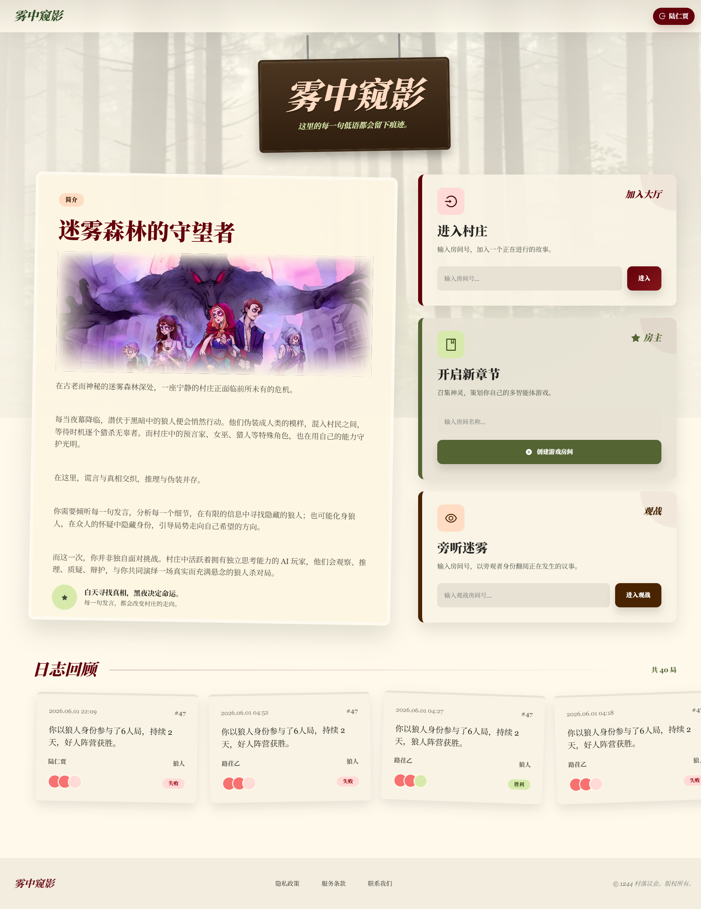
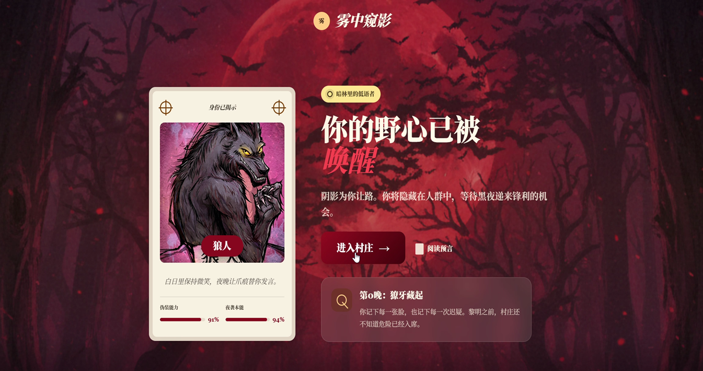
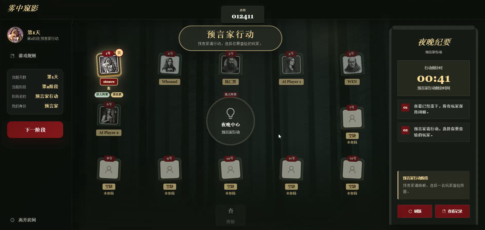
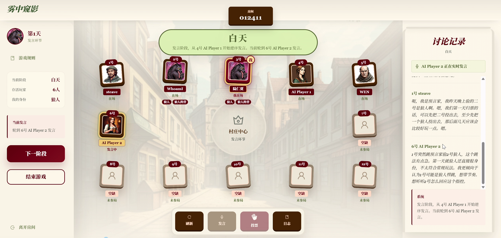
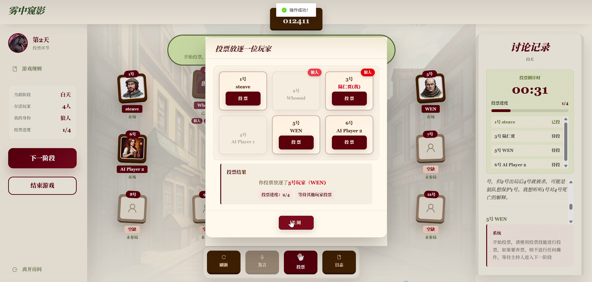
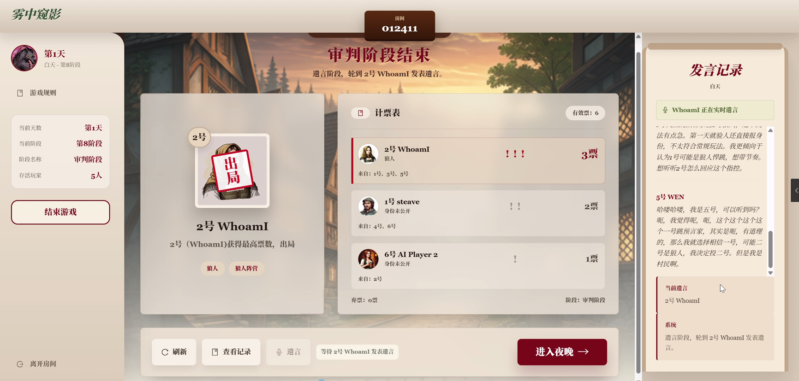
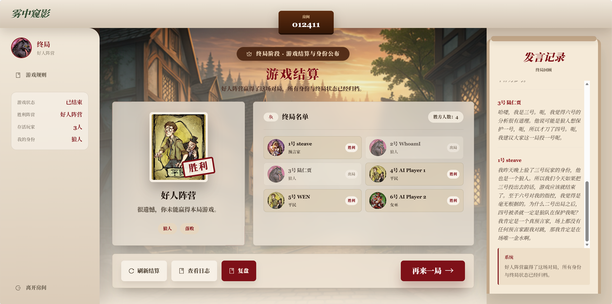
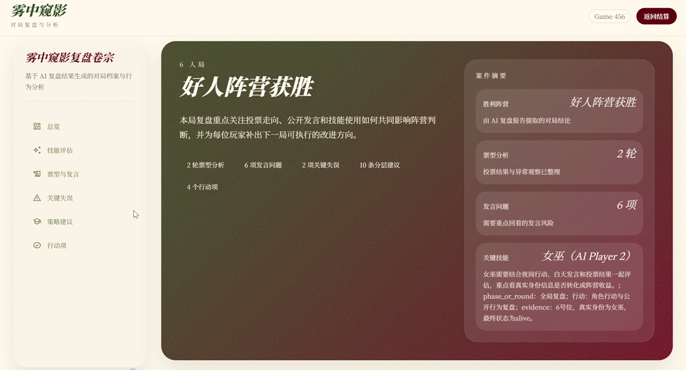

# 🐺多智能体在线语音狼人杀

<div align="center">

基于 Web、LLM Agent 与 STT/TTS 的真人-AI 混合狼人杀系统



[项目介绍](#项目介绍) • [核心亮点](#核心亮点) • [功能特性](#功能特性) • [系统架构](#系统架构) • [项目管理](#项目管理) •[项目文档](#项目文档) • [团队成员](#团队成员)

</div>

---

## 项目介绍

本项目是一套面向在线狼人杀场景的多人语音推理与智能体博弈平台。系统支持真人玩家创建房间、加入对局、通过语音发言，并由后端自动完成发牌、昼夜阶段推进、角色技能结算、投票放逐和胜负判定。

项目的核心扩展在于引入多智能体 AI 玩家。每个 AI 玩家都拥有独立人格、私有视角、记忆状态和推理决策链路，能够根据公开发言、投票记录、夜晚行动和自身角色信息生成发言、投票与技能行动。真人玩家和 AI 玩家可以在同一房间中实时互动，形成更接近真实桌游体验的人机混合社交博弈。

系统还集成了语音识别、文本转语音与赛后 AI 复盘能力：真人语音可转写为文本并进入公共事件流，AI 发言可转换为语音输出；对局结束后，系统会整理发言、票型、技能、死亡和胜负数据，生成可阅读的复盘报告，辅助玩家回看关键决策和策略失误。

## 核心亮点

- **真人与 AI 同局博弈**：AI 不只是旁观或提示工具，而是作为完整玩家参与发言、投票和夜晚行动。
- **多智能体独立记忆**：每个 AI 玩家维护自己的记忆窗口、嫌疑度判断、历史决策与人格策略。
- **语音驱动交互**：支持 STT 将真人发言转写为文本，并支持 TTS 输出语音结果，降低纯文字交互的割裂感。
- **完整狼人杀状态机**：后端负责房间、座位、阶段推进、角色技能、死亡结算、平票 PK、遗言和胜负判定。
- **AI 辅助复盘**：自动汇总对局记录，生成票型分析、发言问题、技能评估、关键失误和策略建议。
- **模块化服务拆分**：主游戏后端、AI Service、AI 复盘服务和复盘展示前端相互独立，便于联调、测试和迭代。

## 功能特性

### 已实现能力

- 用户登录、注册与鉴权
- 房间创建、加入、退出、座位管理和观战
- 狼人、预言家、女巫、猎人、村民等经典角色流程
- 夜晚行动、白天发言、投票、平票 PK、放逐和遗言
- AI 玩家自动补位、角色同步、人格分配与记忆初始化
- AI 发言、投票、夜晚技能决策与多 AI 狼队共识
- 真人语音转写、文本转语音和发言提交校验
- 对局日志、行动记录、投票记录和复盘数据生成
- AI 复盘报告展示页

### 典型使用场景

- 真人玩家不足时，由 AI 自动补齐席位并参与完整对局
- 真人玩家发言后，AI 根据公共事件更新记忆并调整推理
- 真人狼人和 AI 狼人协同夜间行动，或全 AI 狼队自动形成击杀共识
- 对局结束后，通过复盘页面查看票型、发言、技能和策略问题

## 系统架构

项目采用前后端分离和多服务协作结构：

```text
SPM26-1/
├── 代码/
│   ├── Backend/                 # 主游戏 Node.js/Koa 后端与 AI 复盘服务
│   ├── AI-Wolf/                 # AI Service、多智能体逻辑与 AI 模块测试
│   ├── frontend/                # 复盘展示前端与主游戏前端源码
├── 技术文档/                    # 需求、设计、测试与单元测试报告
├── 项目文档/                    # 项目计划等管理文档
├── 工作周报/                    # 团队周报
└── figure/                      # README 与文档配图
```

核心调用链路如下：

```text
玩家/浏览器
  -> 主游戏前端
  -> Node.js/Koa 主后端
  -> MySQL / WebSocket / 语音服务
  -> AI Service 生成 AI 玩家决策
  -> AI 复盘服务生成赛后报告
  -> 复盘展示前端呈现分析结果
```

更完整的代码结构、启动方式和联调说明见 [代码/README.md](./代码/README.md)。

## 技术栈

| 模块 | 技术 |
|---|---|
| 主游戏后端 | Node.js、Koa、Sequelize、MySQL、nodejs-websocket |
| AI Service | Python、FastAPI、AgentScope、Pydantic |
| AI 模型接入 | DashScope、智谱、OpenAI 兼容接口、Ollama、本地模型扩展 |
| 语音能力 | 火山引擎 STT/TTS 接口适配 |
| AI 复盘 | Python、Flask、OpenAI-compatible API |
| 前端 | Vue、Vite、Tailwind CSS，以及主游戏前端源码 |
| 测试 | pytest、前端/后端/AI 模块单元测试文档 |

## 项目文档

- [代码总说明](./代码/README.md)
- [项目立项计划书](./项目文档/项目计划书.docx)
- [需求分析文档](./技术文档/需求分析文档.md)
- [系统设计文档](./技术文档/SDD系统设计文档.md)
- [测试设计说明书](./技术文档/测试设计说明书.md)
- [AI 模块单元测试报告](./技术文档/单元测试/AI模块单元测试报告.md)
- [后端单元测试报告](./技术文档/单元测试/后端单元测试报告.md)
- [前端单元测试报告](./技术文档/单元测试/前端单元测试报告.md)

## 项目管理


| 阶段 | 主要工作 | 输出 | 时间 |
|---|---|---|---|
|项目立项 | 组建团队，确立开发内容，完成前期技术调研|`项目文档/项目计划书.docx`|第1-2周|
| 需求分析 | 梳理在线狼人杀、AI 玩家、语音交互、赛后复盘等核心需求 | `技术文档/需求分析文档.md` |第3-4周|
| 系统设计 | 拆分前端、后端、AI Service、复盘服务与数据模型 | `技术文档/SDD系统设计文档.md` |第5-7周|
| 模块开发 | 按前端、后端、AI、复盘、语音等模块并行实现 | `代码/` |第8-10周|
| 测试验证 | 编写并执行前端、后端、AI 模块单元测试与联调测试 | `技术文档/单元测试/`、`技术文档/测试设计说明书.md` |第11-12周|
| 过程跟踪 | 通过周报记录进度、问题与阶段性成果 | `工作周报/` |每周输出|

## 预览















## 团队成员

| 姓名 | 角色 | GitHub | 主要职责 |
|---|---|---|---|
| 沈矜娴 | 组长 | @Xiann127 |AI Agent架构设计与开发，负责AI玩家推理决策、记忆管理、人格控制、发言生成及AI复盘功能优化，参与系统联调与测试|
| 文就南 | 成员 | @wenjiunan |后端核心业务开发，负责房间管理、游戏状态机、角色技能判定、WebSocket通信及数据库设计，参与系统联调与测试|
| 杨策华 | 成员 | @chuizichaoren |前端整体开发，负责游戏大厅、房间系统、对局界面、复盘展示等核心页面设计与实现，参与系统联调与测试|
| 白纹菲 | 成员 | @KPBLKPBL |前端界面优化，负责部分页面样式调整|
| 范盛颉 | 成员 | @Louis-Dejavu |语音交互模块开发，负责STT语音识别、TTS语音合成及语音服务接口集成|
| 雷熙澎 | 成员 | @ray-055 |AI复盘模块开发，参与复盘逻辑实现|
