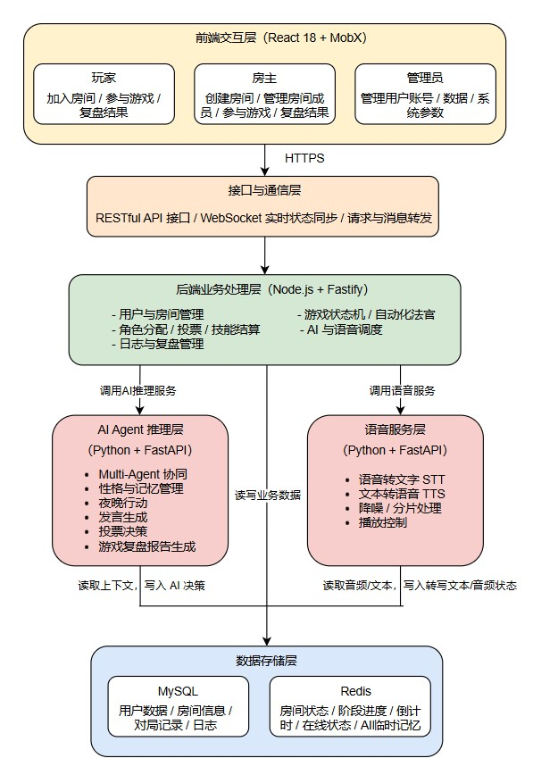
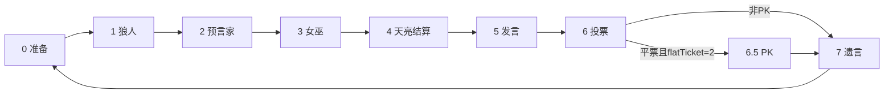
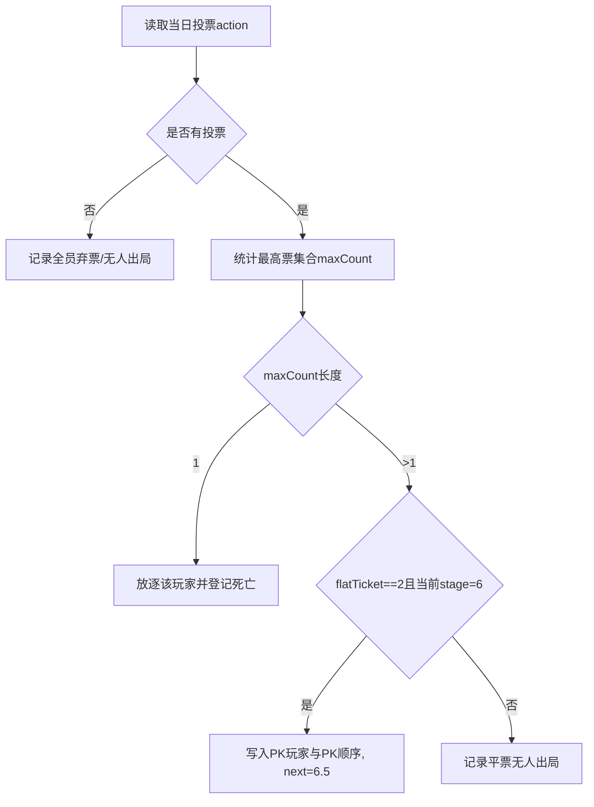
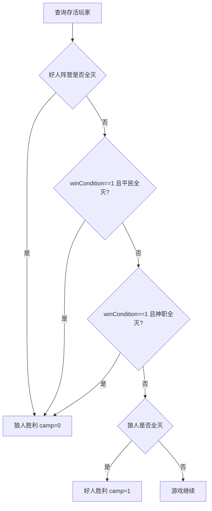

# 多智能体在线语音狼人杀系统 软件设计说明书（SDD）

## 1. 引言

### 1.1 编写目的
编写本软件设计说明书（Software Design Document, SDD）的主要目的，是将《多智能体在线语音狼人杀系统需求分析文档》中确定的各项业务需求、功能需求与非功能需求，转化为具体可执行的系统技术架构与模块设计方案。

本文档作为项目开发、测试与维护阶段的核心技术契约与指导准则，旨在：
1. **确立架构蓝图**：全面阐述系统的总体架构分层、运行环境与核心技术选型。
2. **划分模块边界**：明确后端游戏引擎、多智能体交互、实时通信与数据存储等核心模块的职责及内部逻辑。
3. **规范接口与数据**：统一规范前后端通信接口（REST & WebSocket）、数据库表结构及关键业务流转状态机。
4. **指导工程实践**：为项目开发团队的后续编码实现、系统集成、代码审查及自动化测试提供权威的技术依据。

**预期受众**：本项目开发团队全体成员、项目指导教师、系统架构评审人员、测试工程师，以及后续可能参与项目维护或二次开发的开发者。

### 1.2 项目背景与系统范围
**项目背景：**
传统桌面逻辑推理游戏“狼人杀”深受大众喜爱，但普遍面临线下组局困难、玩家凑不齐、复盘无记录等痛点。为解决这些问题，并探索大语言模型（LLM）在多智能体（Multi-Agent）非完全信息博弈场景中的应用潜力，本项目致力于开发一款高度拟真、支持人机协同协作的**在线多人语音推理与博弈平台——“多智能体在线语音狼人杀”**。

**系统范围：**
本系统不仅接管了传统狼人杀中繁琐的自动化发牌、昼夜流程控制与规则结算机制，其设计范围还将涵盖以下核心能力：
* **基础对局系统**：完整的用户体系、房间分配、6-12人标准局游戏状态机演进。
* **AI 玩家系统（Agent）**：基于大语言模型的 AI 玩家，具备独立视野、性格预设与自主推理决策能力，可随时填补空缺座位。
* **语音交互系统**：集成实时语音识别（STT）与语音合成（TTS）能力，打破人机交互的文本壁垒。
* **数据与复盘系统**：全链路对局日志记录，及基于 LLM 的赛后智能复盘分析。

### 1.3 设计目标与核心技术亮点
基于项目愿景，本系统的架构设计将重点围绕以下三大技术亮点展开：

1. **Multi-Agent 驱动的多智能体协同博弈**
   * **独立沙盒运行**：系统中每个 AI 玩家均作为一个独立的 Agent 实例运行，与其他玩家信息严格隔离（仅拥有自身视角的视野矩阵）。
   * **动态长效记忆（Memory）**：Agent 能够持续接收并理解对局中的聊天文本与行为事件，维持上下文连贯性。
   * **个性化心智模型**：具备独立决策能力，动态计算其他玩家的嫌疑度，并结合设定的性格特征（激进/保守/逻辑型）自动生成符合当前身份的伪装发言、投票决策及夜晚行动。

2. **实时语音识别（STT）与交互闭环**
   * 打通“人机语音屏障”，底层架构集成 STT 与 TTS 异步处理模块。
   * 真人玩家的实时语音流经系统降噪转写为文本供 AI 提取关键信息；AI 生成决策后，通过 TTS 转化为自然语音播报，形成无缝衔接的沉浸式音视频交互闭环。

3. **全栈日志记录与 AI 智能复盘**
   * 游戏引擎具备完整的事件溯源能力，将对局内的发言、票型、技能释放及阶段切换结构化落盘存储。
   * 对局结束后触发 AI 复盘引擎，以上帝视角或特定玩家视角生成包含票型逻辑、发言疑点分析的图文复盘报告。

### 1.4 术语、定义与缩略语
为避免阅读歧义，本文档涉及的技术缩略语及游戏领域特定术语统一定义如下：

| 术语 / 缩写 | 含义说明 | 分类 |
| --- | --- | --- |
| **SDD** | Software Design Document，软件设计说明书。 | 技术 |
| **LLM** | Large Language Model，大语言模型（如 GPT-4, 闭源/开源模型）。 | 技术 |
| **STT / TTS** | Speech-to-Text (语音转文本) / Text-to-Speech (文本转语音)。 | 技术 |
| **Multi-Agent** | 多智能体系统，指多个具备自主决策能力的独立 AI 代理在同一环境中协同或博弈。 | 技术 |
| **Room** | 房间，承载玩家组织与开局入口的容器，具备独立生命周期。 | 业务 |
| **Game** | 一局游戏实例，包含阶段、天数、板子配置及胜负判定规则。 | 业务 |
| **Player** | 某局内玩家的数据快照（与全局系统 User 解耦，包含角色、状态、技能等）。 | 业务 |
| **Stage** | 游戏阶段标识（如 0/1/2/3/4/5/6/6.5/7），驱动状态机演进的核心依据。 | 业务 |
| **GameTag** | 关键事件标签（如死亡事件、发言顺序、PK信息等结构化数据）。 | 业务 |
| **性格预设** | AI 玩家的行为倾向：<br>- **激进型**：倾向于冒险、主动发言与带节奏；<br>- **保守型**：倾向于谨慎、低调发言与随大流；<br>- **逻辑型**：倾向于严谨推理与数据驱动决策。 | 业务 |

### 1.5 参考资料
本文档的编写与设计决策主要参考以下资料：
1. 《多智能体在线语音狼人杀系统 需求分析文档 / PRD》（内部文档，前置产出物）
2. 狼人杀官方通用规则手册（6人局、9人局、12人标准局）
3. IEEE 1016-2009 Standard for Information Technology—Systems Design—Software Design Descriptions

### 1.6 文档结构
本设计说明书的后续章节将按照以下结构展开，由宏观到微观层层递进：
* **第 2~4 章（系统设计方案）**：描述系统的当前状态、总体分层架构、模块划分及软硬件技术选型。
* **第 5~6 章（模块与业务设计）**：详细说明核心子系统（如游戏状态机、房间管理、流程控制）的职责及核心业务时序图。
* **第 7~8 章（数据与接口设计）**：定义数据库实体模型（ER）、表结构、状态缓存方案，以及前后端交互接口及 WebSocket 协议。
* **第 9~10 章（评估与演进设计）**：对系统的非功能特性进行评估，并重点针对 AI 智能体、语音交互等未来扩展功能提供架构预留建议。

### 1.7 编写团队与版本记录

**编写团队：**
* **组长 / 主架构**：沈矜娴 (@Xiann127)
* **核心研发成员**：文就南 (@wenjiunan)、杨策华 (@chuizichaoren)、白纹菲 (@KPBLKPBL)、范盛颉 (@Louis-Dejavu)、雷熙澎 (@ray-055)

**修订记录（Version History）：**
| 版本号 | 修订日期 | 修订人 | 修订说明 |
| --- | --- | --- | --- |
| V1.0.0 | 2026-04-07 | 编写团队 | 初始版本草案完成，确立核心架构。 |


## 2. 系统设计目标与范围
本章明确本多智能体在线语音狼人杀系统的设计目标、当前实现范围及未实现的扩展范围，结合总体设计思路，界定系统设计的核心边界，为后续详细设计、开发实现及扩展迭代提供明确依据，确保设计工作与需求目标、实际开发进度保持一致。

### 2.1 系统设计目标
系统设计目标以需求文档为核心依据，结合技术选型与开发可行性，围绕**功能完整、架构清晰、可扩展、易维护**四大核心原则，具体设计目标如下：

1. **核心功能落地**：设计并实现用户登录认证、房间管理（创建、加入、入座等）、游戏全流程（开局、角色分配、昼夜阶段推进、技能结算、投票放逐、胜负判定）及对局记录查看等核心功能，确保游戏规则规范、流程顺畅，满足用户基础游玩需求。
2. **实时交互保障**：基于 WebSocket 技术设计房间级事件推送机制，实现游戏状态、阶段变化、倒计时等信息的实时同步，保障多用户在线交互的流畅性，减少延迟，提升用户体验。
3. **架构分层清晰**：采用前后端分离 + 单体后端服务模式，后端基于 Koa 框架设计自定义 MVC 装载器，按 `Controller/Service/Model` 分层架构，实现业务逻辑与数据访问解耦，提升代码可维护性与可扩展性。
4. **规则集中管控**：将游戏核心规则（阶段推进、技能执行、胜负判定等）集中封装于 `gameService` 与 `stageService`，控制器仅负责参数校验与服务调用编排，确保游戏规则的一致性、可复用性，便于后续规则优化与调整。
5. **预留扩展空间**：在架构设计中预留扩展接口，为后续 AI Agent 推理与行为生成、语音 STT/TTS 转换、复盘分析服务化、断线重连恢复机制等功能的扩展提供技术支撑，保障系统的可迭代性。
6. **权限分级管控**：设计并实现 `admin/host/player` 三级权限体系，明确各级角色的操作权限，确保系统操作的安全性与规范性。

### 2.2 系统实现范围
根据功能的作用，系统实现范围分为**核心功能**与**扩展功能**两部分，明确当前系统的开发进程，界定设计与开发的核心边界。

#### 2.2.1 核心功能范围
覆盖用户游玩全流程，具体包括：

1. **账号与权限管理**：实现账号登录功能，完成 `admin/host/player` 三级角色权限的基础配置，确保不同角色拥有对应操作权限。
2. **房间管理功能**：实现房间创建、通过房间码加入房间、玩家入座、房主踢人、观战模式、玩家退出房间等完整房间操作流程。
3. **游戏开局与角色分配**：支持房主发起开局，系统自动完成随机角色分配，同时初始化角色视野矩阵，符合狼人杀规则权限。
4. **游戏全流程推进**：实现昼夜阶段推进、夜晚技能释放、发言顺序控制、投票/PK 环节、遗言阶段、胜负判定。
5. **游戏结束与记录**：支持游戏结束、再来一局、对局记录查看，满足基础复盘需求。
6. **实时消息推送**：基于 WebSocket 实现房间级事件推送与夜晚阶段倒计时推送，保证多端状态实时同步。

#### 2.2.2 扩展功能范围
在核心流程的基础上拓展的功能，具体包括：

1. **AI Agent 模块**：AI 推理决策、行为生成、发言/投票/夜间操作模拟。
2. **语音交互功能**：STT 语音转文本、TTS 文本转语音，实现语音交互闭环。
3. **复盘分析服务化**：基于对局日志生成智能复盘报告与策略分析。
4. **断线重连恢复机制**：支持用户断线重连后恢复当前对局状态。

### 2.3 系统设计边界
结合总体设计思路与实现范围，明确系统设计边界：

1. **架构模式边界**：采用前后端分离 + 单体后端服务，暂不考虑分布式部署。
2. **后端技术边界**：后端基于 Koa 构建，使用自定义 MVC 装载器，严格按照 controller/service/model 三层结构组织代码，不引入额外复杂架构模式。
3. **业务逻辑边界**：所有狼人杀游戏规则、阶段控制、技能与投票逻辑统一集中在 gameService 和 stageService 实现；控制器仅负责参数校验、接口编排与结果返回，不嵌入核心规则逻辑。
4. **前端交互边界**：以房间页面为核心交互载体，前端通过 REST 接口拉取游戏状态数据，并通过 WebSocket 接收实时事件以触发界面刷新，不涉及多端同步与复杂状态管理框架。


## 3. 系统总体架构

### 3.1 架构设计思想
本系统当前采用前后端分离、后端分层组织的总体架构。前端负责房间界面展示、用户交互与状态呈现，后端统一承担业务控制、游戏流程调度、实时通信和数据持久化等职责。

考虑到狼人杀系统具有明显的阶段性、状态性和实时性特征，系统架构设计重点围绕以下三点展开：

1. **规则与界面分离**  ：将前端展示逻辑与后端游戏规则处理解耦，避免核心游戏流程依赖页面实现。
2. **业务处理与数据访问分离**  ：后端通过 Controller、Service、Model 的分层组织方式，将请求接入、业务处理和数据持久化区分开来，使系统结构更加清晰，也便于后续维护和扩展。
3. **实时交互与数据持久化并重**  ：由于游戏过程对实时性要求较高，因此系统通过 WebSocket 实现状态同步和消息推送；同时通过 MySQL 保存用户、房间和对局等关键数据，保证系统运行过程中数据可追踪、结果可查询。


### 3.2 架构分层
#### 3.2.1 整体架构图

<p align="center">
  
  <br>
  <em>图1 系统架构图</em>
</p>

#### 3.2.2 各层功能概述

1. **表现层**  ：表现层是系统面向用户的直接交互入口，主要负责用户界面展示、页面布局组织、玩家交互输入和游戏状态渲染等核心任务，并提供语音录制、语音播放以及阶段提示动画等前端交互内容。该层将基于 MobX 进行前端状态管理，使页面能够及时响应房间状态、玩家信息和游戏阶段的变化。
2. **接口访问层** ：接口访问层主要通过 Axios 对前后端的 REST 接口进行统一封装，负责发送和接收登录认证、创建房间、加入房间、查询房间状态、获取对局记录等非实时请求，同时也为 AI 复盘数据获取、语音转写结果查询、文本转语音结果获取等扩展能力提供统一的请求入口。通过这一层的封装，可以减少页面组件对底层请求细节的直接依赖，同时便于后续统一处理 Token 注入、异常提示和请求重试等功能。
3. **控制层** ：控制层位于后端接入侧，负责接收客户端请求、完成路由分发、基础参数校验、权限验证和请求上下文组织，并将具体业务逻辑交由 Service 层处理。该层不直接承载复杂的游戏规则处理，而是作为外部请求与核心业务逻辑之间的协调层，保证系统入口统一、处理流程清晰。
4. **领域服务层**：领域服务层是当前系统的核心业务层，承担房间管理、角色分配、投票统计、技能执行、胜负判定等关键规则处理任务，此外还负责AI Agent接入游戏流程的具体业务逻辑。由于本项目属于典型的状态驱动型博弈系统，昼夜切换、角色行动顺序、投票放逐和平票处理都要求统一的规则中枢，因此该层本质上承担了“游戏引擎”的职责。
5. **数据访问层** ：数据访问层基于 Sequelize Model 和 MySQL 实现，负责用户信息、房间信息、游戏记录等结构化数据的持久化存储。通过 ORM 方式访问数据库，可以降低业务逻辑与底层 SQL 的耦合程度，也有利于后续数据模型的维护与调整。
6. **实时通信层**  ：实时通信层负责处理游戏过程中的高频、低延迟消息同步与状态推送，包括房间成员变化、阶段切换、语音转写结果以及AI发言内容等。由于狼人杀对局具有较强的实时性，若仅依赖轮询式 HTTP 接口将难以满足多人同步体验，因此系统将通过 WebSocket 建立双向通信机制，实现服务端主动推送与客户端状态即时更新。
7. **辅助支撑层** ：辅助层为系统运行提供必要的支撑能力，主要包括 NodeCache、日志组件和权限中间件等。其中NodeCache 用于保存倒计时等短周期临时状态；日志组件用于记录运行过程中的关键操作和异常信息，为对局记录与后续排障提供支持；权限中间件则负责基础的身份校验与访问控制。虽然这些能力不直接参与业务规则处理，但它们对于满足系统稳定性、安全性和可维护性要求至关重要。

### 3.3 软件配置项CSCI

| CSCI编号 | 名称 | 主要职责 |　技术组成　|　对外接口/交互对象|
| --- | --- | --- | --- | --- |
| CSCI－01| 前端交互客户端 | 负责登录、大厅、房间、游戏主界面、投票面板、夜晚行动界面、AI复盘界面的展示；接收玩家、房主、管理员操作；完成语音录制、文本展示和语音播放 | React 18、MobX 6、Axios、WebSocket、MediaRecorder | 与游戏逻辑服务通过 RESTful API 和 WebSocket 交互；与语音服务通过音频上传链路间接交互 |
| CSCI－02 | 游戏逻辑服务 | 负责用户与房间管理、JWT 认证、角色分配、游戏状态机流转、技能结算、投票统计、胜负判定、日志记录与复盘调度；统一调度 AI 与语音服务 | Node.js、Fastify、WebSocket、状态机/自动化法官机制 | 对前提供 RESTful API 与 WebSocket 服务；向 AI Agent 推理服务发起推理请求；向语音服务发起 STT/TTS 请求；读写 MySQL/Redis |
| CSCI－03 | AI Agent推理服务 | 负责 AI 玩家生成、性格设定、上下文记忆维护、发言生成、投票决策、夜晚行动决策，以及赛后 AI 复盘分析 | Python 3.10+、FastAPI、Prompt Engineering | 接收游戏逻辑服务传入的游戏上下文；返回 AI 发言、投票、行动和复盘结果；读取/写入部分上下文与结果数据 |
| CSCI－04 | 语音STT/TTS服务 | 负责玩家语音输入的语音转文字（STT）处理，以及 AI 发言和系统提示的文本转语音（TTS）处理；负责降噪、分片处理和播放控制相关能力 | Python 3.10+、FastAPI、OpenAI Whisper | 接收前端上传的音频或经游戏逻辑服务转发的语音请求；向游戏逻辑服务返回转写文本或语音结果；回写音频处理状态与文本结果 |
| CSCI－05 | 数据存储与缓存服务 | 负责系统结构化数据持久化、实时状态缓存与共享；支撑房间状态、对局记录、日志、AI 临时记忆和复盘结果的存储 | MySQL 8.0、Redis | 为游戏逻辑服务提供用户、房间、对局、日志读写；为 AI 服务提供上下文与结果存取；为语音服务提供转写文本、音频状态和索引存储 |

### 3.4 硬件配置项HWCI
| HWCI编号 | 名称 | 规格 |　用途说明　|
| --- | --- | --- | --- |
| HWCI-01 | 前端应用服务器 | 2 核 CPU / 4GB 内存 / 50GB SSD | 部署前端静态资源，供用户浏览器访问系统界面 | 
| HWCI-02 | 游戏业务服务器 | 4 核 CPU / 8GB 内存 / 100GB SSD | 部署游戏逻辑服务，负责房间管理、状态机流转、WebSocket 通信和规则控制 |
| HWCI-03 | AI 推理服务器 | 4 核 GPU / 8GB 内存 / 100GB SSD | 部署 AI Agent 推理服务，负责上下文组织、AI 决策、发言生成和复盘分析 | 
| HWCI-04 | 语音处理服务器 | 4 核 GPU / 8GB 内存 / 100GB SSD | 部署 STT/TTS 服务，负责语音识别、语音合成、降噪和分片处理 |
| HWCI-05 | 数据库服务器 | 4 核 CPU / 8GB 内存 / 100GB SSD | 部署 MySQL，存储用户信息、房间信息、对局记录、日志和复盘结果 | 
| HWCI-06 | 缓存服务器 | 2 核 CPU / 4GB 内存 | 部署 Redis，维护房间状态、阶段进度、倒计时、在线状态和 AI 临时记忆 | 

### 3.5 CSCI/HWCI部署关系表
| CSCI编号 | CSCI名称 | 部署HWCI |　部署关系说明　|
| --- | --- | --- | --- |
| CSCI－01| 前端交互客户端 | HWCI-01 | 前端静态页面、脚本和样式资源部署在前端应用服务器上，供用户浏览器访问 |
| CSCI－02 | 游戏逻辑服务 | HWCI-02 | 游戏逻辑服务独立部署于游戏业务服务器，向上对接前端客户端，向下调用 AI 推理服务和语音服务，并访问数据库与缓存 | 
| CSCI－03 | AI Agent推理服务 | HWCI-03 | AI Agent 推理服务独立部署于 AI 推理服务器，由游戏逻辑服务按阶段触发调用 |
| CSCI－04 | 语音STT/TTS服务 | HWCI-04 | 语音服务独立部署于语音处理服务器，接收前端语音输入或后端 TTS 请求，并将处理结果返回游戏逻辑服务 | 
| CSCI－05 | 数据存储与缓存服务 | HWCI-05、HWCI-06 | MySQL 独立部署于数据库服务器，为游戏逻辑服务、AI 推理服务和语音服务提供结构化数据存储支撑；Redis 独立部署于缓存服务器，主要由游戏逻辑服务访问，同时为 AI 推理服务提供临时记忆和状态共享支持 |


## 4.数据结构设计
### 4.1 数据库基本信息
| 项次 | 信息 |
| ---- | ---- |
| 数据库名称 | werewolf |
| 字符集 | utf8mb4（支持emoji表情） |
| 排序规则 | utf8mb4_unicode_ci |
| 兼容版本 | MySQL 8.0+，MySQL 5.7（需支持JSON类型） |
| 存储引擎 | InnoDB |
| 设计模式 | 逻辑删除（`isDelete`字段）、审计字段（创建/修改时间、操作人） |

### 4.2 数据表总览
本数据库共**12张表**，分为**系统权限管理**和**狼人杀核心业务**两大模块：

#### 4.2.1 系统权限管理模块（5张）
| 表名 | 表注释 |
| ---- | ---- |
| lcoco_user | 系统用户表 |
| lcoco_role | 系统角色表 |
| lcoco_route | 前端路由表 |
| lcoco_ui_permission | UI界面权限表 |
| lcoco_url_permission | 后端接口权限表 |

#### 4.2.2 狼人杀核心业务模块（7张）
| 表名 | 表注释 |
| ---- | ---- |
| lcoco_room | 游戏房间表 |
| lcoco_game | 游戏对局表 |
| lcoco_player | 游戏玩家表 |
| lcoco_vision | 玩家视野权限表 |
| lcoco_action | 玩家行为记录表 |
| lcoco_game_tag | 游戏状态标签表 |
| lcoco_record | 游戏流程记录表 |

---

### 4.3 详细表结构设计
#### 4.3.1 系统权限管理模块
#### 4.3.1.1 lcoco_user（系统用户表）
存储系统后台/游戏用户的基础信息、角色权限、状态等。

| 字段名 | 数据类型 | 约束 | 默认值 | 字段注释 |
| ---- | ---- | ---- | ---- | ---- |
| _id | BIGINT UNSIGNED | PK, AUTO_INCREMENT | - | 主键ID |
| username | VARCHAR(64) | NOT NULL, UNIQUE | - | 用户名（唯一） |
| password | VARCHAR(255) | NOT NULL | - | 密码（加密存储） |
| name | VARCHAR(64) | NOT NULL | 空字符串 | 昵称/真实姓名 |
| roles | JSON | NULL | - | 绑定的角色列表 |
| defaultRoleName | VARCHAR(32) | NULL | - | 默认角色名称 |
| defaultRole | VARCHAR(32) | NULL | - | 默认角色标识 |
| remark | VARCHAR(255) | NULL | - | 备注 |
| status | INT | NOT NULL | 1 | 状态（1-正常，0-禁用） |
| createTime | DATETIME | NOT NULL | CURRENT_TIMESTAMP | 创建时间 |
| modifyTime | DATETIME | NOT NULL | CURRENT_TIMESTAMP ON UPDATE | 更新时间 |
| createId | INT | NOT NULL | 1 | 创建人ID |
| modifyId | INT | NOT NULL | 1 | 修改人ID |
| isDelete | TINYINT(1) | NOT NULL | 0 | 逻辑删除（0-未删除，1-已删除） |

**索引**：
- 主键：`PRIMARY KEY (_id)`
- 唯一索引：`uk_user_username (username)`
- 普通索引：`idx_user_status (status)`

---

#### 4.3.1.2 lcoco_role（系统角色表）
存储系统权限角色，用于权限分组管理。

| 字段名 | 数据类型 | 约束 | 默认值 | 字段注释 |
| ---- | ---- | ---- | ---- | ---- |
| _id | BIGINT UNSIGNED | PK, AUTO_INCREMENT | - | 主键ID |
| key | VARCHAR(32) | NOT NULL, UNIQUE | - | 角色唯一标识 |
| name | VARCHAR(32) | NOT NULL | 空字符串 | 角色名称 |
| status | INT | NOT NULL | 1 | 状态（1-正常，0-禁用） |
| remark | VARCHAR(255) | NULL | - | 备注 |
| createTime | DATETIME | NOT NULL | CURRENT_TIMESTAMP | 创建时间 |
| modifyTime | DATETIME | NOT NULL | CURRENT_TIMESTAMP ON UPDATE | 更新时间 |
| createId | INT | NOT NULL | 1 | 创建人ID |
| modifyId | INT | NOT NULL | 1 | 修改人ID |
| isDelete | TINYINT(1) | NOT NULL | 0 | 逻辑删除 |

**索引**：
- 主键：`PRIMARY KEY (_id)`
- 唯一索引：`uk_role_key (key)`
- 普通索引：`idx_role_status (status)`

---

#### 4.3.1.3 lcoco_route（前端路由表）
存储前端页面路由，控制页面访问权限。

| 字段名 | 数据类型 | 约束 | 默认值 | 字段注释 |
| ---- | ---- | ---- | ---- | ---- |
| _id | BIGINT UNSIGNED | PK, AUTO_INCREMENT | - | 主键ID |
| key | VARCHAR(64) | NOT NULL | 空字符串 | 路由标识 |
| path | VARCHAR(128) | NOT NULL, UNIQUE | - | 路由路径 |
| name | VARCHAR(64) | NOT NULL | 管理后台 | 路由名称 |
| roles | JSON | NULL | - | 允许访问的角色列表 |
| exact | TINYINT(1) | NOT NULL | 1 | 精准匹配标识 |
| backUrl | VARCHAR(128) | NOT NULL | /403 | 无权限跳转地址 |
| status | INT | NOT NULL | 1 | 状态 |
| createTime | DATETIME | NOT NULL | CURRENT_TIMESTAMP | 创建时间 |
| modifyTime | DATETIME | NOT NULL | CURRENT_TIMESTAMP ON UPDATE | 更新时间 |
| createId | INT | NOT NULL | 1 | 创建人ID |
| modifyId | INT | NOT NULL | 1 | 修改人ID |
| isDelete | TINYINT(1) | NOT NULL | 0 | 逻辑删除 |

**索引**：
- 主键：`PRIMARY KEY (_id)`
- 唯一索引：`uk_route_path (path)`
- 普通索引：`idx_route_status (status)`

---

#### 4.3.1.4 lcoco_ui_permission（UI界面权限表）
存储前端按钮、组件等UI元素的权限控制。

| 字段名 | 数据类型 | 约束 | 默认值 | 字段注释 |
| ---- | ---- | ---- | ---- | ---- |
| _id | BIGINT UNSIGNED | PK, AUTO_INCREMENT | - | 主键ID |
| key | VARCHAR(64) | NOT NULL, UNIQUE | - | 权限唯一标识 |
| name | VARCHAR(64) | NOT NULL | 空字符串 | 权限名称 |
| roles | JSON | NULL | - | 拥有权限的角色列表 |
| type | VARCHAR(32) | NOT NULL | button | 权限类型（按钮/组件） |
| status | INT | NOT NULL | 1 | 状态 |
| remark | VARCHAR(255) | NULL | - | 备注 |
| createTime | DATETIME | NOT NULL | CURRENT_TIMESTAMP | 创建时间 |
| modifyTime | DATETIME | NOT NULL | CURRENT_TIMESTAMP ON UPDATE | 更新时间 |
| createId | INT | NOT NULL | 1 | 创建人ID |
| modifyId | INT | NOT NULL | 1 | 修改人ID |
| isDelete | TINYINT(1) | NOT NULL | 0 | 逻辑删除 |

**索引**：
- 主键：`PRIMARY KEY (_id)`
- 唯一索引：`uk_ui_permission_key (key)`
- 普通索引：`idx_ui_permission_status (status)`

---

#### 4.3.1.5 lcoco_url_permission（后端接口权限表）
存储后端API接口的访问权限控制。

| 字段名 | 数据类型 | 约束 | 默认值 | 字段注释 |
| ---- | ---- | ---- | ---- | ---- |
| _id | BIGINT UNSIGNED | PK, AUTO_INCREMENT | - | 主键ID |
| key | VARCHAR(64) | NOT NULL, UNIQUE | - | 接口权限标识 |
| name | VARCHAR(64) | NOT NULL | 空字符串 | 接口名称 |
| roles | JSON | NULL | - | 允许访问的角色列表 |
| type | VARCHAR(32) | NOT NULL | button | 权限类型 |
| status | INT | NOT NULL | 1 | 状态 |
| remark | VARCHAR(255) | NULL | - | 备注 |
| createTime | DATETIME | NOT NULL | CURRENT_TIMESTAMP | 创建时间 |
| modifyTime | DATETIME | NOT NULL | CURRENT_TIMESTAMP ON UPDATE | 更新时间 |
| createId | INT | NOT NULL | 1 | 创建人ID |
| modifyId | INT | NOT NULL | 1 | 修改人ID |
| isDelete | TINYINT(1) | NOT NULL | 0 | 逻辑删除 |

**索引**：
- 主键：`PRIMARY KEY (_id)`
- 唯一索引：`uk_url_permission_key (key)`
- 普通索引：`idx_url_permission_status (status)`

---

#### 4.3.2 狼人杀核心业务模块
#### 4.3.2.1 lcoco_room（游戏房间表）
存储狼人杀游戏房间的基础信息、玩家席位、状态等。

| 字段名 | 数据类型 | 约束 | 默认值 | 字段注释 |
| ---- | ---- | ---- | ---- | ---- |
| _id | BIGINT UNSIGNED | PK, AUTO_INCREMENT | - | 主键ID |
| name | VARCHAR(64) | NOT NULL | 狼人杀房间 | 房间名称 |
| status | INT | NOT NULL | 0 | 房间状态 |
| gameId | BIGINT UNSIGNED | NULL | - | 关联对局ID |
| password | VARCHAR(16) | NOT NULL | - | 房间密码 |
| owner | VARCHAR(64) | NOT NULL | - | 房主用户名 |
| v1~v12 | VARCHAR(64) | NULL | - | 1-12号席位玩家用户名 |
| count | INT | NOT NULL | 12 | 最大玩家数 |
| wait | JSON | NULL | - | 等待列表 |
| ob | JSON | NULL | - | 观战列表 |
| remark | VARCHAR(255) | NULL | - | 备注 |
| createTime | DATETIME | NOT NULL | CURRENT_TIMESTAMP | 创建时间 |
| modifyTime | DATETIME | NOT NULL | CURRENT_TIMESTAMP ON UPDATE | 更新时间 |
| createId | INT | NOT NULL | 1 | 创建人ID |
| modifyId | INT | NOT NULL | 1 | 修改人ID |
| isDelete | TINYINT(1) | NOT NULL | 0 | 逻辑删除 |

**索引**：
- 主键：`PRIMARY KEY (_id)`
- 普通索引：`idx_room_password (password)`、`idx_room_owner (owner)`、`idx_room_status (status)`

---

#### 4.3.2.2 lcoco_game（游戏对局表）
存储单局狼人杀游戏的配置、进程、结果等核心信息。

| 字段名 | 数据类型 | 约束 | 默认值 | 字段注释 |
| ---- | ---- | ---- | ---- | ---- |
| _id | BIGINT UNSIGNED | PK, AUTO_INCREMENT | - | 主键ID |
| roomId | BIGINT UNSIGNED | NOT NULL | - | 关联房间ID |
| owner | VARCHAR(64) | NOT NULL | - | 房主 |
| status | INT | NOT NULL | 1 | 对局状态 |
| stage | DECIMAL(4,1) | NOT NULL | 0.0 | 当前游戏阶段 |
| day | INT | NOT NULL | 1 | 当前天数 |
| v1~v12 | VARCHAR(64) | NULL | - | 1-12号玩家身份配置 |
| winner | INT | NOT NULL | -1 | 获胜方（-1-未结束） |
| mode | VARCHAR(32) | NOT NULL | standard_9 | 游戏模式 |
| playerCount | INT | NOT NULL | 9 | 玩家数量 |
| witchSaveSelf | INT | NOT NULL | 1 | 女巫是否能自救 |
| winCondition | INT | NOT NULL | 1 | 胜利条件 |
| flatTicket | INT | NOT NULL | 1 | 平票规则 |
| p1/p2/p3 | INT | NOT NULL | 30/45/30 | 阶段计时配置 |
| remark | VARCHAR(255) | NULL | - | 备注 |
| createTime | DATETIME | NOT NULL | CURRENT_TIMESTAMP | 创建时间 |
| modifyTime | DATETIME | NOT NULL | CURRENT_TIMESTAMP ON UPDATE | 更新时间 |
| createId | INT | NOT NULL | 1 | 创建人ID |
| modifyId | INT | NOT NULL | 1 | 修改人ID |
| isDelete | TINYINT(1) | NOT NULL | 0 | 逻辑删除 |

**索引**：
- 主键：`PRIMARY KEY (_id)`
- 普通索引：`idx_game_room (roomId)`、`idx_game_status (status)`、`idx_game_day_stage (day, stage)`

---

#### 4.3.2.3 lcoco_player（游戏玩家表）
存储单局游戏中每个玩家的身份、阵营、状态、位置等信息。

| 字段名 | 数据类型 | 约束 | 默认值 | 字段注释 |
| ---- | ---- | ---- | ---- | ---- |
| _id | BIGINT UNSIGNED | PK, AUTO_INCREMENT | - | 主键ID |
| roomId | BIGINT UNSIGNED | NOT NULL | - | 关联房间ID |
| gameId | BIGINT UNSIGNED | NOT NULL | - | 关联对局ID |
| userId | BIGINT UNSIGNED | NULL | - | 关联用户ID |
| username | VARCHAR(64) | NOT NULL | - | 用户名 |
| name | VARCHAR(64) | NULL | - | 玩家昵称 |
| role | VARCHAR(32) | NOT NULL | - | 身份标识 |
| roleName | VARCHAR(32) | NULL | - | 身份名称 |
| camp | INT | NOT NULL | 0 | 阵营标识 |
| campName | VARCHAR(32) | NULL | - | 阵营名称 |
| status | INT | NOT NULL | 1 | 玩家状态（存活/死亡） |
| outReason | VARCHAR(32) | NULL | - | 出局原因 |
| position | INT | NOT NULL | - | 座位号 |
| skill | JSON | NULL | - | 技能状态 |
| remark | VARCHAR(255) | NULL | - | 备注 |
| createTime | DATETIME | NOT NULL | CURRENT_TIMESTAMP | 创建时间 |
| modifyTime | DATETIME | NOT NULL | CURRENT_TIMESTAMP ON UPDATE | 更新时间 |
| createId | INT | NOT NULL | 1 | 创建人ID |
| modifyId | INT | NOT NULL | 1 | 修改人ID |
| isDelete | TINYINT(1) | NOT NULL | 0 | 逻辑删除 |

**索引**：
- 主键：`PRIMARY KEY (_id)`
- 唯一索引：`uk_player_game_username (gameId, username)`、`uk_player_game_position (gameId, position)`
- 普通索引：`idx_player_room_game (roomId, gameId)`、`idx_player_status (status)`

---

#### 4.3.2.4 lcoco_vision（玩家视野权限表）
控制游戏中玩家之间的可见性、视野权限。

| 字段名 | 数据类型 | 约束 | 默认值 | 字段注释 |
| ---- | ---- | ---- | ---- | ---- |
| _id | BIGINT UNSIGNED | PK, AUTO_INCREMENT | - | 主键ID |
| roomId | BIGINT UNSIGNED | NOT NULL | - | 关联房间ID |
| gameId | BIGINT UNSIGNED | NOT NULL | - | 关联对局ID |
| from | VARCHAR(64) | NOT NULL | - | 视野发起者 |
| to | VARCHAR(64) | NOT NULL | - | 视野目标 |
| status | INT | NOT NULL | 0 | 视野状态 |
| remark | VARCHAR(255) | NULL | - | 备注 |
| createTime | DATETIME | NOT NULL | CURRENT_TIMESTAMP | 创建时间 |
| modifyTime | DATETIME | NOT NULL | CURRENT_TIMESTAMP ON UPDATE | 更新时间 |
| createId | INT | NOT NULL | 1 | 创建人ID |
| modifyId | INT | NOT NULL | 1 | 修改人ID |
| isDelete | TINYINT(1) | NOT NULL | 0 | 逻辑删除 |

**索引**：
- 主键：`PRIMARY KEY (_id)`
- 唯一索引：`uk_vision_game_from_to (gameId, from, to)`
- 普通索引：`idx_vision_room_game (roomId, gameId)`

---

#### 4.3.2.5 lcoco_action（玩家行为记录表）
记录游戏中玩家的所有操作行为（投票、杀人、用药等）。

| 字段名 | 数据类型 | 约束 | 默认值 | 字段注释 |
| ---- | ---- | ---- | ---- | ---- |
| _id | BIGINT UNSIGNED | PK, AUTO_INCREMENT | - | 主键ID |
| roomId | BIGINT UNSIGNED | NOT NULL | - | 关联房间ID |
| gameId | BIGINT UNSIGNED | NOT NULL | - | 关联对局ID |
| day | INT | NOT NULL | 1 | 天数 |
| stage | DECIMAL(4,1) | NOT NULL | 0.0 | 游戏阶段 |
| from | VARCHAR(64) | NOT NULL | - | 行为发起者 |
| to | VARCHAR(64) | NOT NULL | - | 行为目标 |
| action | VARCHAR(32) | NOT NULL | - | 行为类型 |
| remark | VARCHAR(255) | NULL | - | 备注 |
| createTime | DATETIME | NOT NULL | CURRENT_TIMESTAMP | 创建时间 |
| modifyTime | DATETIME | NOT NULL | CURRENT_TIMESTAMP ON UPDATE | 更新时间 |
| createId | INT | NOT NULL | 1 | 创建人ID |
| modifyId | INT | NOT NULL | 1 | 修改人ID |
| isDelete | TINYINT(1) | NOT NULL | 0 | 逻辑删除 |

**索引**：
- 主键：`PRIMARY KEY (_id)`
- 普通索引：`idx_action_room_game_stage (roomId, gameId, day, stage)`、`idx_action_from (from)`、`idx_action_type (action)`

---

#### 4.3.2.6 lcoco_game_tag（游戏状态标签表）
存储游戏过程中的状态标记、临时数据、扩展信息。

| 字段名 | 数据类型 | 约束 | 默认值 | 字段注释 |
| ---- | ---- | ---- | ---- | ---- |
| _id | BIGINT UNSIGNED | PK, AUTO_INCREMENT | - | 主键ID |
| roomId | BIGINT UNSIGNED | NOT NULL | - | 关联房间ID |
| gameId | BIGINT UNSIGNED | NOT NULL | - | 关联对局ID |
| day | INT | NOT NULL | 1 | 天数 |
| stage | DECIMAL(4,1) | NOT NULL | 0.0 | 游戏阶段 |
| target | VARCHAR(64) | NOT NULL | - | 标签目标 |
| name | VARCHAR(64) | NULL | - | 标签名称 |
| position | INT | NULL | - | 座位号 |
| dayStatus | INT | NOT NULL | - | 当日状态 |
| desc | VARCHAR(32) | NOT NULL | - | 标签描述 |
| mode | INT | NOT NULL | - | 标签模式 |
| value | VARCHAR(255) | NULL | - | 标签值 |
| value2 | JSON | NULL | - | 扩展值1 |
| value3 | JSON | NULL | - | 扩展值2 |
| createTime | DATETIME | NOT NULL | CURRENT_TIMESTAMP | 创建时间 |
| modifyTime | DATETIME | NOT NULL | CURRENT_TIMESTAMP ON UPDATE | 更新时间 |
| createId | INT | NOT NULL | 1 | 创建人ID |
| modifyId | INT | NOT NULL | 1 | 修改人ID |
| isDelete | TINYINT(1) | NOT NULL | 0 | 逻辑删除 |

**索引**：
- 主键：`PRIMARY KEY (_id)`
- 普通索引：`idx_tag_room_game (roomId, gameId)`、`idx_tag_day_stage_mode (day, stage, mode)`、`idx_tag_desc (desc)`

---

#### 4.3.2.7 lcoco_record（游戏流程记录表）
记录游戏全流程日志、公告、关键事件，用于复盘和展示。

| 字段名 | 数据类型 | 约束 | 默认值 | 字段注释 |
| ---- | ---- | ---- | ---- | ---- |
| _id | BIGINT UNSIGNED | PK, AUTO_INCREMENT | - | 主键ID |
| roomId | BIGINT UNSIGNED | NOT NULL | - | 关联房间ID |
| gameId | BIGINT UNSIGNED | NOT NULL | - | 关联对局ID |
| content | JSON | NOT NULL | - | 记录内容 |
| view | JSON | NULL | - | 可见范围 |
| isCommon | INT | NOT NULL | 0 | 是否公共记录 |
| stage | DECIMAL(4,1) | NOT NULL | 0.0 | 游戏阶段 |
| day | INT | NOT NULL | 1 | 天数 |
| isTitle | INT | NOT NULL | 0 | 是否标题记录 |
| remark | VARCHAR(255) | NULL | - | 备注 |
| createTime | DATETIME | NOT NULL | CURRENT_TIMESTAMP | 创建时间 |
| modifyTime | DATETIME | NOT NULL | CURRENT_TIMESTAMP ON UPDATE | 更新时间 |
| createId | INT | NOT NULL | 1 | 创建人ID |
| modifyId | INT | NOT NULL | 1 | 修改人ID |
| isDelete | TINYINT(1) | NOT NULL | 0 | 逻辑删除 |

**索引**：
- 主键：`PRIMARY KEY (_id)`
- 普通索引：`idx_record_room_game (roomId, gameId)`、`idx_record_day_stage (day, stage)`、`idx_record_common (isCommon)`

---

### 4.4 设计规范说明
1. **主键规范**：所有表主键统一为 `_id`，类型为 `BIGINT UNSIGNED`，自增；
2. **通用字段**：所有表包含 `createTime`、`modifyTime`、`createId`、`modifyId`、`isDelete` 审计/逻辑删除字段；
3. **权限设计**：基于**用户-角色-权限**的RBAC权限模型，支持路由、UI、接口三级权限控制；
4. **数据类型**：使用 `JSON` 类型存储列表/扩展数据，适配游戏动态配置需求；
5. **关联关系**：业务表通过 `roomId`、`gameId` 关联核心对局数据，无物理外键，通过业务逻辑保证完整性。


## 5. 功能设计
*按照核心 CSCI 模块分解的 CSC 组件级设计*

### 5.1 CSCI-01 前端交互客户端功能设计
#### CSC-01-01 界面渲染组件
**1. 功能**：负责登录页、大厅、房间列表、游戏内界面、投票面板、夜间操作面板、语音面板的渲染与布局。

**2. 实现**
- 基于 React 18 + MobX 进行组件化与状态管理，页面按路由懒加载。
- 根据用户角色（房主 / 玩家 / 观战）动态控制按钮可见性与操作权限。
- 实时接收 WebSocket 事件，局部刷新状态，不整页重渲染。

#### CSC-01-02 玩家操作交互组件
**1. 功能**：接收玩家点击、准备/取消准备、投票、技能释放、发言、换座等操作。

**2. 实现**
- 前端统一封装请求层，通过 REST 或 WebSocket 发送操作指令。
- 根据游戏阶段与玩家状态做本地前置校验，非法操作直接拦截并提示。
- 接收后端返回结果，实时刷新视图状态。

#### CSC-01-03 语音采集与播放组件
**1. 功能**：录制玩家语音、播放系统提示音、AI 语音、其他玩家语音流。

**2. 实现**
- 使用 MediaRecorder 采集语音，分片生成 PCM/MP3 片段。
- 语音数据通过上传接口发送给后端语音服务，或直接流式传输。
- 接收 TTS 返回的音频 URL 或二进制流，调用 Audio 对象自动播放。
- 提供麦克风开关、音量调节、语音禁言状态展示。

---

### 5.2 CSCI-02 游戏逻辑服务功能设计
#### CSC-02-01 用户认证与权限组件
**1. 功能**：登录、注册、JWT 签发与校验、角色权限判断、接口鉴权。

**2. 实现**
- 用户名 + 密码登录，密码 bcrypt 加密存储。
- 登录成功生成 JWT Token，存入请求头用于后续鉴权。
- 中间件统一校验 Token 有效性、过期时间、用户状态。
- 基于 RBAC 模型，根据用户角色（admin/host/player）控制接口与 UI 权限。

**3. 登录体系实现**
- 输入：用户名、密码
- 输出：Token、用户信息、登录结果
- 数据结构：`LoginRequest { username, password }`，`LoginResponse { token, userInfo }`
- 账号密码登录：前端提交用户名与明文密码，后端在 Controller 层接收参数，通过 Service 层查询 MySQL 用户表验证用户是否存在；密码不做明文存储，而是使用 bcrypt 加密算法对密码进行加盐哈希处理，注册时将哈希值存入数据库，登录时直接对比前端传入密码与数据库哈希值，不暴露任何明文密码，防止彩虹表破解与暴力破解。
- Token 机制：登录验证通过后，后端使用 JWT 工具类生成 AccessToken，有效期 2 小时，同时生成 RefreshToken 并存储到 Redis，有效期 7 天；AccessToken 用于接口鉴权，RefreshToken 用于 AccessToken 过期后的无感续期，续期时后端校验 RefreshToken 合法性，重新生成一对 Token 并更新 Redis 与数据库记录。
- 鉴权拦截：后端通过 SpringMVC 拦截器 / 网关过滤器统一拦截所有请求，从请求头获取 Token；后端解析 JWT 签名、过期时间、用户状态，并查询 Redis 判断 Token 是否有效；若 Token 非法、过期或用户被封禁，直接返回 401 并拒绝请求。

**4. 权限控制**
- 接口权限：后端维护 URL + 请求方法与角色的映射关系，存储在 MySQL 权限表中；用户请求接口时，拦截器根据用户角色查询权限表，判断是否允许访问当前接口，未授权请求直接返回 403 拦截。
- 防重复提交：前端传入唯一请求 ID，后端通过 Redis 分布式锁对请求 ID 加锁，锁有效期 5 秒；同一请求 ID 在 5 秒内多次提交会被直接拒绝，防止重复操作与重放攻击。
- 安全策略：用户登录时，后端记录 IP 地址与设备标识并存储到 Redis；同一账号在新设备登录时，自动删除旧 Token 并将旧登录踢下线；连续登录失败次数存储在 Redis，达到 5 次后自动锁定账号 15 分钟，禁止登录。

---

#### CSC-02-02 房间管理组件
**1. 功能**：房间创建、加入、退出、入座、踢人、观战、房间状态维护。

**2. 实现**
- 房间码唯一生成，存入 Redis 快速校验。
- 房间信息同时落库 MySQL 与缓存 Redis，读多写少走缓存。
- 座位使用数组结构管理，支持 1~12 号位动态分配与状态同步。
- 并发操作通过分布式锁保证原子性，防止超坐、重复加入。
- 房间生命周期：待开始 → 游戏中 → 结束 → 自动清理。

**3. 房间核心流程**
- 输入：房间码、用户 ID、座位号
- 输出：房间信息、座位列表、加入结果
- 数据结构：`JoinRoomRequest { roomCode }`，`SeatInfo { position, username, status }`
- 创建房间：房主在前端提交房间配置，后端 Controller 接收参数，通过分布式锁保证并发安全；后端生成 6 位数字房间码，使用 Redis 校验唯一性，避免重复；房间基础信息写入 MySQL 房间表，房间状态、人数、配置同步写入 Redis 做高速缓存；同时初始化座位表，房主默认入座 1 号位置。
- 加入房间：用户输入房间码后，后端优先从 Redis 查询房间信息，不存在则查询 MySQL；后端依次校验房间状态、人数上限、密码是否正确；校验通过后，为用户分配最小空座位，更新 MySQL 座位表与 Redis 缓存中的玩家列表，返回加入成功结果。
- 座位机制：后端使用数组结构存储座位状态（1~12 号），座位数据全部存储在 Redis 中，保证读写速度；房主执行换座、踢人、禁赛时，后端通过分布式锁保证操作原子性，修改 Redis 与 MySQL 中的座位状态；观战位用户只接收消息，后端在业务层判断身份，拒绝所有游戏操作请求。
- 并发安全：入座、开始游戏、踢人等并发操作，后端使用 Redis 分布式锁（`lock:room:{roomId}`）加锁，确保同一时间只有一个线程修改房间数据，避免多客户端同时操作导致数据错乱。

**4. 房间状态流转**
- 房间状态分为：待开始 → 游戏中 → 已结束 → 已解散，所有状态变更由后端单向控制，前端无法直接修改状态；
- 游戏开始后，后端锁定房间，拒绝新用户加入与配置修改；
- 后端通过定时任务每 5 分钟扫描一次房间，对超过 2 小时未开始的房间自动修改状态为“已解散”，清理 Redis 缓存与 MySQL 临时数据。
**[关键结构]**
```js
// 房间模型（server/mysqlModel/room.js）
{
  _id, name, status, gameId, password, owner,
  v1...v12, count, wait: JSON[], ob: JSON[]
}
```

#### CSC-02-03 游戏状态机 / 流程控制组件
**1. 功能**：游戏阶段推进、昼夜循环、倒计时管理、阶段流转与事件触发。

**2. 实现**
- 内置标准阶段序列：准备 → 狼人行动 → 预言家查验 → 女巫操作 → 天亮公告 → 发言环节 → 投票放逐 → PK 环节 → 遗言阶段。
- 阶段由服务端单向控制，前端无法越阶操作。
- 倒计时通过后端定时任务维护，通过 WebSocket 实时广播至所有客户端。
- 阶段切换采用事务保证状态一致性。

**3. 状态机模型**
- 阶段枚举：后端使用枚举类定义所有游戏阶段：准备 → 黑夜（狼人→预言家→女巫）→ 天亮 → 公投 → 放逐 → 黑夜循环，所有阶段严格按顺序执行。
- 扩展阶段：警长竞选、平票 PK、死亡公布、遗言等阶段通过阶段状态位扩展实现，后端根据游戏配置动态判断是否进入。
- 推进规则：后端使用状态机转移表控制阶段流转，只有当前阶段完成且满足条件，才能进入下一阶段；前端所有阶段切换请求都会被后端强校验，非法越阶请求直接拒绝。

**4. 时序与一致性**
- 倒计时：后端使用 ScheduledExecutorService 定时任务或 Redis 过期回调实现阶段倒计时，每秒向 Redis 更新剩余时间，并通过 WebSocket 广播给房间内所有用户；倒计时结束自动触发阶段切换逻辑。
- 事务保证：阶段切换、状态更新、日志记录、玩家状态修改等多表操作，后端使用 Spring 声明式事务包裹，任何一步失败都会自动回滚，保证数据一致性。
- 状态广播：阶段变化时，后端通过 WebSocket 主动推送 stageChange 事件，携带最新阶段、倒计时、玩家状态，确保所有客户端视图完全一致。

**[关键结构]**
```js
// common/constants.js
stageMap = {
  0: '天黑请闭眼', 1: '预言家', 2: '狼人', 3: '女巫',
  4: '天亮', 5: '发言', 6: '投票', 6.5: 'PK', 7: '遗言'
}

// lcoco_game 关键字段
{ status, stage, day, p1, p2, p3, flatTicket }
```


**[判定流程] 阶段推进总览**



#### CSC-02-04 角色分配与视野组件
**1. 功能**：按板子配置分配角色、初始化阵营、构建玩家视野权限。

**2. 实现**
- 内置 6、9、12 人标准板子，开局时随机洗牌分配角色
- 自动构建视野权限：狼人互相可见，好人仅可见自身。
- 视野数据写入 lcoco_vision 表并缓存至 Redis，供前端权限控制。

**3. 角色配置体系**
- 板子配置：后端在数据库或配置文件中预定义 6/8/9/10/12 人标准板子，明确狼人、平民、预言家、女巫、猎人、白痴的数量与组合；创建房间时根据人数自动加载对应板子。
- 分配算法：游戏开始时，后端从板子配置中获取角色列表，使用 Collections.shuffle() 随机洗牌算法打乱角色顺序，按座位号依次分配给玩家；角色分配后，狼队成员互相可见，神职与平民只能看到自己，后端统一维护视野关系。

**4. 视野与状态初始化**
- 视野矩阵：后端根据角色阵营生成视野关系，存储为 Map<userId, Set<visibleUserId>> 结构，存入 Redis 供前端快速查询；狼人可见其他狼人，好人仅可见自己。
- 事务写入：角色分配、玩家状态、视野数据三张表的写入操作，后端使用数据库事务保证原子性，要么全部成功，要么全部失败，确保开局数据完整不丢失。

**[关键结构]**
```js
// 板子配置（common/constants.js）
gameModeMap['standard_9'] = [
  'wolf','wolf','wolf','villager','villager','villager',
  'predictor','witch','hunter'
]

// 玩家快照（server/mysqlModel/player.js）
{ roomId, gameId, username, role, camp, status, skill, position }

// 视野（server/mysqlModel/vision.js）
{ from, to, status } // 0未知 1知晓阵营 2知晓身份
```

#### CSC-02-05 白天发言与投票组件
**1. 功能**：发言顺序控制、投票收集、票型统计、平票处理、放逐结算。

**2. 实现**
- 仅存活玩家可参与投票，警长票数按 1.5 倍计算。
- 所有投票行为记录至 lcoco_action 表，支持后续复盘回溯。
- 计票规则：最高票者放逐；平票进入 PK 环节；再次平票则本轮无人放逐。
- 结算后更新玩家死亡状态并广播系统公告。

**3. 投票规则**
- 输入：投票目标 ID、游戏 ID
- 输出：票型统计、放逐结果、死亡公告
- 数据结构：`VoteRequest { targetId }`，`VoteResult { voteCount, exiledUser }`
- 参与范围：后端在投票前校验玩家状态，只有存活玩家可发起投票，每人仅允许投一票，支持弃票；若玩家是警长，后端在计票时自动将票数按 1.5 倍计算。

**4. 数据与安全**
- 票型存储：每一张投票都会持久化到 MySQL，记录投票人、目标、时间、阶段，用于后续复盘与回溯。
- 防作弊：后端统一校验投票资格、存活状态、当前阶段、投票次数；重复投票、越权投票、死亡玩家投票都会被直接拦截，不写入任何数据。

**[关键结构]**
```js
// action 表中的投票动作
{ day, stage, from, to, action: 'vote' }

// gameTag 表中的 PK 信息
{ desc: 'pkPlayer', mode: 3, value2: [username...] }
{ desc: 'pkOrder', mode: 2, value: 'asc'|'desc' }
```


**[判定流程] 投票结算**



#### CSC-02-06  夜晚技能执行组件
**1. 功能**：狼人袭击、预言家查验、女巫解药 / 毒药使用、猎人开枪、技能冷却管理。

**2. 实现**
- 夜间所有操作私密执行，结果统一在天亮阶段结算。
- 狼人需达成一致目标方可成功刀人；预言家每晚仅可查验一次。
- 女巫解药、毒药各限使用一次，使用状态记录在玩家技能字段中。
- 结算优先级：毒杀 → 狼刀 → 猎人开枪。

**3. 角色技能规范**
- 输入：技能类型、目标 ID、gameId、roomId
- 输出：技能结果、状态变更、私密提示
- 数据结构：`SkillRequest { skillType, targetId }`，`SkillResponse { success, message }`
- 狼人：夜间所有狼人选择目标，后端使用 Redis 集合统计所有狼人选择，只有全部狼人选择一致时目标才生效，否则为空刀；最终目标存入 Redis 等待天亮结算。
- 预言家：每晚仅允许查验一次，后端查询目标玩家角色阵营，返回 “好人 / 狼人”，并在 Redis 标记该玩家已查验，防止重复查验。
- 女巫：解药、毒药各只能使用一次，后端使用 Redis 标记使用状态；双药不能同一天使用，首夜可自救，技能使用后永久标记为已消耗。。
- 猎人：被放逐或夜间死亡可开枪，被女巫毒杀则技能无法触发；后端在玩家状态中统一记录技能可用性，死亡时判断是否允许发动。

**4. 结算机制**
- 所有夜间技能不立即生效，后端统一收集后，在天亮前批量集中结算，按配置好的技能优先级依次执行。
- 发动技能前，后端进行强校验：必须满足当前阶段正确 + 玩家存活 + 拥有技能 + 未使用，任何条件不满足都直接拒绝。

**[关键结构]**
```js
// action 类型（夜晚相关）
'check' | 'assault' | 'kill' | 'antidote' | 'poison' | 'shoot' | 'boom'

// 玩家出局原因
'assault' | 'vote' | 'shoot' | 'poison' | 'boom'
```

#### CSC-02-07 游戏状态机 / 流程控制组件
**1. 功能**：阵营存活统计、胜利条件判断、游戏结束控制。

**2. 实现**
- 支持屠城、屠边两种胜利模式。
- 每次放逐或夜间结算后自动调用 checkWin() 进行判定。
- 满足条件立即结束游戏，标记获胜方并生成复盘记录

**3. 胜利模式**
- 屠城：后端实时统计存活人数，狼人消灭所有好人 → 狼人胜利；好人消灭所有狼人 → 好人胜利。
- 屠边：狼人消灭神职全部阵亡 或 平民全部阵亡 → 狼人胜利；好人消灭所有狼人 → 好人胜利。

**4. 判定时机**
- 每次放逐结算、夜间结算、技能触发后，后端立即自动调用 checkWin() 方法；
- 满足胜利条件时，后端修改游戏状态为结束，记录胜利阵营、结束类型、关键事件，写入 MySQL 用于战绩展示与复盘生成。

**[关键结构]**
```js
// game 关键字段
{ status: 1|2|3, winner: -1|0|1, winCondition: 1|2 }

// 判定方法
async settleGameOver(id) {}
async setGameWin(id, camp) {}
```

**[判定流程] 胜负判定**



#### CSC-02-08 实时通信模块
**1. 核心功能**：WebSocket 连接、房间内消息广播、状态同步、断线重连、消息可靠性保证。

**2. 通信协议**
   - 前后端使用 固定 JSON 结构通信：{event, gameId, data, timestamp, version}，所有消息统一格式，避免解析异常；
   - 后端定义核心事件类型：roomUpdate、stageChange、vote、action、gameOver、countdown，前端根据事件类型更新视图。

**3. 可靠性**
   - 鉴权：WebSocket 建立连接时必须携带 Token，后端解析并校验用户身份与房间权限，不合法连接直接拒绝。
   - 断线恢复：用户断线重连后，后端主动查询当前游戏全量状态，通过 WebSocket 推送给前端，自动恢复视图、倒计时、角色、座位等数据。
   - 消息去重：每条消息携带唯一 msgId，后端使用 Redis 记录已发送消息 ID，避免重复推送与重复处理。

**[关键结构]**

```js
// 前端事件分发（client/src/pages/views/room/index.jsx）
const wsMessage = (msg) => { ... }

// 后端 WS 初始化（server/application/loader.js）
const server = ws.createServer(...).listen(6003)
```

#### CSC-02-09 AI Agent 调度组件
**1. 核心功能**：AI 玩家创建、对局上下文组织、推理请求调度、行为结果回灌。

**2. 实现**
   - 开局时对空座位自动创建 AI 智能体实例，绑定角色与性格。
   - 每阶段自动拼接游戏历史、存活状态、视野信息作为推理上下文。
   - 调用 AI 推理服务获取发言、投票、夜间行动决策并自动执行。
   - 维护 AI 长效记忆，存入 Redis 以保持多轮对话逻辑一致。
   - 设置推理超时机制，超时后使用默认行为保证流程不阻塞。

#### CSC-02-10 语音服务调度组件
**1. 核心功能**：语音转写（STT）、语音合成（TTS）、语音结果回灌与同步。

**2. 实现**
   - 接收前端上传语音分片，转发至 STT 服务进行识别。
   - 将转写文本存入对局日志，并作为 AI 理解的输入内容。
   - 将 AI 发言文本转发至 TTS 服务，获取音频地址后广播至前端播放。
   - 对语音时长、格式进行校验，异常情况给出默认提示不阻塞流程。

### 5.3 CSCI-03 AI Agent 推理服务功能设计
#### CSC-03-01 智能体上下文管理组件
**1. 核心功能**：AI 实例生命周期管理、性格设定、记忆维护、对局状态理解。

**2. 实现**
   - 采用 FastAPI 提供独立推理接口，支持多 AI 并行处理。
   - 每个 AI 维护独立记忆上下文，记录历史发言、投票、行为。
   - 支持激进、保守、逻辑型三种性格策略，影响发言风格与决策倾向。

#### CSC-03-02 推理决策组件
**1. 核心功能**：发言生成、投票决策、夜间行动选择、嫌疑度计算。

**2. 实现**
   - 根据当前阶段、角色、视野与历史信息生成合理发言内容。
   - 对其他玩家进行嫌疑度打分，排序后决定投票或行动目标。
   - 通过规则约束保证 AI 行为符合身份，不出现逻辑自爆。
   - 无明显信息时根据性格采取跟风、划水或随机策略。

#### CSC-03-03 智能复盘分析组件
**1. 核心功能**：对局日志分析、关键轮次梳理、逻辑疑点总结、复盘报告生成。

**2. 实现**
   - 读取全量对局记录与真实角色信息，以上帝视角复盘。
   - 分析票型合理性、发言矛盾点、关键失误与胜负转折点。
   - 输出结构化、可读性强的复盘报告返回给游戏逻辑服务。

### 5.4 CSCI-04 语音 STT/TTS 服务功能设计
#### CSC-04-01 STT 语音识别组件
**1. 核心功能**：语音分片接收、降噪处理、语音转文本、结果返回。

**2. 实现**
   - 基于 Whisper 模型实现中文实时语音转写。
   - 对音频进行预处理：降噪、静音切除、统一采样率转换。
   - 通过回调接口将转写文本返回游戏逻辑服务，供展示与 AI 理解。

#### CSC-04-02 TTS 语音合成组件
**1. 核心功能**：文本转自然语音、多音色选择、语速控制、音频输出。

**2. 实现**
   - 支持系统公告音色与 AI 玩家发言音色两种风格。
   - 将文本合成为标准 MP3 音频，返回可访问 URL 或二进制流。
   - 支持长文本自动断句合成，保证语音流畅自然。

#### CSC-04-03 音频预处理组件
**1. 核心功能**：音频格式校验、分片切割、静音检测、异常过滤。

**2. 实现**
   - 对前端上传音频进行格式与大小校验。
   - 自动过滤无效静音片段，减少识别耗时与资源占用。
   - 异常音频直接返回错误，不影响游戏主流程。

### 5.5 CSCI-05 数据存储与缓存服务功能设计
#### CSC-05-01 数据存储模块
**1. 核心功能**：业务数据持久化、事务管理、缓存加速、日志归档、数据备份。

**2. 存储分层**
   - 热数据（房间、游戏、玩家、状态）：采用 MySQL 持久化存储 + Redis 缓存加速，设置 TTL 过期自动淘汰，保证高频访问速度。
   - 日志数据（投票、行动、记录）：按游戏 ID 分表存储，后端使用定时任务定期归档，避免主表膨胀。
   - 配置数据（角色、板子、规则）：系统启动时加载到本地缓存，并同步到 Redis，修改后自动刷新，无需频繁查询数据库。

**3. 数据安全**
   - 事务：开局、投票、结算、阶段切换等关键写操作使用 强事务，保证原子性、一致性。
   - 索引优化：gameId、roomId、userId 建立联合索引，大幅提升查询、统计、关联查询速度。
   - 归档策略：超过 3 个月的历史对局，后端通过定时任务迁移到冷数据表，保留复盘能力，减少主库压力。

**[关键结构]**

```js
// 关键业务表
lcoco_room, lcoco_game, lcoco_player,
lcoco_action, lcoco_game_tag, lcoco_record, lcoco_vision

// 通用基础列（server/mysqlModel/baseModel.js）
{ _id, createTime, modifyTime, createId, modifyId, isDelete }
```

## 6. 接口设计

本章基于需求分析文档（PRD）中的接口需求（SRS-IF 系列），结合前后端分离架构与微服务模块划分，详细定义系统内部通信、前后端交互以及第三方外部服务调用的接口规范与数据契约。

### 6.1 总体接口架构与设计规范

为了保证系统接口的安全性、一致性与可维护性，全系统接口遵循以下统一规范：

#### 6.1.1 通信协议与数据格式
1. **常规业务交互**：采用 **HTTP/1.1 RESTful API**。请求内容（Request Body）与响应内容（Response Body）统一使用 `application/json` 格式。
2. **实时状态同步**：采用 **WebSocket** 协议，基于发布/订阅模型进行游戏状态的高频下发与事件广播。
3. **跨服务调用**：Node.js 游戏引擎与 Python AI/Voice 服务之间采用内部 **HTTP (FastAPI) + Webhook 回调** 机制，以解决大模型推理耗时导致的阻塞问题。

#### 6.1.2 统一响应结构（RESTful）
所有后端 REST API 无论成功与否，均返回统一的信封结构（Envelope），前端通过 HTTP 状态码与 `code` 字段进行业务流转：
```json
{
  "code": 200,             // 业务状态码：200-成功，401-未授权，403-无权限，500-服务器内部错误，400x-业务异常
  "message": "操作成功",     // 给前端展示的提示信息
  "data": { ... },         // 具体的业务数据负载，失败时可为空或 null
  "timestamp": 1682345678  // 服务器响应时间戳
}
```

#### 6.1.3 接口鉴权与安全 (JWT & 分布式锁)
1. **HTTP 鉴权**：除登录/注册外的所有接口，必须在 HTTP Request Header 中携带 JWT：`Authorization: Bearer <AccessToken>`。
2. **WebSocket 鉴权**：建立连接时的握手阶段，需在 URL 参数或协议头中携带 Token（如 `ws://domain/ws?token=<AccessToken>&roomId=123`），Node.js 层拦截校验后方可升级协议。
3. **防重放与防抖**：针对游戏内的关键操作（如投票、开枪），前端生成唯一 `requestId`，后端使用 Redis 分布式锁 `lock:action:{gameId}:{userId}` 拦截 5 秒内的重复提交。


### 6.2 内部 RESTful API 设计 (前端 $\leftrightarrow$ 游戏业务后端)
该层接口主要由 **CSCI-01 (前端)** 调用 **CSCI-02 (游戏逻辑服务)**，处理低频、重事务的业务请求。

#### 6.2.1 用户管理模块 API
| 接口路径 | 方法 | 功能描述 | 权限校验 | 核心输入数据 (Body) | 核心输出数据 (Data) |
| --- | --- | --- | --- | --- | --- |
| `/api/user/login` | POST | 账号密码登录 | 无 | `username`, `password` | `token`, `userInfo` |
| `/api/user/register` | POST | 注册新用户 | 无 | `username`, `password`, `name` | `userId` |
| `/api/user/info` | GET | 获取当前用户信息 | 需登录 | 无 | `username`, `roles`, `status` |

#### 6.2.2 房间管理模块 API
| 接口路径 | 方法 | 功能描述 | 权限校验 | 核心输入数据 (Body) | 核心输出数据 (Data) |
| --- | --- | --- | --- | --- | --- |
| `/api/room/create` | POST | 创建房间 | 需登录 | `name`, `password`, `count`, `config` | `roomId`, `roomCode` |
| `/api/room/join` | POST | 房间码加入房间 | 需登录 | `roomCode`, `password` | 房间详情、当前分配的座位号 |
| `/api/room/seat` | PUT | 换座操作 | 需登录 | `roomId`, `targetPosition` | 换座结果布尔值 |
| `/api/game/start` | POST | 房主发起开局 | 仅房主 | `roomId` | 游戏 ID (`gameId`)、初始阶段信息 |

#### 6.2.3 游戏操作指令 API
*注：为了保证强事务一致性，玩家的投票和技能释放通过 REST 请求触发，后端处理完成后通过 WebSocket 广播结果。*

**1. 玩家行动接口 (`POST /api/game/action`)**
*   **功能**：处理玩家的投票、技能使用（查验、毒杀、救人等）。
*   **请求参数**：
    ```json
    {
      "gameId": 10024,
      "actionType": "vote", // vote, check, poison, antidote, kill
      "targetPosition": 5   // 目标玩家座位号
    }
    ```
*   **实现逻辑**：控制器接收请求 -> 校验 JWT -> `gameService` 校验当前阶段（stage）与玩家存活状态 -> 执行对应逻辑记录 `lcoco_action` 表 -> Redis 标记已操作 -> 返回成功响应。


### 6.3 WebSocket 实时通信协议设计
该协议负责维持前端界面与后端游戏状态机的一致性，满足低延迟（SRS-PERF-06）的实时推送需求。

#### 6.3.1 通信信封标准
**服务端下发（Server -> Client）统一结构**：
```json
{
  "event": "stageChange",  // 事件路由标识
  "gameId": 10024,
  "data": { ... },         // 事件专属负载数据
  "timestamp": 1682345678
}
```

#### 6.3.2 核心下发事件定义 (Server -> Client)

| 事件标识 (`event`) | 触发时机 | `data` 负载数据结构示例 | 视图层响应逻辑 |
| --- | --- | --- | --- |
| `roomUpdate` | 玩家加入/离开/换座时 | `[{position: 1, user: 'A'}, {position: 2, user: null}]` | 刷新座位图展示状态 |
| `stageChange` | 游戏阶段推进（如天亮、天黑） | `{ stage: 1, stageName: "预言家", countdown: 30 }` | 切换 UI 面板，启动倒计时，禁用/启用操作按钮 |
| `privateInfo` | 开局身份发放、预言家查验结果 | `{ role: "witch", vision: [2, 3] }` | 仅向特定玩家推送私密数据，更新个人卡牌与视野 |
| `actionBroadcast`| 玩家发言、投票票型公布 | `{ from: 2, to: 5, action: "vote", time: "12:00" }` | 在界面右侧消息流中新增记录，展示票型连线动画 |
| `audioPlay` | 轮到 AI 发言或系统提示时 | `{ type: "ai_speech", url: "http://.../audio.mp3" }` | 触发前端 Audio 播放器播报，并展示对应玩家的发光特效 |
| `gameOver` | 触发胜利条件时 | `{ winnerCamp: 1, winCondition: 1, details: [...] }` | 弹出结算面板，展示所有人真实身份，并提供复盘入口 |

#### 6.3.3 前端上报事件定义 (Client -> Server)
除心跳包外，前端主要通过 WS 上报状态确认，如：
*   `heartbeat`：每 15 秒发送 `{"event": "ping"}`，后端返回 `pong`。
*   `voiceState`：上报当前麦克风状态 `{"event": "mic", "data": {"isSpeaking": true}}`，用于在头像上展示音频波形特效。


### 6.4 内部微服务通信设计 (Node.js $\leftrightarrow$ Python AI/Voice)
该层涉及 **CSCI-02 (游戏逻辑服务)** 与 **CSCI-03 (AI推理)**、**CSCI-04 (语音处理)** 的交互。由于大模型推理耗时较长，接口采用 **异步触发 + Webhook 回调** 设计。

#### 6.4.1 AI Agent 调度接口
**1. 触发 AI 动作 (Node.js -> Python FastAPI)**
*   **URL**: `POST http://ai-service:8000/agent/invoke`
*   **描述**：轮到 AI 发言或夜晚行动时，Node.js 构建游戏上下文并异步调用该接口。
*   **请求体**：
    ```json
    {
      "gameId": 10024,
      "aiId": "ai_user_001",
      "aiRole": "wolf",
      "aiPersonality": "aggressive", // 激进型
      "currentStage": 5, // 发言阶段
      "historyLog": ["玩家1: 我是好人...", "系统: 玩家2昨晚死亡"], // 仅包含AI可见上下文
      "callbackUrl": "http://node-backend:3000/api/internal/ai/callback"
    }
    ```

**2. AI 动作回调 (Python -> Node.js webhook)**
*   **URL**: 由 `callbackUrl` 决定
*   **描述**：Python 端 LLM 推理完成后，将生成的动作或文本回调给主服务。
*   **请求体**：
    ```json
    {
      "gameId": 10024,
      "aiId": "ai_user_001",
      "actionType": "speech", 
      "speechText": "我觉得1号玩家发言很退水，我今天投1号。", // 发言内容
      "targetPosition": 1 // 夜晚技能或投票的目标（若当前阶段适用）
    }
    ```
*   **处理机制**：Node.js 收到回调后，将 `speechText` 发送给 TTS 服务获取音频，并最终通过 WebSocket 将文字和音频 URL 广播给所有玩家。

#### 6.4.2 语音转写 (STT) 接口
*   **通信流转**：前端录音结束后，生成 `Blob` 对象。由于语音文件较大，前端直接将音频表单（`multipart/form-data`）上传给 Node.js，Node.js 转发至 Python 语音服务。
*   **URL**: `POST http://voice-service:8001/stt/transcribe`
*   **输入**：音频二进制流 (支持 `mp3/wav/ogg`)。
*   **输出**：`{ "text": "我是预言家，昨晚查了3号是金水。", "confidence": 0.92 }`。

#### 6.4.3 语音合成 (TTS) 接口
*   **URL**: `POST http://voice-service:8001/tts/synthesize`
*   **输入**：
    ```json
    {
      "text": "天黑请闭眼，狼人请睁眼。",
      "voiceId": "system_female_01",
      "speed": 1.0
    }
    ```
*   **输出**：返回音频文件的可访问静态 URL（例如：`http://voice-service/static/audio/xxx.mp3`），Node.js 获取后分发给前端播放。


### 6.5 外部第三方接口设计 (External APIs)
系统内部封装了针对外部基座大模型的调用，这部分主要由 CSCI-03 (AI 推理服务) 内部实现。

#### 6.5.1 大语言模型 (LLM) 接口调用规范
*   **协议栈**：HTTPS 请求，遵循 OpenAI API 标准格式规范。
*   **System Prompt 注入**：
    每次请求外部 LLM 时，Python 服务需将性格模型与规则作为系统提示词传入。
    *示例*：`"你正在玩狼人杀。你的身份是【狼人】，性格是【保守】。你不能暴露自己。请根据以下局势发言..."`
*   **输出约束 (Function Calling)**：
    为防止 AI 输出冗余废话，必须要求大模型以 JSON 格式输出，接口调用时设定 `response_format: { "type": "json_object" }`。约束字段包括：`{"thought_process": "内部推理...", "action_type": "...", "target": "...", "speak_content": "..."}`。
*   **容错与降级机制**：若外部 LLM 接口超时（>5秒）或返回 500，AI 服务需捕获异常，并使用本地预设的“兜底文本”（如：“我今天过麦，听听后面怎么说”或执行随机弃票）进行回调，确保游戏主流程状态机不被阻塞 (满足 SRS-PERF-07)。


## 7. 性能指标设计

本章说明系统如何通过具体的技术手段满足《需求分析文档》中定义的各项性能指标（SRS-PERF）。核心设计思路是通过异步非阻塞架构、内存级缓存、增量通信协议以及 AI 异步流水线，保障高并发下的实时对局体验。

### 7.1 响应延迟优化方案（针对 SRS-PERF-01, 02）
为确保常规 REST API 响应时间 ≤ 300ms 且前端页面加载达到秒开水平，系统采用以下设计：
* **后端非阻塞 I/O 机制**：基于 Koa.js 的异步中间件架构，所有数据库查询（Sequelize）和文件操作均采用 `async/await`。这种事件循环机制确保了即使在处理重计算任务时，系统依然能快速响应心跳和状态查询请求。
* **数据库连接池配置**：通过 Sequelize 维护一个动态连接池（Min: 5, Max: 20）。通过预热连接减少 TCP 三次握手产生的建连延迟，确保在高频访问时数据库 IO 不成为瓶颈。
* **前端资源优化**：采用 React 生产环境构建，利用 Gzip 压缩传输静态资源，并对大体积依赖（如 UI 组件库）进行按需加载，减少首屏渲染的阻塞时间。

### 7.2 实时通信与高并发保障（针对 SRS-PERF-04, 06）
针对 6-12 人并发对局及多房间同时运行的压力，系统设计如下：
* **WebSocket 增量推送协议**：放弃传统的全量数据轮询，采用基于 Socket.io 的“事件驱动型”推送。服务器仅下发发生变化的状态碎片（如：`{ action: 'VOTE_UPDATE', data: { from: 1, to: 2 } }`），极大降低了网络带宽消耗和序列化开销。
* **内存状态管理机**：对局中的瞬时状态（如发言倒计时、准备人数等）优先存储在后端实例内存（或 Redis）中，而非每秒写入 MySQL。仅在阶段切换（如入夜、天亮）等关键节点进行持久化，从而将 QPS 压力从磁盘释放到内存。
* **连接心跳与自动重连**：设计双向 `ping-pong` 机制（30s 周期）。当监测到网络波动导致断连时，客户端通过本地存储的 JWT Token 自动发起重连请求，由服务端根据房间 ID 恢复当前的逻辑状态。

### 7.3 语音交互与 AI 处理效率（针对 SRS-PERF-03, 05, 09）
由于 STT/TTS 和 LLM 推理属于高耗时任务，系统采取“异步流水线”设计：
* **语音流式分片上传**：前端利用 `MediaRecorder` API 将音频切分为 500ms 的小段实时流式上传，服务端 STT 引擎并行处理识别，避免用户结束说话后才开始漫长的整段上传。
* **AI 调度异步解耦**：
    * **触发机制**：游戏引擎逻辑与 AI 推理服务通过异步子进程（Subprocess）或消息队列通讯。
    * **占位符机制**：在 AI 推理（通常需 1-3s）期间，服务端先通过 Socket 发送“AI 正在思考”的状态码，前端展示占位动画，待 LLM 结果返回后再推送到发言区域，避免系统逻辑卡死。
* **并发限流策略**：对 AI 玩家的请求进行并发计数，若当前推理请求超过预设阈值（如同时 10 个房间在进行 AI 发言），系统将自动进行排队或调用轻量级模型（如 DeepSeek-V3 快速版本）以换取速度。

### 7.4 系统稳定性与一致性（针对 SRS-PERF-07, 08）
* **数据事务一致性**：在涉及角色出局、胜负判定等核心逻辑时，使用 MySQL 事务（Transaction）确保多表更新的原子性，防止因服务器宕机导致房间状态异常。
* **日志性能打点**：利用 `log4js` 对所有关键流程进行毫秒级计时采样。系统自动监控平均处理时长，当 95 分位（P95）延迟超过 1 秒时，自动触发预警日志，便于后期针对性优化。


## 8. 其他设计
### 8.1 安全性（高优先级）
| 技术点 | 选型方案 |
|--------|----------|
| 密码存储 | BCrypt（加盐哈希） |
| 身份认证 | JWT（JSON Web Token） + Redis |
| 传输安全 | HTTPS（TLS 1.3） |
| 防攻击 | 请求频率限流、CSRF防护、XSS防护、SQL注入防护 |

### 8.2 稳定性（高优先级）
| 技术点 | 选型方案 |
|--------|----------|
| 服务架构 | 微服务/单体服务 + 心跳机制 |
| 断线重连 | WebSocket自动重连 + 状态快照 |
| 异常处理 | 全局异常捕获 + 熔断降级 |
| 高可用 | 服务集群 + 负载均衡（Nginx） |

### 8.3 兼容性（中优先级）
| 技术点 | 选型方案 |
|--------|----------|
| 前端框架 | Vue/React + 响应式布局（Flex/Grid） |
| 浏览器兼容 | Babel + Polyfill + PostCSS |
| 分辨率适配 | 自适应布局 + 媒体查询 |

### 8.4 可维护性（中优先级）
| 技术点 | 选型方案 |
|--------|----------|
| 代码规范 | ESLint + Prettier + EditorConfig |
| 模块化 | 前后端分层架构 + 单一职责原则 |
| 文档 | Swagger/OpenAPI + JSDoc + Git Commit规范 |
| 版本控制 | Git + GitFlow工作流 |

### 8.5 易用性（高优先级）
| 技术点 | 选型方案 |
|--------|----------|
| 交互设计 | 原型设计（Figma） + 用户测试 |
| 前端交互 | 防抖/节流 + 即时反馈 |
| 引导系统 | 新手引导 + 操作提示 |

### 8.6 合规性（高优先级）
| 技术点 | 选型方案 |
|--------|----------|
| 内容审核 | 第三方内容审核API（阿里云/腾讯云） + 本地敏感词库 |
| 隐私保护 | 数据脱敏 + 权限控制 + 隐私政策 |
| 合规审计 | 操作日志 + 数据留存 |

### 8.7 可配置性（中优先级）
| 技术点 | 选型方案 |
|--------|----------|
| 配置中心 | Nacos/Apollo（分布式）/ 本地配置文件（单体） + 配置管理后台 |
| 配置热更新 | 配置监听 + 实时生效 |

### 8.8 数据备份能力（中优先级）
| 技术点 | 选型方案 |
|--------|----------|
| 数据备份 | 定时全量备份 + 增量备份 |
| 备份存储 | 云存储（OSS/COS） + 本地冗余存储 |
| 恢复机制 | 一键恢复 + 数据校验 |

## 附录
