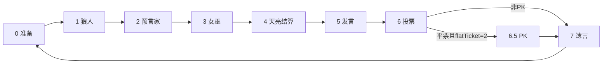
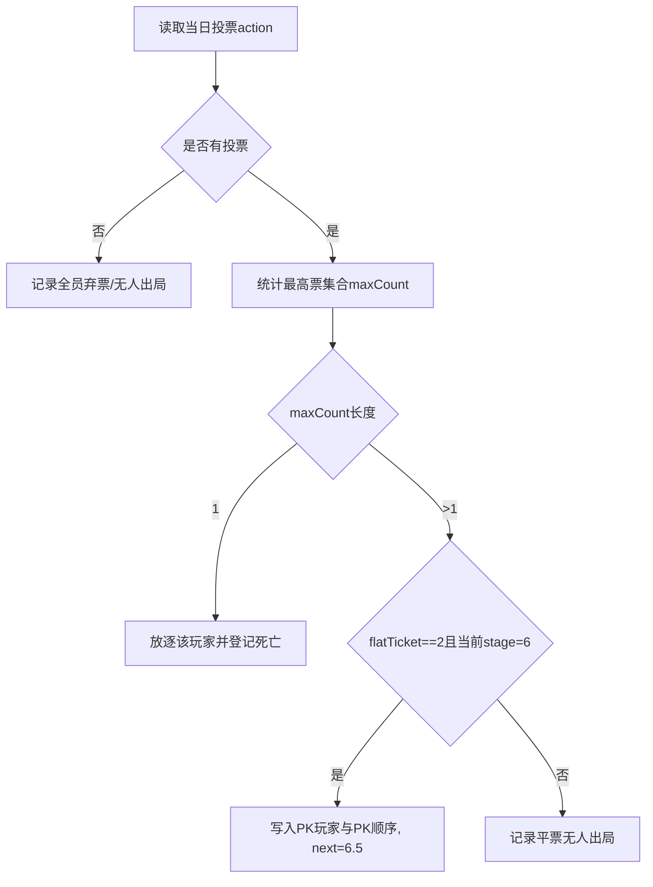
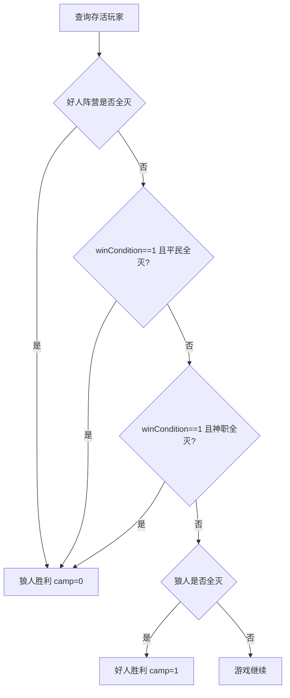
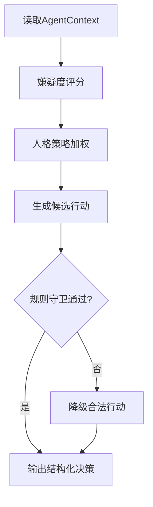
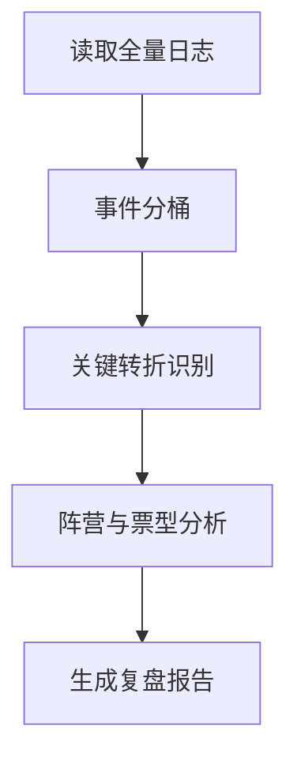
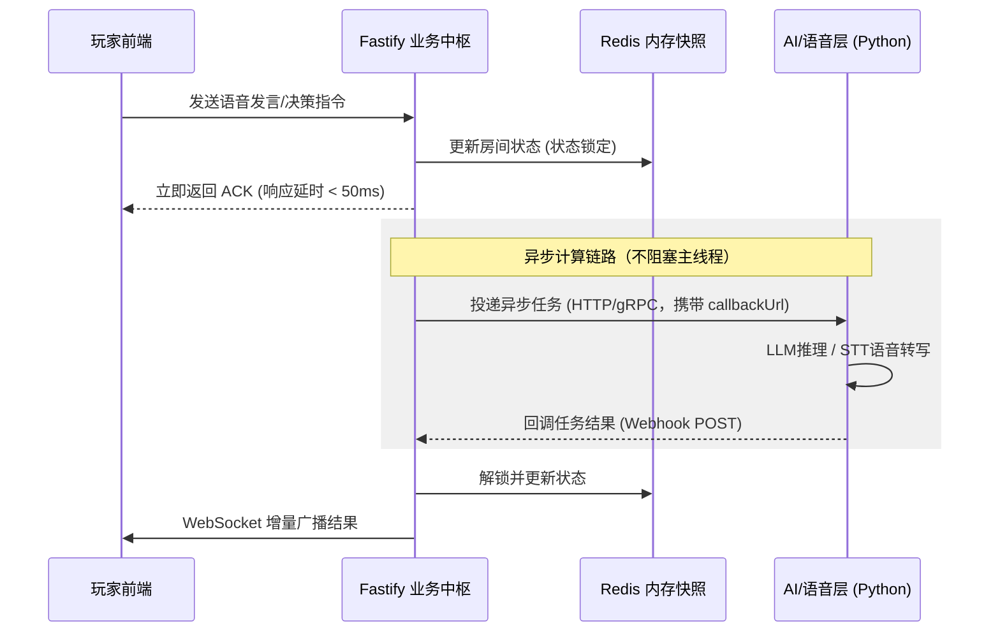
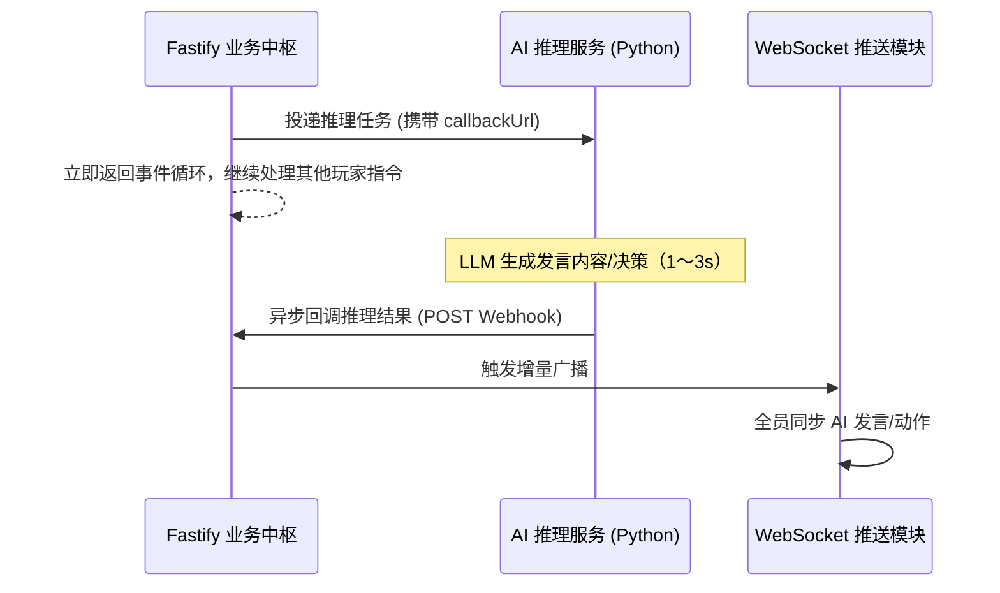

# 多智能体在线语音狼人杀系统 软件设计说明书（SDD）

## 1. 引言

### 1.1 编写目的
编写本软件设计说明书（Software Design Document, SDD）的主要目的，是将《多智能体在线语音狼人杀系统需求分析文档》中确定的各项业务需求、功能需求与非功能需求，转化为具体可执行的系统技术架构与模块设计方案。

本文档作为项目开发、测试与维护阶段的核心技术契约与指导准则，旨在：
1. **确立架构蓝图**：全面阐述系统的总体架构分层、运行环境与核心技术选型。
2. **划分模块边界**：明确后端游戏引擎、多智能体交互、实时通信与数据存储等核心模块的职责及内部逻辑。
3. **规范接口与数据**：统一规范前后端通信接口（REST & WebSocket）、数据库表结构及关键业务流转状态机。
4. **指导工程实践**：为项目开发团队的后续编码实现、系统集成、代码审查及自动化测试提供权威的技术依据。

**预期受众**：本项目开发团队全体成员、项目指导教师、系统架构评审人员、测试工程师，以及后续可能参与项目维护或二次开发的开发者。

### 1.2 项目背景与系统范围
**项目背景：**
传统桌面逻辑推理游戏“狼人杀”深受大众喜爱，但普遍面临线下组局困难、玩家凑不齐、复盘无记录等痛点。为解决这些问题，并探索大语言模型（LLM）在多智能体（Multi-Agent）非完全信息博弈场景中的应用潜力，本项目致力于开发一款高度拟真、支持人机协同协作的**在线多人语音推理与博弈平台——“多智能体在线语音狼人杀”**。

**系统范围：**
本系统不仅接管了传统狼人杀中繁琐的自动化发牌、昼夜流程控制与规则结算机制，其设计范围还将涵盖以下核心能力：
* **基础对局系统**：完整的用户体系、房间分配、6-12人标准局游戏状态机演进。
* **AI 玩家系统（Agent）**：基于大语言模型的 AI 玩家，具备独立视野、性格预设与自主推理决策能力，可随时填补空缺座位。
* **语音交互系统**：集成实时语音识别（STT）与语音合成（TTS）能力，打破人机交互的文本壁垒。
* **数据与复盘系统**：全链路对局日志记录，及基于 LLM 的赛后智能复盘分析。

### 1.3 设计目标与核心技术亮点
基于项目愿景，本系统的架构设计将重点围绕以下三大技术亮点展开：

1. **Multi-Agent 驱动的多智能体协同博弈**
   * **独立沙盒运行**：系统中每个 AI 玩家均作为一个独立的 Agent 实例运行，与其他玩家信息严格隔离（仅拥有自身视角的视野矩阵）。
   * **动态长效记忆（Memory）**：Agent 能够持续接收并理解对局中的聊天文本与行为事件，维持上下文连贯性。
   * **个性化心智模型**：具备独立决策能力，动态计算其他玩家的嫌疑度，并结合设定的性格特征（激进/保守/逻辑型）自动生成符合当前身份的伪装发言、投票决策及夜晚行动。

2. **实时语音识别（STT）与交互闭环**
   * 打通“人机语音屏障”，底层架构集成 STT 与 TTS 异步处理模块。
   * 真人玩家的实时语音流经系统降噪转写为文本供 AI 提取关键信息；AI 生成决策后，通过 TTS 转化为自然语音播报，形成无缝衔接的沉浸式音视频交互闭环。

3. **全栈日志记录与 AI 智能复盘**
   * 游戏引擎具备完整的事件溯源能力，将对局内的发言、票型、技能释放及阶段切换结构化落盘存储。
   * 对局结束后触发 AI 复盘引擎，以上帝视角或特定玩家视角生成包含票型逻辑、发言疑点分析的图文复盘报告。

### 1.4 术语、定义与缩略语
为避免阅读歧义，本文档涉及的技术缩略语及游戏领域特定术语统一定义如下：

<table align="center">
  <thead>
    <tr>
      <th>术语 / 缩写</th>
      <th>含义说明</th>
      <th>分类</th>
    </tr>
  </thead>
  <tbody>
    <tr>
      <td><strong>SDD</strong></td>
      <td>Software Design Document，软件设计说明书。</td>
      <td>技术</td>
    </tr>
    <tr>
      <td><strong>LLM</strong></td>
      <td>Large Language Model，大语言模型（如 GPT-4, 闭源/开源模型）。</td>
      <td>技术</td>
    </tr>
    <tr>
      <td><strong>STT / TTS</strong></td>
      <td>Speech-to-Text (语音转文本) / Text-to-Speech (文本转语音)。</td>
      <td>技术</td>
    </tr>
    <tr>
      <td><strong>Multi-Agent</strong></td>
      <td>多智能体系统，指多个具备自主决策能力的独立 AI 代理在同一环境中协同或博弈。</td>
      <td>技术</td>
    </tr>
    <tr>
      <td><strong>Room</strong></td>
      <td>房间，承载玩家组织与开局入口的容器，具备独立生命周期。</td>
      <td>业务</td>
    </tr>
    <tr>
      <td><strong>Game</strong></td>
      <td>一局游戏实例，包含阶段、天数、板子配置及胜负判定规则。</td>
      <td>业务</td>
    </tr>
    <tr>
      <td><strong>Player</strong></td>
      <td>某局内玩家的数据快照（与全局系统 User 解耦，包含角色、状态、技能等）。</td>
      <td>业务</td>
    </tr>
    <tr>
      <td><strong>Stage</strong></td>
      <td>游戏阶段标识（如 0/1/2/3/4/5/6/6.5/7），驱动状态机演进的核心依据。</td>
      <td>业务</td>
    </tr>
    <tr>
      <td><strong>GameTag</strong></td>
      <td>关键事件标签（如死亡事件、发言顺序、PK信息等结构化数据）。</td>
      <td>业务</td>
    </tr>
    <tr>
      <td><strong>性格预设</strong></td>
      <td>AI 玩家的行为倾向：<br>- <strong>激进型</strong>：倾向于冒险、主动发言与带节奏；<br>- <strong>保守型</strong>：倾向于谨慎、低调发言与随大流；<br>- <strong>逻辑型</strong>：倾向于严谨推理与数据驱动决策。</td>
      <td>业务</td>
    </tr>
  </tbody>
</table>

<p align="center">
  <em>表1-1 术语定义表</em>
</p>

### 1.5 参考资料
本文档的编写与设计决策主要参考以下资料：
1. 《多智能体在线语音狼人杀系统 需求分析文档 / PRD》（内部文档，前置产出物）
2. 狼人杀官方通用规则手册（6人局、9人局、12人标准局）
3. IEEE 1016-2009 Standard for Information Technology—Systems Design—Software Design Descriptions

### 1.6 文档结构
本设计说明书的后续章节将按照以下结构展开，由宏观到微观层层递进：
* **第 2~3 章（系统设计方案）**：描述系统的当前状态、总体分层架构、模块划分及软硬件技术选型。
* **第 5 章（模块与业务设计）**：详细说明核心子系统（如游戏状态机、房间管理、流程控制）的职责及核心业务时序图。
* **第 4、6 章（数据与接口设计）**：定义数据库实体模型（ER）、表结构、状态缓存方案，以及前后端交互接口及 WebSocket 协议。
* **第 7~8 章（评估与演进设计）**：对系统的非功能特性进行评估，并重点针对 AI 智能体、语音交互等未来扩展功能提供架构预留建议。

### 1.7 编写团队与版本记录

**编写团队：**
* **组长 / 主架构**：沈矜娴 (@Xiann127)
* **核心研发成员**：文就南 (@wenjiunan)、杨策华 (@chuizichaoren)、白纹菲 (@KPBLKPBL)、范盛颉 (@Louis-Dejavu)、雷熙澎 (@ray-055)

**修订记录（Version History）：**
<table align="center">
  <thead>
    <tr>
      <th>版本号</th>
      <th>修订日期</th>
      <th>修订人</th>
      <th>修订说明</th>
    </tr>
  </thead>
  <tbody>
    <tr>
      <td>V1.0.0</td>
      <td>2026-04-07</td>
      <td>编写团队</td>
      <td>初始版本草案完成，确立核心架构。</td>
    </tr>
    <tr>
      <td>V2.0.0</td>
      <td>2026-04-20</td>
      <td>编写团队</td>
      <td>完成系统架构的建设，以及核心功能、接口的详细设计内容。</td>
    </tr>
    <tr>
      <td>V3.0.0</td>
      <td>2026-04-25</td>
      <td>编写团队</td>
      <td>修正文档格式，更改HWCI配置，完善内容细节。</td>
    </tr>
  </tbody>
</table>

<p align="center">
  <em>表1-2 版本更新记录</em>
</p>

## 2. 系统设计目标与范围
本章明确本多智能体在线语音狼人杀系统的设计目标、当前实现范围及未实现的扩展范围，结合总体设计思路，界定系统设计的核心边界，为后续详细设计、开发实现及扩展迭代提供明确依据，确保设计工作与需求目标、实际开发进度保持一致。

### 2.1 系统设计目标
系统设计目标以需求文档为核心依据，结合技术选型与开发可行性，围绕**功能完整、架构清晰、可扩展、易维护**四大核心原则，具体设计目标如下：

1. **核心功能落地**：设计并实现用户登录认证、房间管理（创建、加入、入座等）、游戏全流程（开局、角色分配、昼夜阶段推进、技能结算、投票放逐、胜负判定）及对局记录查看等核心功能，确保游戏规则规范、流程顺畅，满足用户基础游玩需求。
2. **实时交互保障**：基于 WebSocket 技术设计房间级事件推送机制，实现游戏状态、阶段变化、倒计时等信息的实时同步，保障多用户在线交互的流畅性，减少延迟，提升用户体验。
3. **架构分层清晰**：采用前后端分离 + 单体后端服务模式，后端基于 Koa 框架设计自定义 MVC 装载器，按 `Controller/Service/Model` 分层架构，实现业务逻辑与数据访问解耦，提升代码可维护性与可扩展性。
4. **规则集中管控**：将游戏核心规则（阶段推进、技能执行、胜负判定等）集中封装于 `gameService` 与 `stageService`，控制器仅负责参数校验与服务调用编排，确保游戏规则的一致性、可复用性，便于后续规则优化与调整。
5. **预留扩展空间**：在架构设计中预留扩展接口，为后续 AI Agent 推理与行为生成、语音 STT/TTS 转换、复盘分析服务化、断线重连恢复机制等功能的扩展提供技术支撑，保障系统的可迭代性。
6. **权限分级管控**：设计并实现 `admin/host/player` 三级权限体系，明确各级角色的操作权限，确保系统操作的安全性与规范性。

### 2.2 系统实现范围
根据功能的作用，系统实现范围分为**核心功能**与**扩展功能**两部分，明确当前系统的开发进程，界定设计与开发的核心边界。

#### 2.2.1 核心功能范围
覆盖用户游玩全流程，具体包括：

1. **账号与权限管理**：实现账号登录功能，完成 `admin/host/player` 三级角色权限的基础配置，确保不同角色拥有对应操作权限。
2. **房间管理功能**：实现房间创建、通过房间码加入房间、玩家入座、房主踢人、观战模式、玩家退出房间等完整房间操作流程。
3. **游戏开局与角色分配**：支持房主发起开局，系统自动完成随机角色分配，同时初始化角色视野矩阵，符合狼人杀规则权限。
4. **游戏全流程推进**：实现昼夜阶段推进、夜晚技能释放、发言顺序控制、投票/PK 环节、遗言阶段、胜负判定。
5. **游戏结束与记录**：支持游戏结束、再来一局、对局记录查看，满足基础复盘需求。
6. **实时消息推送**：基于 WebSocket 实现房间级事件推送与夜晚阶段倒计时推送，保证多端状态实时同步。

#### 2.2.2 扩展功能范围
在核心流程的基础上拓展的功能，具体包括：

1. **AI Agent 模块**：AI 推理决策、行为生成、发言/投票/夜间操作模拟。
2. **语音交互功能**：STT 语音转文本、TTS 文本转语音，实现语音交互闭环。
3. **复盘分析服务化**：基于对局日志生成智能复盘报告与策略分析。
4. **断线重连恢复机制**：支持用户断线重连后恢复当前对局状态。

### 2.3 系统设计边界
结合总体设计思路与实现范围，明确系统设计边界：

1. **架构模式边界**：采用前后端分离 + 单体后端服务，暂不考虑分布式部署。
2. **后端技术边界**：后端基于 Koa 构建，使用自定义 MVC 装载器，严格按照 controller/service/model 三层结构组织代码，不引入额外复杂架构模式。
3. **业务逻辑边界**：所有狼人杀游戏规则、阶段控制、技能与投票逻辑统一集中在 gameService 和 stageService 实现；控制器仅负责参数校验、接口编排与结果返回，不嵌入核心规则逻辑。
4. **前端交互边界**：以房间页面为核心交互载体，前端通过 REST 接口拉取游戏状态数据，并通过 WebSocket 接收实时事件以触发界面刷新，不涉及多端同步与复杂状态管理框架。


## 3. 系统总体架构

### 3.1 架构设计思想
本系统当前采用前后端分离、后端分层组织的总体架构。前端负责房间界面展示、用户交互与状态呈现，后端统一承担业务控制、游戏流程调度、实时通信和数据持久化等职责。

考虑到狼人杀系统具有明显的阶段性、状态性和实时性特征，系统架构设计重点围绕以下三点展开：

1. **规则与界面分离**  ：将前端展示逻辑与后端游戏规则处理解耦，避免核心游戏流程依赖页面实现。
2. **业务处理与数据访问分离**  ：后端通过 Controller、Service、Model 的分层组织方式，将请求接入、业务处理和数据持久化区分开来，使系统结构更加清晰，也便于后续维护和扩展。
3. **实时交互与数据持久化并重**  ：由于游戏过程对实时性要求较高，因此系统通过 WebSocket 实现状态同步和消息推送；同时通过 MySQL 保存用户、房间和对局等关键数据，保证系统运行过程中数据可追踪、结果可查询。


### 3.2 架构分层
#### 3.2.1 整体架构图

<p align="center">
  
  <br>
  <em>图3-1 系统架构图</em>
</p>

#### 3.2.2 各层功能概述

1. **前端交互层**  ：表现层是系统面向用户的直接交互入口，主要负责用户界面展示、页面布局组织、玩家交互输入和游戏状态渲染等核心任务，并提供语音录制、语音播放以及阶段提示动画等前端交互内容。该层将基于 MobX 进行前端状态管理，使页面能够及时响应房间状态、玩家信息和游戏阶段的变化。
2. **接口与通信层** ：接口访问层主要通过 Axios 对前后端的 REST 接口进行统一封装，负责发送和接收登录认证、创建房间、加入房间、查询房间状态、获取对局记录等非实时请求，同时也为 AI 复盘数据获取、语音转写结果查询、文本转语音结果获取等扩展能力提供统一的请求入口。通过这一层的封装，可以减少页面组件对底层请求细节的直接依赖，同时便于后续统一处理 Token 注入、异常提示和请求重试等功能。
3. **后端业务处理层**：领域服务层是当前系统的核心业务层，承担房间管理、角色分配、投票统计、技能执行、胜负判定等关键规则处理任务，此外还负责AI Agent接入游戏流程的具体业务逻辑。由于本项目属于典型的状态驱动型博弈系统，昼夜切换、角色行动顺序、投票放逐和平票处理都要求统一的规则中枢，因此该层本质上承担了“游戏引擎”的职责。
4. **AI Agent推理层**：AI Agent 推理层主要用于支撑 AI 玩家在游戏过程中的行为模拟与发言生成。其中，Multi-Agent 协同用于支持多个 AI 玩家在同一对局中的并行决策；性格与记忆管理用于维护不同 AI 角色的行为风格、身份认知及历史信息；夜晚行动与投票决策用于生成 AI 在关键阶段的策略选择；发言生成负责根据当前局势输出符合角色身份和上下文的自然语言内容；复盘报告生成则面向赛后总结，对整局游戏过程进行整理和分析。
5. **语音服务层**：语音服务层是系统中负责音频处理与语音能力实现的独立服务层，主要服务于真人玩家语音输入和系统语音输出场景。其中，语音转文字用于将玩家语音发言转写为文本内容，供后端业务层和 AI 推理层进一步分析；文本转语音用于将 AI 发言内容转换为语音播放输出；降噪与分片处理用于提升音频识别质量并支持长语音的分段处理；播放控制则用于配合前端完成语音播报的顺序调度与状态控制。
6. **数据存储层** ：数据访问层基于 Redis 和 MySQL 实现，负责用户信息、房间信息、游戏记录等结构化数据的持久化存储。通过 ORM 方式访问数据库，可以降低业务逻辑与底层 SQL 的耦合程度，也有利于后续数据模型的维护与调整。Redis 主要用于存储房间状态、阶段进度、倒计时、在线状态以及 AI 的临时记忆等高频读写数据，以满足狼人杀对局中低延迟、高并发的实时处理需求。


### 3.3 软件配置项CSCI

<table align="center">
  <thead>
    <tr>
      <th>CSCI编号</th>
      <th>名称</th>
      <th>主要职责</th>
      <th>技术组成</th>
      <th>对外接口/交互对象</th>
    </tr>
  </thead>
  <tbody>
    <tr>
      <td>CSCI－01</td>
      <td>前端交互客户端</td>
      <td>负责登录、大厅、房间、游戏主界面、投票面板、夜晚行动界面、AI复盘界面的展示；接收玩家、房主、管理员操作；完成语音录制、文本展示和语音播放</td>
      <td>React 18、MobX 6、Axios、WebSocket、MediaRecorder</td>
      <td>与游戏逻辑服务通过 RESTful API 和 WebSocket 交互；与语音服务通过音频上传链路间接交互</td>
    </tr>
    <tr>
      <td>CSCI－02</td>
      <td>游戏逻辑服务</td>
      <td>负责用户与房间管理、JWT 认证、角色分配、游戏状态机流转、技能结算、投票统计、胜负判定、日志记录与复盘调度；统一调度 AI 与语音服务</td>
      <td>Node.js、Fastify、WebSocket、状态机/自动化法官机制</td>
      <td>对前提供 RESTful API 与 WebSocket 服务；向 AI Agent 推理服务发起推理请求；向语音服务发起 STT/TTS 请求；读写 MySQL/Redis</td>
    </tr>
    <tr>
      <td>CSCI－03</td>
      <td>AI Agent推理服务</td>
      <td>负责 AI 玩家生成、性格设定、上下文记忆维护、发言生成、投票决策、夜晚行动决策，以及赛后 AI 复盘分析</td>
      <td>Python 3.10+、FastAPI、Prompt Engineering</td>
      <td>接收游戏逻辑服务传入的游戏上下文；返回 AI 发言、投票、行动和复盘结果；读取/写入部分上下文与结果数据</td>
    </tr>
    <tr>
      <td>CSCI－04</td>
      <td>语音STT/TTS服务</td>
      <td>负责玩家语音输入的语音转文字（STT）处理，以及 AI 发言和系统提示的文本转语音（TTS）处理；负责降噪、分片处理和播放控制相关能力</td>
      <td>Python 3.10+、FastAPI、OpenAI Whisper</td>
      <td>接收前端上传的音频或经游戏逻辑服务转发的语音请求；向游戏逻辑服务返回转写文本或语音结果；回写音频处理状态与文本结果</td>
    </tr>
    <tr>
      <td>CSCI－05</td>
      <td>数据存储与缓存服务</td>
      <td>负责系统结构化数据持久化、实时状态缓存与共享；支撑房间状态、对局记录、日志、AI 临时记忆和复盘结果的存储</td>
      <td>MySQL 8.0、Redis</td>
      <td>为游戏逻辑服务提供用户、房间、对局、日志读写；为 AI 服务提供上下文与结果存取；为语音服务提供转写文本、音频状态和索引存储</td>
    </tr>
  </tbody>
</table>


<p align="center">
  <em>表3-1 软件配置项 CSCI</em>
</p>


### 3.4 硬件配置项HWCI
根据当前组内部署安排，系统将采用 3 个自建节点，按照实际占用的独立主机统计HWCI配置。

<table align="center">
  <thead>
    <tr>
      <th>HWCI编号</th>
      <th>部署节点名称</th>
      <th>规格</th>
      <th>部署内容与用途说明</th>
    </tr>
  </thead>
  <tbody>
    <tr>
      <td>HWCI-01</td>
      <td>前端交互服务器</td>
      <td>2 核 CPU / 4GB 内存 / 100GB SSD</td>
      <td>部署前端静态资源与反向代理入口，承载网页访问与静态资源分发。</td>
    </tr>
    <tr>
      <td>HWCI-02</td>
      <td>后端与数据服务器</td>
      <td>8 核 CPU / 16GB 内存 / 500GB SSD</td>
      <td>部署游戏逻辑服务（含 WebSocket）、语音交互服务、MySQL、Redis，统一承载业务处理、状态缓存与数据持久化。</td>
    </tr>
    <tr>
      <td>HWCI-03</td>
      <td>AI 推理服务器</td>
      <td>8 核 GPU / 32GB 内存 / 500GB SSD</td>
      <td>部署 AI Agent 推理服务，负责上下文构建、发言生成、投票与夜间行动决策。</td>
    </tr>
  </tbody>
</table>

<p align="center">
  <em>表3-2 硬件配置项 HWCI</em>
</p>


### 3.5 CSCI/HWCI部署关系表
<table align="center">
  <thead>
    <tr>
      <th>CSCI编号</th>
      <th>CSCI名称</th>
      <th>部署HWCI</th>
      <th>部署关系说明</th>
    </tr>
  </thead>
  <tbody>
    <tr>
      <td>CSCI－01</td>
      <td>前端交互客户端</td>
      <td>HWCI-01</td>
      <td>前端静态页面、脚本和样式资源部署在前端服务器上，供用户浏览器访问</td>
    </tr>
    <tr>
      <td>CSCI－02</td>
      <td>游戏逻辑服务</td>
      <td>HWCI-02</td>
      <td>游戏逻辑服务部署在后端与数据服务器，向上对接前端客户端，向下调用 AI 推理服务和语音服务，并访问数据库与缓存</td>
    </tr>
    <tr>
      <td>CSCI－03</td>
      <td>AI Agent推理服务</td>
      <td>HWCI-03</td>
      <td>AI Agent 推理服务独立部署于 AI 推理服务器，由游戏逻辑服务按阶段触发调用</td>
    </tr>
    <tr>
      <td>CSCI－04</td>
      <td>语音STT/TTS服务</td>
      <td>HWCI-02</td>
      <td>语音服务部署于后端与数据服务器，接收前端语音输入或后端 TTS 请求，并将处理结果返回游戏逻辑服务</td>
    </tr>
    <tr>
      <td>CSCI－05</td>
      <td>数据存储与缓存服务</td>
      <td>HWCI-02</td>
      <td>MySQL 与 Redis 与后端服务同机部署，为游戏逻辑服务、AI 推理服务和语音服务提供结构化数据存储支撑，同时为 AI 推理服务提供临时记忆和状态共享支持</td>
    </tr>
  </tbody>
</table>

<p align="center">
  <em>表3-3 CSCI/HWCI 部署关系表</em>
</p>

## 4.数据结构设计
### 4.1 数据库基本信息
<table align="center">
  <thead>
    <tr>
      <th>项次</th>
      <th>信息</th>
    </tr>
  </thead>
  <tbody>
    <tr>
      <td>数据库名称</td>
      <td>werewolf</td>
    </tr>
    <tr>
      <td>字符集</td>
      <td>utf8mb4（支持emoji表情）</td>
    </tr>
    <tr>
      <td>排序规则</td>
      <td>utf8mb4_unicode_ci</td>
    </tr>
    <tr>
      <td>兼容版本</td>
      <td>MySQL 8.0+，MySQL 5.7（需支持JSON类型）</td>
    </tr>
    <tr>
      <td>存储引擎</td>
      <td>InnoDB</td>
    </tr>
    <tr>
      <td>设计模式</td>
      <td>逻辑删除（<code>isDelete</code>字段）、审计字段（创建/修改时间、操作人）</td>
    </tr>
  </tbody>
</table>

<p align="center">
  <em>表4-1 数据库基本信息</em>
</p>

### 4.2 数据表总览
本数据库共**12张表**，分为**系统权限管理**和**狼人杀核心业务**两大模块：

#### 4.2.1 系统权限管理模块（5张）
<table align="center">
  <thead>
    <tr>
      <th>表名</th>
      <th>表注释</th>
    </tr>
  </thead>
  <tbody>
    <tr>
      <td>lcoco_user</td>
      <td>系统用户表</td>
    </tr>
    <tr>
      <td>lcoco_role</td>
      <td>系统角色表</td>
    </tr>
    <tr>
      <td>lcoco_route</td>
      <td>前端路由表</td>
    </tr>
    <tr>
      <td>lcoco_ui_permission</td>
      <td>UI界面权限表</td>
    </tr>
    <tr>
      <td>lcoco_url_permission</td>
      <td>后端接口权限表</td>
    </tr>
  </tbody>
</table>

<p align="center">
  <em>表4-2 系统权限管理模块分类</em>
</p>

#### 4.2.2 狼人杀核心业务模块（7张）
<table align="center">
  <thead>
    <tr>
      <th>表名</th>
      <th>表注释</th>
    </tr>
  </thead>
  <tbody>
    <tr>
      <td>lcoco_room</td>
      <td>游戏房间表</td>
    </tr>
    <tr>
      <td>lcoco_game</td>
      <td>游戏对局表</td>
    </tr>
    <tr>
      <td>lcoco_player</td>
      <td>游戏玩家表</td>
    </tr>
    <tr>
      <td>lcoco_vision</td>
      <td>玩家视野权限表</td>
    </tr>
    <tr>
      <td>lcoco_action</td>
      <td>玩家行为记录表</td>
    </tr>
    <tr>
      <td>lcoco_game_tag</td>
      <td>游戏状态标签表</td>
    </tr>
    <tr>
      <td>lcoco_record</td>
      <td>游戏流程记录表</td>
    </tr>
  </tbody>
</table>

<p align="center">
  <em>表4-3 狼人杀核心业务模块分类</em>
</p>

### 4.3 详细表结构设计
#### 4.3.1 系统权限管理模块
#### 4.3.1.1 lcoco_user（系统用户表）
存储系统后台/游戏用户的基础信息、角色权限、状态等。

<table align="center">
  <thead>
    <tr>
      <th>字段名</th>
      <th>数据类型</th>
      <th>约束</th>
      <th>默认值</th>
      <th>字段注释</th>
    </tr>
  </thead>
  <tbody>
    <tr>
      <td>_id</td>
      <td>BIGINT UNSIGNED</td>
      <td>PK, AUTO_INCREMENT</td>
      <td>-</td>
      <td>主键ID</td>
    </tr>
    <tr>
      <td>username</td>
      <td>VARCHAR(64)</td>
      <td>NOT NULL, UNIQUE</td>
      <td>-</td>
      <td>用户名（唯一）</td>
    </tr>
    <tr>
      <td>password</td>
      <td>VARCHAR(255)</td>
      <td>NOT NULL</td>
      <td>-</td>
      <td>密码（加密存储）</td>
    </tr>
    <tr>
      <td>name</td>
      <td>VARCHAR(64)</td>
      <td>NOT NULL</td>
      <td>空字符串</td>
      <td>昵称/真实姓名</td>
    </tr>
    <tr>
      <td>roles</td>
      <td>JSON</td>
      <td>NULL</td>
      <td>-</td>
      <td>绑定的角色列表</td>
    </tr>
    <tr>
      <td>defaultRoleName</td>
      <td>VARCHAR(32)</td>
      <td>NULL</td>
      <td>-</td>
      <td>默认角色名称</td>
    </tr>
    <tr>
      <td>defaultRole</td>
      <td>VARCHAR(32)</td>
      <td>NULL</td>
      <td>-</td>
      <td>默认角色标识</td>
    </tr>
    <tr>
      <td>remark</td>
      <td>VARCHAR(255)</td>
      <td>NULL</td>
      <td>-</td>
      <td>备注</td>
    </tr>
    <tr>
      <td>status</td>
      <td>INT</td>
      <td>NOT NULL</td>
      <td>1</td>
      <td>状态（1-正常，0-禁用）</td>
    </tr>
    <tr>
      <td>createTime</td>
      <td>DATETIME</td>
      <td>NOT NULL</td>
      <td>CURRENT_TIMESTAMP</td>
      <td>创建时间</td>
    </tr>
    <tr>
      <td>modifyTime</td>
      <td>DATETIME</td>
      <td>NOT NULL</td>
      <td>CURRENT_TIMESTAMP ON UPDATE</td>
      <td>更新时间</td>
    </tr>
    <tr>
      <td>createId</td>
      <td>INT</td>
      <td>NOT NULL</td>
      <td>1</td>
      <td>创建人ID</td>
    </tr>
    <tr>
      <td>modifyId</td>
      <td>INT</td>
      <td>NOT NULL</td>
      <td>1</td>
      <td>修改人ID</td>
    </tr>
    <tr>
      <td>isDelete</td>
      <td>TINYINT(1)</td>
      <td>NOT NULL</td>
      <td>0</td>
      <td>逻辑删除（0-未删除，1-已删除）</td>
    </tr>
  </tbody>
</table>

<p align="center">
  <em>表4-4 系统用户表</em>
</p>

**索引**：
- 主键：`PRIMARY KEY (_id)`
- 唯一索引：`uk_user_username (username)`
- 普通索引：`idx_user_status (status)`

---

#### 4.3.1.2 lcoco_role（系统角色表）
存储系统权限角色，用于权限分组管理。

<table align="center">
  <thead>
    <tr>
      <th>字段名</th>
      <th>数据类型</th>
      <th>约束</th>
      <th>默认值</th>
      <th>字段注释</th>
    </tr>
  </thead>
  <tbody>
    <tr>
      <td>_id</td>
      <td>BIGINT UNSIGNED</td>
      <td>PK, AUTO_INCREMENT</td>
      <td>-</td>
      <td>主键ID</td>
    </tr>
    <tr>
      <td>key</td>
      <td>VARCHAR(32)</td>
      <td>NOT NULL, UNIQUE</td>
      <td>-</td>
      <td>角色唯一标识</td>
    </tr>
    <tr>
      <td>name</td>
      <td>VARCHAR(32)</td>
      <td>NOT NULL</td>
      <td>空字符串</td>
      <td>角色名称</td>
    </tr>
    <tr>
      <td>status</td>
      <td>INT</td>
      <td>NOT NULL</td>
      <td>1</td>
      <td>状态（1-正常，0-禁用）</td>
    </tr>
    <tr>
      <td>remark</td>
      <td>VARCHAR(255)</td>
      <td>NULL</td>
      <td>-</td>
      <td>备注</td>
    </tr>
    <tr>
      <td>createTime</td>
      <td>DATETIME</td>
      <td>NOT NULL</td>
      <td>CURRENT_TIMESTAMP</td>
      <td>创建时间</td>
    </tr>
    <tr>
      <td>modifyTime</td>
      <td>DATETIME</td>
      <td>NOT NULL</td>
      <td>CURRENT_TIMESTAMP ON UPDATE</td>
      <td>更新时间</td>
    </tr>
    <tr>
      <td>createId</td>
      <td>INT</td>
      <td>NOT NULL</td>
      <td>1</td>
      <td>创建人ID</td>
    </tr>
    <tr>
      <td>modifyId</td>
      <td>INT</td>
      <td>NOT NULL</td>
      <td>1</td>
      <td>修改人ID</td>
    </tr>
    <tr>
      <td>isDelete</td>
      <td>TINYINT(1)</td>
      <td>NOT NULL</td>
      <td>0</td>
      <td>逻辑删除</td>
    </tr>
  </tbody>
</table>

<p align="center">
  <em>表4-5 系统角色表</em>
</p>

**索引**：
- 主键：`PRIMARY KEY (_id)`
- 唯一索引：`uk_role_key (key)`
- 普通索引：`idx_role_status (status)`

---

#### 4.3.1.3 lcoco_route（前端路由表）
存储前端页面路由，控制页面访问权限。

<table align="center">
  <thead>
    <tr>
      <th>字段名</th>
      <th>数据类型</th>
      <th>约束</th>
      <th>默认值</th>
      <th>字段注释</th>
    </tr>
  </thead>
  <tbody>
    <tr>
      <td>_id</td>
      <td>BIGINT UNSIGNED</td>
      <td>PK, AUTO_INCREMENT</td>
      <td>-</td>
      <td>主键ID</td>
    </tr>
    <tr>
      <td>key</td>
      <td>VARCHAR(64)</td>
      <td>NOT NULL</td>
      <td>空字符串</td>
      <td>路由标识</td>
    </tr>
    <tr>
      <td>path</td>
      <td>VARCHAR(128)</td>
      <td>NOT NULL, UNIQUE</td>
      <td>-</td>
      <td>路由路径</td>
    </tr>
    <tr>
      <td>name</td>
      <td>VARCHAR(64)</td>
      <td>NOT NULL</td>
      <td>管理后台</td>
      <td>路由名称</td>
    </tr>
    <tr>
      <td>roles</td>
      <td>JSON</td>
      <td>NULL</td>
      <td>-</td>
      <td>允许访问的角色列表</td>
    </tr>
    <tr>
      <td>exact</td>
      <td>TINYINT(1)</td>
      <td>NOT NULL</td>
      <td>1</td>
      <td>精准匹配标识</td>
    </tr>
    <tr>
      <td>backUrl</td>
      <td>VARCHAR(128)</td>
      <td>NOT NULL</td>
      <td>/403</td>
      <td>无权限跳转地址</td>
    </tr>
    <tr>
      <td>status</td>
      <td>INT</td>
      <td>NOT NULL</td>
      <td>1</td>
      <td>状态</td>
    </tr>
    <tr>
      <td>createTime</td>
      <td>DATETIME</td>
      <td>NOT NULL</td>
      <td>CURRENT_TIMESTAMP</td>
      <td>创建时间</td>
    </tr>
    <tr>
      <td>modifyTime</td>
      <td>DATETIME</td>
      <td>NOT NULL</td>
      <td>CURRENT_TIMESTAMP ON UPDATE</td>
      <td>更新时间</td>
    </tr>
    <tr>
      <td>createId</td>
      <td>INT</td>
      <td>NOT NULL</td>
      <td>1</td>
      <td>创建人ID</td>
    </tr>
    <tr>
      <td>modifyId</td>
      <td>INT</td>
      <td>NOT NULL</td>
      <td>1</td>
      <td>修改人ID</td>
    </tr>
    <tr>
      <td>isDelete</td>
      <td>TINYINT(1)</td>
      <td>NOT NULL</td>
      <td>0</td>
      <td>逻辑删除</td>
    </tr>
  </tbody>
</table>

<p align="center">
  <em>表4-6 前端路由表</em>
</p>

**索引**：
- 主键：`PRIMARY KEY (_id)`
- 唯一索引：`uk_route_path (path)`
- 普通索引：`idx_route_status (status)`

---

#### 4.3.1.4 lcoco_ui_permission（UI界面权限表）
存储前端按钮、组件等UI元素的权限控制。

<table align="center">
  <thead>
    <tr>
      <th>字段名</th>
      <th>数据类型</th>
      <th>约束</th>
      <th>默认值</th>
      <th>字段注释</th>
    </tr>
  </thead>
  <tbody>
    <tr>
      <td>_id</td>
      <td>BIGINT UNSIGNED</td>
      <td>PK, AUTO_INCREMENT</td>
      <td>-</td>
      <td>主键ID</td>
    </tr>
    <tr>
      <td>key</td>
      <td>VARCHAR(64)</td>
      <td>NOT NULL, UNIQUE</td>
      <td>-</td>
      <td>权限唯一标识</td>
    </tr>
    <tr>
      <td>name</td>
      <td>VARCHAR(64)</td>
      <td>NOT NULL</td>
      <td>空字符串</td>
      <td>权限名称</td>
    </tr>
    <tr>
      <td>roles</td>
      <td>JSON</td>
      <td>NULL</td>
      <td>-</td>
      <td>拥有权限的角色列表</td>
    </tr>
    <tr>
      <td>type</td>
      <td>VARCHAR(32)</td>
      <td>NOT NULL</td>
      <td>button</td>
      <td>权限类型（按钮/组件）</td>
    </tr>
    <tr>
      <td>status</td>
      <td>INT</td>
      <td>NOT NULL</td>
      <td>1</td>
      <td>状态</td>
    </tr>
    <tr>
      <td>remark</td>
      <td>VARCHAR(255)</td>
      <td>NULL</td>
      <td>-</td>
      <td>备注</td>
    </tr>
    <tr>
      <td>createTime</td>
      <td>DATETIME</td>
      <td>NOT NULL</td>
      <td>CURRENT_TIMESTAMP</td>
      <td>创建时间</td>
    </tr>
    <tr>
      <td>modifyTime</td>
      <td>DATETIME</td>
      <td>NOT NULL</td>
      <td>CURRENT_TIMESTAMP ON UPDATE</td>
      <td>更新时间</td>
    </tr>
    <tr>
      <td>createId</td>
      <td>INT</td>
      <td>NOT NULL</td>
      <td>1</td>
      <td>创建人ID</td>
    </tr>
    <tr>
      <td>modifyId</td>
      <td>INT</td>
      <td>NOT NULL</td>
      <td>1</td>
      <td>修改人ID</td>
    </tr>
    <tr>
      <td>isDelete</td>
      <td>TINYINT(1)</td>
      <td>NOT NULL</td>
      <td>0</td>
      <td>逻辑删除</td>
    </tr>
  </tbody>
</table>

<p align="center">
  <em>表4-7 UI界面权限表</em>
</p>

**索引**：
- 主键：`PRIMARY KEY (_id)`
- 唯一索引：`uk_ui_permission_key (key)`
- 普通索引：`idx_ui_permission_status (status)`

---

#### 4.3.1.5 lcoco_url_permission（后端接口权限表）
存储后端API接口的访问权限控制。

<table align="center">
  <thead>
    <tr>
      <th>字段名</th>
      <th>数据类型</th>
      <th>约束</th>
      <th>默认值</th>
      <th>字段注释</th>
    </tr>
  </thead>
  <tbody>
    <tr>
      <td>_id</td>
      <td>BIGINT UNSIGNED</td>
      <td>PK, AUTO_INCREMENT</td>
      <td>-</td>
      <td>主键ID</td>
    </tr>
    <tr>
      <td>key</td>
      <td>VARCHAR(64)</td>
      <td>NOT NULL, UNIQUE</td>
      <td>-</td>
      <td>接口权限标识</td>
    </tr>
    <tr>
      <td>name</td>
      <td>VARCHAR(64)</td>
      <td>NOT NULL</td>
      <td>空字符串</td>
      <td>接口名称</td>
    </tr>
    <tr>
      <td>roles</td>
      <td>JSON</td>
      <td>NULL</td>
      <td>-</td>
      <td>允许访问的角色列表</td>
    </tr>
    <tr>
      <td>type</td>
      <td>VARCHAR(32)</td>
      <td>NOT NULL</td>
      <td>button</td>
      <td>权限类型</td>
    </tr>
    <tr>
      <td>status</td>
      <td>INT</td>
      <td>NOT NULL</td>
      <td>1</td>
      <td>状态</td>
    </tr>
    <tr>
      <td>remark</td>
      <td>VARCHAR(255)</td>
      <td>NULL</td>
      <td>-</td>
      <td>备注</td>
    </tr>
    <tr>
      <td>createTime</td>
      <td>DATETIME</td>
      <td>NOT NULL</td>
      <td>CURRENT_TIMESTAMP</td>
      <td>创建时间</td>
    </tr>
    <tr>
      <td>modifyTime</td>
      <td>DATETIME</td>
      <td>NOT NULL</td>
      <td>CURRENT_TIMESTAMP ON UPDATE</td>
      <td>更新时间</td>
    </tr>
    <tr>
      <td>createId</td>
      <td>INT</td>
      <td>NOT NULL</td>
      <td>1</td>
      <td>创建人ID</td>
    </tr>
    <tr>
      <td>modifyId</td>
      <td>INT</td>
      <td>NOT NULL</td>
      <td>1</td>
      <td>修改人ID</td>
    </tr>
    <tr>
      <td>isDelete</td>
      <td>TINYINT(1)</td>
      <td>NOT NULL</td>
      <td>0</td>
      <td>逻辑删除</td>
    </tr>
  </tbody>
</table>

<p align="center">
  <em>表4-8 后端接口权限表</em>
</p>

**索引**：
- 主键：`PRIMARY KEY (_id)`
- 唯一索引：`uk_url_permission_key (key)`
- 普通索引：`idx_url_permission_status (status)`

---

#### 4.3.2 狼人杀核心业务模块
#### 4.3.2.1 lcoco_room（游戏房间表）
存储狼人杀游戏房间的基础信息、玩家席位、状态等。

<table align="center">
  <thead>
    <tr>
      <th>字段名</th>
      <th>数据类型</th>
      <th>约束</th>
      <th>默认值</th>
      <th>字段注释</th>
    </tr>
  </thead>
  <tbody>
    <tr>
      <td>_id</td>
      <td>BIGINT UNSIGNED</td>
      <td>PK, AUTO_INCREMENT</td>
      <td>-</td>
      <td>主键ID</td>
    </tr>
    <tr>
      <td>name</td>
      <td>VARCHAR(64)</td>
      <td>NOT NULL</td>
      <td>狼人杀房间</td>
      <td>房间名称</td>
    </tr>
    <tr>
      <td>status</td>
      <td>INT</td>
      <td>NOT NULL</td>
      <td>0</td>
      <td>房间状态</td>
    </tr>
    <tr>
      <td>gameId</td>
      <td>BIGINT UNSIGNED</td>
      <td>NULL</td>
      <td>-</td>
      <td>关联对局ID</td>
    </tr>
    <tr>
      <td>password</td>
      <td>VARCHAR(16)</td>
      <td>NOT NULL</td>
      <td>-</td>
      <td>房间密码</td>
    </tr>
    <tr>
      <td>owner</td>
      <td>VARCHAR(64)</td>
      <td>NOT NULL</td>
      <td>-</td>
      <td>房主用户名</td>
    </tr>
    <tr>
      <td>v1~v12</td>
      <td>VARCHAR(64)</td>
      <td>NULL</td>
      <td>-</td>
      <td>1-12号席位玩家用户名</td>
    </tr>
    <tr>
      <td>count</td>
      <td>INT</td>
      <td>NOT NULL</td>
      <td>12</td>
      <td>最大玩家数</td>
    </tr>
    <tr>
      <td>wait</td>
      <td>JSON</td>
      <td>NULL</td>
      <td>-</td>
      <td>等待列表</td>
    </tr>
    <tr>
      <td>ob</td>
      <td>JSON</td>
      <td>NULL</td>
      <td>-</td>
      <td>观战列表</td>
    </tr>
    <tr>
      <td>remark</td>
      <td>VARCHAR(255)</td>
      <td>NULL</td>
      <td>-</td>
      <td>备注</td>
    </tr>
    <tr>
      <td>createTime</td>
      <td>DATETIME</td>
      <td>NOT NULL</td>
      <td>CURRENT_TIMESTAMP</td>
      <td>创建时间</td>
    </tr>
    <tr>
      <td>modifyTime</td>
      <td>DATETIME</td>
      <td>NOT NULL</td>
      <td>CURRENT_TIMESTAMP ON UPDATE</td>
      <td>更新时间</td>
    </tr>
    <tr>
      <td>createId</td>
      <td>INT</td>
      <td>NOT NULL</td>
      <td>1</td>
      <td>创建人ID</td>
    </tr>
    <tr>
      <td>modifyId</td>
      <td>INT</td>
      <td>NOT NULL</td>
      <td>1</td>
      <td>修改人ID</td>
    </tr>
    <tr>
      <td>isDelete</td>
      <td>TINYINT(1)</td>
      <td>NOT NULL</td>
      <td>0</td>
      <td>逻辑删除</td>
    </tr>
  </tbody>
</table>

<p align="center">
  <em>表4-9 游戏房间表</em>
</p>

**索引**：
- 主键：`PRIMARY KEY (_id)`
- 普通索引：`idx_room_password (password)`、`idx_room_owner (owner)`、`idx_room_status (status)`

---

#### 4.3.2.2 lcoco_game（游戏对局表）
存储单局狼人杀游戏的配置、进程、结果等核心信息。

<table align="center">
  <thead>
    <tr>
      <th>字段名</th>
      <th>数据类型</th>
      <th>约束</th>
      <th>默认值</th>
      <th>字段注释</th>
    </tr>
  </thead>
  <tbody>
    <tr>
      <td>_id</td>
      <td>BIGINT UNSIGNED</td>
      <td>PK, AUTO_INCREMENT</td>
      <td>-</td>
      <td>主键ID</td>
    </tr>
    <tr>
      <td>roomId</td>
      <td>BIGINT UNSIGNED</td>
      <td>NOT NULL</td>
      <td>-</td>
      <td>关联房间ID</td>
    </tr>
    <tr>
      <td>owner</td>
      <td>VARCHAR(64)</td>
      <td>NOT NULL</td>
      <td>-</td>
      <td>房主</td>
    </tr>
    <tr>
      <td>status</td>
      <td>INT</td>
      <td>NOT NULL</td>
      <td>1</td>
      <td>对局状态</td>
    </tr>
    <tr>
      <td>stage</td>
      <td>DECIMAL(4,1)</td>
      <td>NOT NULL</td>
      <td>0.0</td>
      <td>当前游戏阶段</td>
    </tr>
    <tr>
      <td>day</td>
      <td>INT</td>
      <td>NOT NULL</td>
      <td>1</td>
      <td>当前天数</td>
    </tr>
    <tr>
      <td>v1~v12</td>
      <td>VARCHAR(64)</td>
      <td>NULL</td>
      <td>-</td>
      <td>1-12号玩家身份配置</td>
    </tr>
    <tr>
      <td>winner</td>
      <td>INT</td>
      <td>NOT NULL</td>
      <td>-1</td>
      <td>获胜方（-1-未结束）</td>
    </tr>
    <tr>
      <td>mode</td>
      <td>VARCHAR(32)</td>
      <td>NOT NULL</td>
      <td>standard_9</td>
      <td>游戏模式</td>
    </tr>
    <tr>
      <td>playerCount</td>
      <td>INT</td>
      <td>NOT NULL</td>
      <td>9</td>
      <td>玩家数量</td>
    </tr>
    <tr>
      <td>witchSaveSelf</td>
      <td>INT</td>
      <td>NOT NULL</td>
      <td>1</td>
      <td>女巫是否能自救</td>
    </tr>
    <tr>
      <td>winCondition</td>
      <td>INT</td>
      <td>NOT NULL</td>
      <td>1</td>
      <td>胜利条件</td>
    </tr>
    <tr>
      <td>flatTicket</td>
      <td>INT</td>
      <td>NOT NULL</td>
      <td>1</td>
      <td>平票规则</td>
    </tr>
    <tr>
      <td>p1/p2/p3</td>
      <td>INT</td>
      <td>NOT NULL</td>
      <td>30/45/30</td>
      <td>阶段计时配置</td>
    </tr>
    <tr>
      <td>remark</td>
      <td>VARCHAR(255)</td>
      <td>NULL</td>
      <td>-</td>
      <td>备注</td>
    </tr>
    <tr>
      <td>createTime</td>
      <td>DATETIME</td>
      <td>NOT NULL</td>
      <td>CURRENT_TIMESTAMP</td>
      <td>创建时间</td>
    </tr>
    <tr>
      <td>modifyTime</td>
      <td>DATETIME</td>
      <td>NOT NULL</td>
      <td>CURRENT_TIMESTAMP ON UPDATE</td>
      <td>更新时间</td>
    </tr>
    <tr>
      <td>createId</td>
      <td>INT</td>
      <td>NOT NULL</td>
      <td>1</td>
      <td>创建人ID</td>
    </tr>
    <tr>
      <td>modifyId</td>
      <td>INT</td>
      <td>NOT NULL</td>
      <td>1</td>
      <td>修改人ID</td>
    </tr>
    <tr>
      <td>isDelete</td>
      <td>TINYINT(1)</td>
      <td>NOT NULL</td>
      <td>0</td>
      <td>逻辑删除</td>
    </tr>
  </tbody>
</table>

<p align="center">
  <em>表4-10 游戏对局表</em>
</p>

**索引**：
- 主键：`PRIMARY KEY (_id)`
- 普通索引：`idx_game_room (roomId)`、`idx_game_status (status)`、`idx_game_day_stage (day, stage)`

---

#### 4.3.2.3 lcoco_player（游戏玩家表）
存储单局游戏中每个玩家的身份、阵营、状态、位置等信息。

<table align="center">
  <thead>
    <tr>
      <th>字段名</th>
      <th>数据类型</th>
      <th>约束</th>
      <th>默认值</th>
      <th>字段注释</th>
    </tr>
  </thead>
  <tbody>
    <tr>
      <td>_id</td>
      <td>BIGINT UNSIGNED</td>
      <td>PK, AUTO_INCREMENT</td>
      <td>-</td>
      <td>主键ID</td>
    </tr>
    <tr>
      <td>roomId</td>
      <td>BIGINT UNSIGNED</td>
      <td>NOT NULL</td>
      <td>-</td>
      <td>关联房间ID</td>
    </tr>
    <tr>
      <td>gameId</td>
      <td>BIGINT UNSIGNED</td>
      <td>NOT NULL</td>
      <td>-</td>
      <td>关联对局ID</td>
    </tr>
    <tr>
      <td>userId</td>
      <td>BIGINT UNSIGNED</td>
      <td>NULL</td>
      <td>-</td>
      <td>关联用户ID</td>
    </tr>
    <tr>
      <td>username</td>
      <td>VARCHAR(64)</td>
      <td>NOT NULL</td>
      <td>-</td>
      <td>用户名</td>
    </tr>
    <tr>
      <td>name</td>
      <td>VARCHAR(64)</td>
      <td>NULL</td>
      <td>-</td>
      <td>玩家昵称</td>
    </tr>
    <tr>
      <td>role</td>
      <td>VARCHAR(32)</td>
      <td>NOT NULL</td>
      <td>-</td>
      <td>身份标识</td>
    </tr>
    <tr>
      <td>roleName</td>
      <td>VARCHAR(32)</td>
      <td>NULL</td>
      <td>-</td>
      <td>身份名称</td>
    </tr>
    <tr>
      <td>camp</td>
      <td>INT</td>
      <td>NOT NULL</td>
      <td>0</td>
      <td>阵营标识</td>
    </tr>
    <tr>
      <td>campName</td>
      <td>VARCHAR(32)</td>
      <td>NULL</td>
      <td>-</td>
      <td>阵营名称</td>
    </tr>
    <tr>
      <td>status</td>
      <td>INT</td>
      <td>NOT NULL</td>
      <td>1</td>
      <td>玩家状态（存活/死亡）</td>
    </tr>
    <tr>
      <td>outReason</td>
      <td>VARCHAR(32)</td>
      <td>NULL</td>
      <td>-</td>
      <td>出局原因</td>
    </tr>
    <tr>
      <td>position</td>
      <td>INT</td>
      <td>NOT NULL</td>
      <td>-</td>
      <td>座位号</td>
    </tr>
    <tr>
      <td>skill</td>
      <td>JSON</td>
      <td>NULL</td>
      <td>-</td>
      <td>技能状态</td>
    </tr>
    <tr>
      <td>remark</td>
      <td>VARCHAR(255)</td>
      <td>NULL</td>
      <td>-</td>
      <td>备注</td>
    </tr>
    <tr>
      <td>createTime</td>
      <td>DATETIME</td>
      <td>NOT NULL</td>
      <td>CURRENT_TIMESTAMP</td>
      <td>创建时间</td>
    </tr>
    <tr>
      <td>modifyTime</td>
      <td>DATETIME</td>
      <td>NOT NULL</td>
      <td>CURRENT_TIMESTAMP ON UPDATE</td>
      <td>更新时间</td>
    </tr>
    <tr>
      <td>createId</td>
      <td>INT</td>
      <td>NOT NULL</td>
      <td>1</td>
      <td>创建人ID</td>
    </tr>
    <tr>
      <td>modifyId</td>
      <td>INT</td>
      <td>NOT NULL</td>
      <td>1</td>
      <td>修改人ID</td>
    </tr>
    <tr>
      <td>isDelete</td>
      <td>TINYINT(1)</td>
      <td>NOT NULL</td>
      <td>0</td>
      <td>逻辑删除</td>
    </tr>
  </tbody>
</table>

<p align="center">
  <em>表4-11 游戏玩家表</em>
</p>

**索引**：
- 主键：`PRIMARY KEY (_id)`
- 唯一索引：`uk_player_game_username (gameId, username)`、`uk_player_game_position (gameId, position)`
- 普通索引：`idx_player_room_game (roomId, gameId)`、`idx_player_status (status)`

---

#### 4.3.2.4 lcoco_vision（玩家视野权限表）
控制游戏中玩家之间的可见性、视野权限。

<table align="center">
  <thead>
    <tr>
      <th>字段名</th>
      <th>数据类型</th>
      <th>约束</th>
      <th>默认值</th>
      <th>字段注释</th>
    </tr>
  </thead>
  <tbody>
    <tr>
      <td>_id</td>
      <td>BIGINT UNSIGNED</td>
      <td>PK, AUTO_INCREMENT</td>
      <td>-</td>
      <td>主键ID</td>
    </tr>
    <tr>
      <td>roomId</td>
      <td>BIGINT UNSIGNED</td>
      <td>NOT NULL</td>
      <td>-</td>
      <td>关联房间ID</td>
    </tr>
    <tr>
      <td>gameId</td>
      <td>BIGINT UNSIGNED</td>
      <td>NOT NULL</td>
      <td>-</td>
      <td>关联对局ID</td>
    </tr>
    <tr>
      <td>from</td>
      <td>VARCHAR(64)</td>
      <td>NOT NULL</td>
      <td>-</td>
      <td>视野发起者</td>
    </tr>
    <tr>
      <td>to</td>
      <td>VARCHAR(64)</td>
      <td>NOT NULL</td>
      <td>-</td>
      <td>视野目标</td>
    </tr>
    <tr>
      <td>status</td>
      <td>INT</td>
      <td>NOT NULL</td>
      <td>0</td>
      <td>视野状态</td>
    </tr>
    <tr>
      <td>remark</td>
      <td>VARCHAR(255)</td>
      <td>NULL</td>
      <td>-</td>
      <td>备注</td>
    </tr>
    <tr>
      <td>createTime</td>
      <td>DATETIME</td>
      <td>NOT NULL</td>
      <td>CURRENT_TIMESTAMP</td>
      <td>创建时间</td>
    </tr>
    <tr>
      <td>modifyTime</td>
      <td>DATETIME</td>
      <td>NOT NULL</td>
      <td>CURRENT_TIMESTAMP ON UPDATE</td>
      <td>更新时间</td>
    </tr>
    <tr>
      <td>createId</td>
      <td>INT</td>
      <td>NOT NULL</td>
      <td>1</td>
      <td>创建人ID</td>
    </tr>
    <tr>
      <td>modifyId</td>
      <td>INT</td>
      <td>NOT NULL</td>
      <td>1</td>
      <td>修改人ID</td>
    </tr>
    <tr>
      <td>isDelete</td>
      <td>TINYINT(1)</td>
      <td>NOT NULL</td>
      <td>0</td>
      <td>逻辑删除</td>
    </tr>
  </tbody>
</table>

<p align="center">
  <em>表4-12 玩家视野权限表</em>
</p>

**索引**：
- 主键：`PRIMARY KEY (_id)`
- 唯一索引：`uk_vision_game_from_to (gameId, from, to)`
- 普通索引：`idx_vision_room_game (roomId, gameId)`

---

#### 4.3.2.5 lcoco_action（玩家行为记录表）
记录游戏中玩家的所有操作行为（投票、杀人、用药等）。

<table align="center">
  <thead>
    <tr>
      <th>字段名</th>
      <th>数据类型</th>
      <th>约束</th>
      <th>默认值</th>
      <th>字段注释</th>
    </tr>
  </thead>
  <tbody>
    <tr>
      <td>_id</td>
      <td>BIGINT UNSIGNED</td>
      <td>PK, AUTO_INCREMENT</td>
      <td>-</td>
      <td>主键ID</td>
    </tr>
    <tr>
      <td>roomId</td>
      <td>BIGINT UNSIGNED</td>
      <td>NOT NULL</td>
      <td>-</td>
      <td>关联房间ID</td>
    </tr>
    <tr>
      <td>gameId</td>
      <td>BIGINT UNSIGNED</td>
      <td>NOT NULL</td>
      <td>-</td>
      <td>关联对局ID</td>
    </tr>
    <tr>
      <td>day</td>
      <td>INT</td>
      <td>NOT NULL</td>
      <td>1</td>
      <td>天数</td>
    </tr>
    <tr>
      <td>stage</td>
      <td>DECIMAL(4,1)</td>
      <td>NOT NULL</td>
      <td>0.0</td>
      <td>游戏阶段</td>
    </tr>
    <tr>
      <td>from</td>
      <td>VARCHAR(64)</td>
      <td>NOT NULL</td>
      <td>-</td>
      <td>行为发起者</td>
    </tr>
    <tr>
      <td>to</td>
      <td>VARCHAR(64)</td>
      <td>NOT NULL</td>
      <td>-</td>
      <td>行为目标</td>
    </tr>
    <tr>
      <td>action</td>
      <td>VARCHAR(32)</td>
      <td>NOT NULL</td>
      <td>-</td>
      <td>行为类型</td>
    </tr>
    <tr>
      <td>remark</td>
      <td>VARCHAR(255)</td>
      <td>NULL</td>
      <td>-</td>
      <td>备注</td>
    </tr>
    <tr>
      <td>createTime</td>
      <td>DATETIME</td>
      <td>NOT NULL</td>
      <td>CURRENT_TIMESTAMP</td>
      <td>创建时间</td>
    </tr>
    <tr>
      <td>modifyTime</td>
      <td>DATETIME</td>
      <td>NOT NULL</td>
      <td>CURRENT_TIMESTAMP ON UPDATE</td>
      <td>更新时间</td>
    </tr>
    <tr>
      <td>createId</td>
      <td>INT</td>
      <td>NOT NULL</td>
      <td>1</td>
      <td>创建人ID</td>
    </tr>
    <tr>
      <td>modifyId</td>
      <td>INT</td>
      <td>NOT NULL</td>
      <td>1</td>
      <td>修改人ID</td>
    </tr>
    <tr>
      <td>isDelete</td>
      <td>TINYINT(1)</td>
      <td>NOT NULL</td>
      <td>0</td>
      <td>逻辑删除</td>
    </tr>
  </tbody>
</table>

<p align="center">
  <em>表4-13 玩家行为记录表</em>
</p>

**索引**：
- 主键：`PRIMARY KEY (_id)`
- 普通索引：`idx_action_room_game_stage (roomId, gameId, day, stage)`、`idx_action_from (from)`、`idx_action_type (action)`

---

#### 4.3.2.6 lcoco_game_tag（游戏状态标签表）
存储游戏过程中的状态标记、临时数据、扩展信息。

<table align="center">
  <thead>
    <tr>
      <th>字段名</th>
      <th>数据类型</th>
      <th>约束</th>
      <th>默认值</th>
      <th>字段注释</th>
    </tr>
  </thead>
  <tbody>
    <tr>
      <td>_id</td>
      <td>BIGINT UNSIGNED</td>
      <td>PK, AUTO_INCREMENT</td>
      <td>-</td>
      <td>主键ID</td>
    </tr>
    <tr>
      <td>roomId</td>
      <td>BIGINT UNSIGNED</td>
      <td>NOT NULL</td>
      <td>-</td>
      <td>关联房间ID</td>
    </tr>
    <tr>
      <td>gameId</td>
      <td>BIGINT UNSIGNED</td>
      <td>NOT NULL</td>
      <td>-</td>
      <td>关联对局ID</td>
    </tr>
    <tr>
      <td>day</td>
      <td>INT</td>
      <td>NOT NULL</td>
      <td>1</td>
      <td>天数</td>
    </tr>
    <tr>
      <td>stage</td>
      <td>DECIMAL(4,1)</td>
      <td>NOT NULL</td>
      <td>0.0</td>
      <td>游戏阶段</td>
    </tr>
    <tr>
      <td>target</td>
      <td>VARCHAR(64)</td>
      <td>NOT NULL</td>
      <td>-</td>
      <td>标签目标</td>
    </tr>
    <tr>
      <td>name</td>
      <td>VARCHAR(64)</td>
      <td>NULL</td>
      <td>-</td>
      <td>标签名称</td>
    </tr>
    <tr>
      <td>position</td>
      <td>INT</td>
      <td>NULL</td>
      <td>-</td>
      <td>座位号</td>
    </tr>
    <tr>
      <td>dayStatus</td>
      <td>INT</td>
      <td>NOT NULL</td>
      <td>-</td>
      <td>当日状态</td>
    </tr>
    <tr>
      <td>desc</td>
      <td>VARCHAR(32)</td>
      <td>NOT NULL</td>
      <td>-</td>
      <td>标签描述</td>
    </tr>
    <tr>
      <td>mode</td>
      <td>INT</td>
      <td>NOT NULL</td>
      <td>-</td>
      <td>标签模式</td>
    </tr>
    <tr>
      <td>value</td>
      <td>VARCHAR(255)</td>
      <td>NULL</td>
      <td>-</td>
      <td>标签值</td>
    </tr>
    <tr>
      <td>value2</td>
      <td>JSON</td>
      <td>NULL</td>
      <td>-</td>
      <td>扩展值1</td>
    </tr>
    <tr>
      <td>value3</td>
      <td>JSON</td>
      <td>NULL</td>
      <td>-</td>
      <td>扩展值2</td>
    </tr>
    <tr>
      <td>createTime</td>
      <td>DATETIME</td>
      <td>NOT NULL</td>
      <td>CURRENT_TIMESTAMP</td>
      <td>创建时间</td>
    </tr>
    <tr>
      <td>modifyTime</td>
      <td>DATETIME</td>
      <td>NOT NULL</td>
      <td>CURRENT_TIMESTAMP ON UPDATE</td>
      <td>更新时间</td>
    </tr>
    <tr>
      <td>createId</td>
      <td>INT</td>
      <td>NOT NULL</td>
      <td>1</td>
      <td>创建人ID</td>
    </tr>
    <tr>
      <td>modifyId</td>
      <td>INT</td>
      <td>NOT NULL</td>
      <td>1</td>
      <td>修改人ID</td>
    </tr>
    <tr>
      <td>isDelete</td>
      <td>TINYINT(1)</td>
      <td>NOT NULL</td>
      <td>0</td>
      <td>逻辑删除</td>
    </tr>
  </tbody>
</table>

<p align="center">
  <em>表4-14 游戏状态标签表</em>
</p>

**索引**：
- 主键：`PRIMARY KEY (_id)`
- 普通索引：`idx_tag_room_game (roomId, gameId)`、`idx_tag_day_stage_mode (day, stage, mode)`、`idx_tag_desc (desc)`

---

#### 4.3.2.7 lcoco_record（游戏流程记录表）
记录游戏全流程日志、公告、关键事件，用于复盘和展示。

<table align="center">
  <thead>
    <tr>
      <th>字段名</th>
      <th>数据类型</th>
      <th>约束</th>
      <th>默认值</th>
      <th>字段注释</th>
    </tr>
  </thead>
  <tbody>
    <tr>
      <td>_id</td>
      <td>BIGINT UNSIGNED</td>
      <td>PK, AUTO_INCREMENT</td>
      <td>-</td>
      <td>主键ID</td>
    </tr>
    <tr>
      <td>roomId</td>
      <td>BIGINT UNSIGNED</td>
      <td>NOT NULL</td>
      <td>-</td>
      <td>关联房间ID</td>
    </tr>
    <tr>
      <td>gameId</td>
      <td>BIGINT UNSIGNED</td>
      <td>NOT NULL</td>
      <td>-</td>
      <td>关联对局ID</td>
    </tr>
    <tr>
      <td>content</td>
      <td>JSON</td>
      <td>NOT NULL</td>
      <td>-</td>
      <td>记录内容</td>
    </tr>
    <tr>
      <td>view</td>
      <td>JSON</td>
      <td>NULL</td>
      <td>-</td>
      <td>可见范围</td>
    </tr>
    <tr>
      <td>isCommon</td>
      <td>INT</td>
      <td>NOT NULL</td>
      <td>0</td>
      <td>是否公共记录</td>
    </tr>
    <tr>
      <td>stage</td>
      <td>DECIMAL(4,1)</td>
      <td>NOT NULL</td>
      <td>0.0</td>
      <td>游戏阶段</td>
    </tr>
    <tr>
      <td>day</td>
      <td>INT</td>
      <td>NOT NULL</td>
      <td>1</td>
      <td>天数</td>
    </tr>
    <tr>
      <td>isTitle</td>
      <td>INT</td>
      <td>NOT NULL</td>
      <td>0</td>
      <td>是否标题记录</td>
    </tr>
    <tr>
      <td>remark</td>
      <td>VARCHAR(255)</td>
      <td>NULL</td>
      <td>-</td>
      <td>备注</td>
    </tr>
    <tr>
      <td>createTime</td>
      <td>DATETIME</td>
      <td>NOT NULL</td>
      <td>CURRENT_TIMESTAMP</td>
      <td>创建时间</td>
    </tr>
    <tr>
      <td>modifyTime</td>
      <td>DATETIME</td>
      <td>NOT NULL</td>
      <td>CURRENT_TIMESTAMP ON UPDATE</td>
      <td>更新时间</td>
    </tr>
    <tr>
      <td>createId</td>
      <td>INT</td>
      <td>NOT NULL</td>
      <td>1</td>
      <td>创建人ID</td>
    </tr>
    <tr>
      <td>modifyId</td>
      <td>INT</td>
      <td>NOT NULL</td>
      <td>1</td>
      <td>修改人ID</td>
    </tr>
    <tr>
      <td>isDelete</td>
      <td>TINYINT(1)</td>
      <td>NOT NULL</td>
      <td>0</td>
      <td>逻辑删除</td>
    </tr>
  </tbody>
</table>

<p align="center">
  <em>表4-15 游戏流程记录表</em>
</p>

**索引**：
- 主键：`PRIMARY KEY (_id)`
- 普通索引：`idx_record_room_game (roomId, gameId)`、`idx_record_day_stage (day, stage)`、`idx_record_common (isCommon)`

---

### 4.4 设计规范说明
1. **主键规范**：所有表主键统一为 `_id`，类型为 `BIGINT UNSIGNED`，自增；
2. **通用字段**：所有表包含 `createTime`、`modifyTime`、`createId`、`modifyId`、`isDelete` 审计/逻辑删除字段；
3. **权限设计**：基于**用户-角色-权限**的RBAC权限模型，支持路由、UI、接口三级权限控制；
4. **数据类型**：使用 `JSON` 类型存储列表/扩展数据，适配游戏动态配置需求；
5. **关联关系**：业务表通过 `roomId`、`gameId` 关联核心对局数据，无物理外键，通过业务逻辑保证完整性。


## 5. 功能设计
*按照核心 CSCI 模块分解的 CSC 组件级设计*

### 5.1 CSCI-01 前端交互客户端功能设计
#### CSC-01-01 界面渲染组件
**1. 功能**：负责登录页、大厅、房间列表、游戏内界面、投票面板、夜间操作面板、语音面板的渲染与布局。

**2. 实现**
- 基于 React 18 + MobX 进行组件化与状态管理，页面按路由懒加载。
- 根据用户角色（房主 / 玩家 / 观战）动态控制按钮可见性与操作权限。
- 实时接收 WebSocket 事件，局部刷新状态，不整页重渲染。

#### CSC-01-02 玩家操作交互组件
**1. 功能**：接收玩家点击、准备/取消准备、投票、技能释放、发言、换座等操作。

**2. 实现**
- 前端统一封装请求层，通过 REST 或 WebSocket 发送操作指令。
- 根据游戏阶段与玩家状态做本地前置校验，非法操作直接拦截并提示。
- 接收后端返回结果，实时刷新视图状态。

#### CSC-01-03 语音采集与播放组件
**1. 功能**：录制玩家语音、播放系统提示音、AI 语音、其他玩家语音流。

**2. 实现**
- 使用 MediaRecorder 采集语音，分片生成 PCM/MP3 片段。
- 语音数据通过上传接口发送给后端语音服务，或直接流式传输。
- 接收 TTS 返回的音频 URL 或二进制流，调用 Audio 对象自动播放。
- 提供麦克风开关、音量调节、语音禁言状态展示。

---

### 5.2 CSCI-02 游戏逻辑服务功能设计
#### CSC-02-01 用户认证与权限组件
**1. 功能**：登录、注册、JWT 签发与校验、角色权限判断、接口鉴权。

**2. 实现**
- 用户名 + 密码登录，密码 bcrypt 加密存储。
- 登录成功生成 JWT Token，存入请求头用于后续鉴权。
- 中间件统一校验 Token 有效性、过期时间、用户状态。
- 基于 RBAC 模型，根据用户角色（admin/host/player）控制接口与 UI 权限。

**3. 登录体系实现**
- 输入：用户名、密码
- 输出：Token、用户信息、登录结果
- 数据结构：`LoginRequest { username, password }`，`LoginResponse { token, userInfo }`
- 账号密码登录：前端提交用户名与明文密码，后端在 Controller 层接收参数，通过 Service 层查询 MySQL 用户表验证用户是否存在；密码不做明文存储，而是使用 bcrypt 加密算法对密码进行加盐哈希处理，注册时将哈希值存入数据库，登录时直接对比前端传入密码与数据库哈希值，不暴露任何明文密码，防止彩虹表破解与暴力破解。
- Token 机制：登录验证通过后，后端使用 JWT 工具类生成 AccessToken，有效期 2 小时，同时生成 RefreshToken 并存储到 Redis，有效期 7 天；AccessToken 用于接口鉴权，RefreshToken 用于 AccessToken 过期后的无感续期，续期时后端校验 RefreshToken 合法性，重新生成一对 Token 并更新 Redis 与数据库记录。
- 鉴权拦截：后端通过 SpringMVC 拦截器 / 网关过滤器统一拦截所有请求，从请求头获取 Token；后端解析 JWT 签名、过期时间、用户状态，并查询 Redis 判断 Token 是否有效；若 Token 非法、过期或用户被封禁，直接返回 401 并拒绝请求。

**4. 权限控制**
- 接口权限：后端维护 URL + 请求方法与角色的映射关系，存储在 MySQL 权限表中；用户请求接口时，拦截器根据用户角色查询权限表，判断是否允许访问当前接口，未授权请求直接返回 403 拦截。
- 防重复提交：前端传入唯一请求 ID，后端通过 Redis 分布式锁对请求 ID 加锁，锁有效期 5 秒；同一请求 ID 在 5 秒内多次提交会被直接拒绝，防止重复操作与重放攻击。
- 安全策略：用户登录时，后端记录 IP 地址与设备标识并存储到 Redis；同一账号在新设备登录时，自动删除旧 Token 并将旧登录踢下线；连续登录失败次数存储在 Redis，达到 5 次后自动锁定账号 15 分钟，禁止登录。

---

#### CSC-02-02 房间管理组件
**1. 功能**：房间创建、加入、退出、入座、踢人、观战、房间状态维护。

**2. 实现**
- 房间码唯一生成，存入 Redis 快速校验。
- 房间信息同时落库 MySQL 与缓存 Redis，读多写少走缓存。
- 座位使用数组结构管理，支持 1~12 号位动态分配与状态同步。
- 并发操作通过分布式锁保证原子性，防止超坐、重复加入。
- 房间生命周期：待开始 → 游戏中 → 结束 → 自动清理。

**3. 房间核心流程**
- 输入：房间码、用户 ID、座位号
- 输出：房间信息、座位列表、加入结果
- 数据结构：`JoinRoomRequest { roomCode }`，`SeatInfo { position, username, status }`
- 创建房间：房主在前端提交房间配置，后端 Controller 接收参数，通过分布式锁保证并发安全；后端生成 6 位数字房间码，使用 Redis 校验唯一性，避免重复；房间基础信息写入 MySQL 房间表，房间状态、人数、配置同步写入 Redis 做高速缓存；同时初始化座位表，房主默认入座 1 号位置。
- 加入房间：用户输入房间码后，后端优先从 Redis 查询房间信息，不存在则查询 MySQL；后端依次校验房间状态、人数上限、密码是否正确；校验通过后，为用户分配最小空座位，更新 MySQL 座位表与 Redis 缓存中的玩家列表，返回加入成功结果。
- 座位机制：后端使用数组结构存储座位状态（1~12 号），座位数据全部存储在 Redis 中，保证读写速度；房主执行换座、踢人、禁赛时，后端通过分布式锁保证操作原子性，修改 Redis 与 MySQL 中的座位状态；观战位用户只接收消息，后端在业务层判断身份，拒绝所有游戏操作请求。
- 并发安全：入座、开始游戏、踢人等并发操作，后端使用 Redis 分布式锁（`lock:room:{roomId}`）加锁，确保同一时间只有一个线程修改房间数据，避免多客户端同时操作导致数据错乱。

**4. 房间状态流转**
- 房间状态分为：待开始 → 游戏中 → 已结束 → 已解散，所有状态变更由后端单向控制，前端无法直接修改状态；
- 游戏开始后，后端锁定房间，拒绝新用户加入与配置修改；
- 后端通过定时任务每 5 分钟扫描一次房间，对超过 2 小时未开始的房间自动修改状态为“已解散”，清理 Redis 缓存与 MySQL 临时数据。

**[关键结构]**
```js
// 房间模型（server/mysqlModel/room.js）
{
  _id, name, status, gameId, password, owner,
  v1...v12, count, wait: JSON[], ob: JSON[]
}
```

---


#### CSC-02-03 游戏状态机 / 流程控制组件
**1. 功能**：游戏阶段推进、昼夜循环、倒计时管理、阶段流转与事件触发。

**2. 实现**
- 内置标准阶段序列：准备 → 狼人行动 → 预言家查验 → 女巫操作 → 天亮公告 → 发言环节 → 投票放逐 → PK 环节 → 遗言阶段。
- 阶段由服务端单向控制，前端无法越阶操作。
- 倒计时通过后端定时任务维护，通过 WebSocket 实时广播至所有客户端。
- 阶段切换采用事务保证状态一致性。

**3. 状态机模型**
- 阶段枚举：后端使用枚举类定义所有游戏阶段：准备 → 黑夜（狼人→预言家→女巫）→ 天亮 → 公投 → 放逐 → 黑夜循环，所有阶段严格按顺序执行。
- 扩展阶段：警长竞选、平票 PK、死亡公布、遗言等阶段通过阶段状态位扩展实现，后端根据游戏配置动态判断是否进入。
- 推进规则：后端使用状态机转移表控制阶段流转，只有当前阶段完成且满足条件，才能进入下一阶段；前端所有阶段切换请求都会被后端强校验，非法越阶请求直接拒绝。

**4. 时序与一致性**
- 倒计时：后端使用 ScheduledExecutorService 定时任务或 Redis 过期回调实现阶段倒计时，每秒向 Redis 更新剩余时间，并通过 WebSocket 广播给房间内所有用户；倒计时结束自动触发阶段切换逻辑。
- 事务保证：阶段切换、状态更新、日志记录、玩家状态修改等多表操作，后端使用 Spring 声明式事务包裹，任何一步失败都会自动回滚，保证数据一致性。
- 状态广播：阶段变化时，后端通过 WebSocket 主动推送 stageChange 事件，携带最新阶段、倒计时、玩家状态，确保所有客户端视图完全一致。

**[关键结构]**
```js
// common/constants.js
stageMap = {
  0: '天黑请闭眼', 1: '预言家', 2: '狼人', 3: '女巫',
  4: '天亮', 5: '发言', 6: '投票', 6.5: 'PK', 7: '遗言'
}

// lcoco_game 关键字段
{ status, stage, day, p1, p2, p3, flatTicket }
```


**[判定流程] 阶段推进总览**



<p align="center">
  <em>图5-1 阶段推进流程图</em>
</p>


---


#### CSC-02-04 角色分配与视野组件
**1. 功能**：按板子配置分配角色、初始化阵营、构建玩家视野权限。

**2. 实现**
- 内置 6、9、12 人标准板子，开局时随机洗牌分配角色
- 自动构建视野权限：狼人互相可见，好人仅可见自身。
- 视野数据写入 lcoco_vision 表并缓存至 Redis，供前端权限控制。

**3. 角色配置体系**
- 板子配置：后端在数据库或配置文件中预定义 6/8/9/10/12 人标准板子，明确狼人、平民、预言家、女巫、猎人、白痴的数量与组合；创建房间时根据人数自动加载对应板子。
- 分配算法：游戏开始时，后端从板子配置中获取角色列表，使用 Collections.shuffle() 随机洗牌算法打乱角色顺序，按座位号依次分配给玩家；角色分配后，狼队成员互相可见，神职与平民只能看到自己，后端统一维护视野关系。

**4. 视野与状态初始化**
- 视野矩阵：后端根据角色阵营生成视野关系，存储为 Map<userId, Set<visibleUserId>> 结构，存入 Redis 供前端快速查询；狼人可见其他狼人，好人仅可见自己。
- 事务写入：角色分配、玩家状态、视野数据三张表的写入操作，后端使用数据库事务保证原子性，要么全部成功，要么全部失败，确保开局数据完整不丢失。

**[关键结构]**
```js
// 板子配置（common/constants.js）
gameModeMap['standard_9'] = [
  'wolf','wolf','wolf','villager','villager','villager',
  'predictor','witch','hunter'
]

// 玩家快照（server/mysqlModel/player.js）
{ roomId, gameId, username, role, camp, status, skill, position }

// 视野（server/mysqlModel/vision.js）
{ from, to, status } // 0未知 1知晓阵营 2知晓身份
```

---


#### CSC-02-05 白天发言与投票组件
**1. 功能**：发言顺序控制、投票收集、票型统计、平票处理、放逐结算。

**2. 实现**
- 仅存活玩家可参与投票，警长票数按 1.5 倍计算。
- 所有投票行为记录至 lcoco_action 表，支持后续复盘回溯。
- 计票规则：最高票者放逐；平票进入 PK 环节；再次平票则本轮无人放逐。
- 结算后更新玩家死亡状态并广播系统公告。

**3. 投票规则**
- 输入：投票目标 ID、游戏 ID
- 输出：票型统计、放逐结果、死亡公告
- 数据结构：`VoteRequest { targetId }`，`VoteResult { voteCount, exiledUser }`
- 参与范围：后端在投票前校验玩家状态，只有存活玩家可发起投票，每人仅允许投一票，支持弃票；若玩家是警长，后端在计票时自动将票数按 1.5 倍计算。

**4. 数据与安全**
- 票型存储：每一张投票都会持久化到 MySQL，记录投票人、目标、时间、阶段，用于后续复盘与回溯。
- 防作弊：后端统一校验投票资格、存活状态、当前阶段、投票次数；重复投票、越权投票、死亡玩家投票都会被直接拦截，不写入任何数据。

**[关键结构]**
```js
// action 表中的投票动作
{ day, stage, from, to, action: 'vote' }

// gameTag 表中的 PK 信息
{ desc: 'pkPlayer', mode: 3, value2: [username...] }
{ desc: 'pkOrder', mode: 2, value: 'asc'|'desc' }
```


**[判定流程] 投票结算**


<p align="center">
  <em>图5-2 投票结算流程图</em>
</p>


---


#### CSC-02-06  夜晚技能执行组件
**1. 功能**：狼人袭击、预言家查验、女巫解药 / 毒药使用、猎人开枪、技能冷却管理。

**2. 实现**
- 夜间所有操作私密执行，结果统一在天亮阶段结算。
- 狼人需达成一致目标方可成功刀人；预言家每晚仅可查验一次。
- 女巫解药、毒药各限使用一次，使用状态记录在玩家技能字段中。
- 结算优先级：毒杀 → 狼刀 → 猎人开枪。

**3. 角色技能规范**
- 输入：技能类型、目标 ID、gameId、roomId
- 输出：技能结果、状态变更、私密提示
- 数据结构：`SkillRequest { skillType, targetId }`，`SkillResponse { success, message }`
- 狼人：夜间所有狼人选择目标，后端使用 Redis 集合统计所有狼人选择，只有全部狼人选择一致时目标才生效，否则为空刀；最终目标存入 Redis 等待天亮结算。
- 预言家：每晚仅允许查验一次，后端查询目标玩家角色阵营，返回 “好人 / 狼人”，并在 Redis 标记该玩家已查验，防止重复查验。
- 女巫：解药、毒药各只能使用一次，后端使用 Redis 标记使用状态；双药不能同一天使用，首夜可自救，技能使用后永久标记为已消耗。。
- 猎人：被放逐或夜间死亡可开枪，被女巫毒杀则技能无法触发；后端在玩家状态中统一记录技能可用性，死亡时判断是否允许发动。

**4. 结算机制**
- 所有夜间技能不立即生效，后端统一收集后，在天亮前批量集中结算，按配置好的技能优先级依次执行。
- 发动技能前，后端进行强校验：必须满足当前阶段正确 + 玩家存活 + 拥有技能 + 未使用，任何条件不满足都直接拒绝。

**[关键结构]**
```js
// action 类型（夜晚相关）
'check' | 'assault' | 'kill' | 'antidote' | 'poison' | 'shoot' | 'boom'

// 玩家出局原因
'assault' | 'vote' | 'shoot' | 'poison' | 'boom'
```

---


#### CSC-02-07 游戏状态机 / 流程控制组件
**1. 功能**：阵营存活统计、胜利条件判断、游戏结束控制。

**2. 实现**
- 支持屠城、屠边两种胜利模式。
- 每次放逐或夜间结算后自动调用 checkWin() 进行判定。
- 满足条件立即结束游戏，标记获胜方并生成复盘记录

**3. 胜利模式**
- 屠城：后端实时统计存活人数，狼人消灭所有好人 → 狼人胜利；好人消灭所有狼人 → 好人胜利。
- 屠边：狼人消灭神职全部阵亡 或 平民全部阵亡 → 狼人胜利；好人消灭所有狼人 → 好人胜利。

**4. 判定时机**
- 每次放逐结算、夜间结算、技能触发后，后端立即自动调用 checkWin() 方法；
- 满足胜利条件时，后端修改游戏状态为结束，记录胜利阵营、结束类型、关键事件，写入 MySQL 用于战绩展示与复盘生成。

**[关键结构]**
```js
// game 关键字段
{ status: 1|2|3, winner: -1|0|1, winCondition: 1|2 }

// 判定方法
async settleGameOver(id) {}
async setGameWin(id, camp) {}
```

**[判定流程] 胜负判定**



<p align="center">
  <em>图5-3 胜负判定流程图</em>
</p>


---


#### CSC-02-08 实时通信模块
**1. 核心功能**：WebSocket 连接、房间内消息广播、状态同步、断线重连、消息可靠性保证。

**2. 通信协议**
   - 前后端使用 固定 JSON 结构通信：{event, gameId, data, timestamp, version}，所有消息统一格式，避免解析异常；
   - 后端定义核心事件类型：roomUpdate、stageChange、vote、action、gameOver、countdown，前端根据事件类型更新视图。

**3. 可靠性**
   - 鉴权：WebSocket 建立连接时必须携带 Token，后端解析并校验用户身份与房间权限，不合法连接直接拒绝。
   - 断线恢复：用户断线重连后，后端主动查询当前游戏全量状态，通过 WebSocket 推送给前端，自动恢复视图、倒计时、角色、座位等数据。
   - 消息去重：每条消息携带唯一 msgId，后端使用 Redis 记录已发送消息 ID，避免重复推送与重复处理。

**[关键结构]**

```js
// 前端事件分发（client/src/pages/views/room/index.jsx）
const wsMessage = (msg) => { ... }

// 后端 WS 初始化（server/application/loader.js）
const server = ws.createServer(...).listen(6003)
```

---


#### CSC-02-09 AI Agent 调度组件
**1. 核心功能**：AI 玩家创建、对局上下文组织、推理请求调度、行为结果回灌。

**2. 实现**
   - 开局时对空座位自动创建 AI 智能体实例，绑定角色与性格。
   - 每阶段自动拼接游戏历史、存活状态、视野信息作为推理上下文。
   - 调用 AI 推理服务获取发言、投票、夜间行动决策并自动执行。
   - 维护 AI 长效记忆，存入 Redis 以保持多轮对话逻辑一致。
   - 设置推理超时机制，超时后使用默认行为保证流程不阻塞。


---


#### CSC-02-10 语音服务调度组件
**1. 核心功能**：语音转写（STT）、语音合成（TTS）、语音结果回灌与同步。

**2. 实现**
   - 接收前端上传语音分片，转发至 STT 服务进行识别。
   - 将转写文本存入对局日志，并作为 AI 理解的输入内容。
   - 将 AI 发言文本转发至 TTS 服务，获取音频地址后广播至前端播放。
   - 对语音时长、格式进行校验，异常情况给出默认提示不阻塞流程。


---


### 5.3 CSCI-03 AI Agent 推理服务功能设计
#### CSC-03-01 智能体上下文管理组件
**1. 核心功能**：AI 实例生命周期管理、性格设定、记忆维护、对局状态理解。

**2. 输入与输出**
- 输入：对局事件流（发言、投票、技能、死亡）、角色信息、视野信息、人格策略参数。
- 输出：结构化推理上下文（供推理决策组件使用）。

**3. 数据结构**
```ts
type AgentMemoryItem = {
  day: number;
  stage: number;
  speaker: string;
  eventType: 'speech'|'vote'|'skill'|'death';
  content: string;
  weight: number;
};

type PersonaPolicy = {
  persona: 'aggressive'|'conservative'|'logical';
  speechRisk: number;      // 发言激进度
  voteVolatility: number;  // 换票倾向
  followGroup: number;     // 跟票倾向
};

type AgentContext = {
  self: AgentProfile;
  alivePlayers: string[];
  privateVision: Record<string, any>;
  memoryWindow: AgentMemoryItem[];
  personaPolicy: PersonaPolicy;
};
```

**4. 设计方式**
   - 采用 FastAPI 提供独立推理接口，支持多 AI 并行处理。
   - 每个 AI 维护独立记忆上下文，记录历史发言、投票、行为。短期记忆窗口：保留最近 N 轮关键事件，优先高权重矛盾与票型变化；长期记忆摘要：按天归档旧事件摘要，控制推理上下文长度。
   - 支持激进、保守、逻辑型三种性格策略，影响发言风格与决策倾向。


---


#### CSC-03-02 推理决策组件
**1. 核心功能**：AI发言生成、投票决策、夜间行动选择、嫌疑度计算。

**2. 输入与输出**
- 输入：`AgentContext`、当前阶段、目标候选集合、规则约束。
- 输出：结构化决策结果（文本 + 行为指令 + 置信度 + 解释信息）。

**3. 数据结构**
```ts
type SuspicionScore = {
  target: string;
  score: number;
  reasons: string[];
};

type AgentDecision = {
  stage: number;
  speechText?: string;
  voteTarget?: string | null;
  skillType?: string;
  skillTarget?: string | null;
  confidence: number;
  explain?: string[];
};
```

**4. 设计方式**
   - 根据当前阶段、角色、视野与历史信息生成合理发言内容。
   - 对其他玩家进行嫌疑度打分，排序后决定投票或行动目标。
   - 通过规则约束保证 AI 行为符合身份，不出现逻辑自爆。
   - 无明显信息时根据性格采取跟风、划水或随机策略。

**[流程图] 推理决策**


<p align="center">
  <em>图5-4 推理决策流程图</em>
</p>


---


#### CSC-03-03 智能复盘分析组件
**1. 核心功能**：对局日志分析、关键轮次梳理、逻辑疑点总结、复盘报告生成。

**2. 输入与输出**
- 输入：完整对局日志、玩家角色真值、阶段状态流、关键事件标签。
- 输出：复盘报告（时间线、关键转折点、失误项、策略建议）。

**3. 数据结构**
```ts
type ReplayReport = {
  gameId: number;
  winnerCamp: 'wolf'|'good';
  keyMoments: Array<{ day: number; stage: number; summary: string }>;
  voteInsights: string[];
  mistakeList: string[];
  suggestions: string[];
};
```

**4. 设计方式**
   - 读取全量对局记录与真实角色信息，以上帝视角复盘。
   - 事件聚类：按“发言、投票、技能、死亡、胜负”对日志进行主题分桶。
   - 分析票型合理性、发言矛盾点、关键失误与胜负转折点。
   - 输出结构化、可读性强的复盘报告返回给游戏逻辑服务。

**[流程图] 复盘生成**


<p align="center">
  <em>图5-5 复盘报告生成流程图</em>
</p>


---


### 5.4 CSCI-04 语音 STT/TTS 服务功能设计
#### CSC-04-01 STT 语音识别组件
**1. 核心功能**：语音分片接收、降噪处理、语音转文本、结果返回。

**2. 输入与输出**
- 输入：语音分片、采样率、编码格式、说话人标识、阶段上下文。
- 输出：转写文本、置信度、耗时指标、错误码。

**3. 数据结构**
```ts
type STTResult = {
  transcript: string;
  confidence: number;
  latencyMs: number;
  lang: 'zh';
};
```

**4. 设计方式**
   - 基于 Whisper 模型实现中文实时语音转写。
   - 对音频进行预处理：降噪、静音切除、统一采样率转换。
   - 通过回调接口将转写文本返回游戏逻辑服务，供展示与 AI 理解，支持分片与流式转写两种工作模式。


---


#### CSC-04-02 TTS 语音合成组件
**1. 核心功能**：文本转自然语音、多音色选择、语速语调控制、音频输出。

**2. 输入与输出**
- 输入：播报文本、音色配置、语速参数、优先级（系统/AI/提示音）。
- 输出：音频资源地址、时长、播放建议参数。

**3. 数据结构**
```ts
type TTSTask = {
  text: string;
  voice: string;
  speed: number;
  priority: 'system'|'agent'|'ambient';
};

type TTSResult = {
  audioUrl: string;
  durationMs: number;
  checksum?: string;
};
```

**4. 设计方式**
   - 支持系统公告音色与 AI 玩家发言音色两种风格。
   - 将文本合成为标准 MP3 音频，返回可访问 URL 或二进制流。
   - 支持长文本自动断句合成，保证语音流畅自然。


---


#### CSC-04-03 音频预处理组件
**1. 核心功能**：音频格式校验、分片切割、静音检测、异常过滤。

**2. 输入与输出**
- 输入：原始音频片段、元数据（格式、大小、时长）。
- 输出：标准化音频、校验结果、异常原因。

**3. 数据结构**
```ts
type AudioMeta = {
  codec: 'wav'|'ogg'|'mp3';
  durationMs: number;
  sampleRate: number;
  sizeBytes: number;
};
```

**4. 设计方式**
   - 对前端上传音频进行格式与大小校验。
   - 自动过滤无效静音片段，减少识别耗时与资源占用。
   - 异常音频直接返回错误，不影响游戏主流程。


---


### 5.5 CSCI-05 数据存储与缓存服务功能设计
#### CSC-05-01 数据存储模块
**1. 核心功能**：业务数据持久化、事务管理、缓存加速、日志归档、数据备份。

**2. 输入与输出**
- 输入：对局状态写入请求、动作事件、语音转写结果、AI 推理结果。
- 输出：结构化持久化记录、查询结果、复盘分析输入数据。

**3. 存储分层**
   - 热数据（房间、游戏、玩家、状态）：采用 MySQL 持久化存储 + Redis 缓存加速，设置 TTL 过期自动淘汰，保证高频访问速度。
   - 日志数据（投票、行动、记录）：按游戏 ID 分表存储，后端使用定时任务定期归档，避免主表膨胀。
   - 配置数据（角色、板子、规则）：系统启动时加载到本地缓存，并同步到 Redis，修改后自动刷新，无需频繁查询数据库。

**4. 设计方式**
   - 事务：开局、投票、结算、阶段切换等关键写操作使用 强事务，保证原子性、一致性。
   - 索引优化：gameId、roomId、userId 建立联合索引，大幅提升查询、统计、关联查询速度。
   - 归档策略：超过 3 个月的历史对局，后端通过定时任务迁移到冷数据表，保留复盘能力，减少主库压力。

**[关键结构]**

```js
// 关键业务表
lcoco_room, lcoco_game, lcoco_player,
lcoco_action, lcoco_game_tag, lcoco_record, lcoco_vision

// 通用基础列（server/mysqlModel/baseModel.js）
{ _id, createTime, modifyTime, createId, modifyId, isDelete }
```


## 6. 接口设计

本章基于需求分析文档（PRD）中的接口需求（SRS-IF 系列），结合前后端分离架构与微服务模块划分，详细定义系统内部通信、前后端交互以及第三方外部服务调用的接口规范与数据契约。

### 6.1 总体接口架构与设计规范

为了保证系统接口的安全性、一致性与可维护性，全系统接口遵循以下统一规范：

#### 6.1.1 通信协议与数据格式
1. **常规业务与UI数据获取**：采用 **HTTP/1.1 RESTful API**。请求内容（Request Body）与响应内容（Response Body）统一使用 `application/json` 格式。
2. **实时状态同步与音频流转**：采用 **WebSocket** 协议，基于发布/订阅模型进行游戏状态的高频下发与事件广播，包含音频编码数据的实时下发。
3. **跨服务调用**：Node.js 游戏主引擎与 Python AI服务之间采用内部 **HTTP (FastAPI) + Webhook 回调** 机制，以解决大模型推理耗时导致的阻塞问题。
4. **音频编码规范**：前端本地录音统一采用 `WebM` 或 `Opus` 格式并进行 **Base64 编码**；云端下发的合成语音统一采用 `MP3` 格式的 **Base64 编码**流，交由前端本地解码播放。

#### 6.1.2 统一响应结构（RESTful）
所有后端 REST API 无论成功与否，均返回统一的信封结构（Envelope），前端通过 HTTP 状态码与 `code` 字段进行业务流转：
```json
{
  "code": 200,             // 业务状态码：200-成功，401-未授权，403-无权限，500-内部错误，400x-业务异常
  "message": "操作成功",     // 给前端展示的提示信息
  "data": { ... },         // 具体的业务数据负载，失败时可为空或 null
  "timestamp": 1682345678  // 服务器响应时间戳
}
```

#### 6.1.3 接口鉴权与安全 (JWT & 分布式锁)
1. **HTTP 鉴权**：除登录/注册、系统配置拉取外的接口，必须在 HTTP Request Header 中携带 JWT：`Authorization: Bearer <AccessToken>`。
2. **WebSocket 鉴权**：建立连接时的握手阶段，需携带 Token（如 `ws://domain/ws?token=<AccessToken>`），拦截校验后升级协议。
3. **防重放与防抖**：针对游戏内的关键操作，前端生成唯一 `requestId`，后端使用 Redis 分布式锁拦截 5 秒内的重复提交。


### 6.2 内部 RESTful API 设计 (前端 $\leftrightarrow$ 游戏业务后端)
该层接口处理低频、重事务的业务请求，以及 UI 界面渲染所需的数据拉取。

#### 6.2.1 用户与 UI 配置模块 API
支持前端 UI 界面的基础展示、历史战绩与图鉴渲染。

<table align="center">
  <thead>
    <tr>
      <th>接口路径</th>
      <th>方法</th>
      <th>功能描述</th>
      <th>权限校验</th>
      <th>核心输入数据</th>
      <th>核心输出数据 (Data)</th>
    </tr>
  </thead>
  <tbody>
    <tr>
      <td><code>/api/user/login</code></td>
      <td>POST</td>
      <td>账号密码登录</td>
      <td>无</td>
      <td><code>username</code>, <code>password</code></td>
      <td><code>token</code>, <code>userInfo</code></td>
    </tr>
    <tr>
      <td><code>/api/system/dict</code></td>
      <td>GET</td>
      <td>获取系统UI配置/图鉴</td>
      <td>无</td>
      <td><code>type=roles</code></td>
      <td>角色说明、UI资源地址、默认头像列表</td>
    </tr>
    <tr>
      <td><code>/api/record/list</code></td>
      <td>GET</td>
      <td>获取用户游戏复盘列表</td>
      <td>需登录</td>
      <td><code>page</code>, <code>pageSize</code></td>
      <td>历史对局列表 (含时间、胜负、身份)</td>
    </tr>
    <tr>
      <td><code>/api/record/{gameId}</code></td>
      <td>GET</td>
      <td>获取单局游戏复盘详情</td>
      <td>需登录</td>
      <td>URL Param: <code>gameId</code></td>
      <td>全局玩家身份、各天夜晚/白天行动时间线</td>
    </tr>
  </tbody>
</table>

<p align="center">
  <em>表6-1 用户与 UI 配置模块 API</em>
</p>

#### 6.2.2 房间管理模块 API
<table align="center">
  <thead>
    <tr>
      <th>接口路径</th>
      <th>方法</th>
      <th>功能描述</th>
      <th>权限校验</th>
      <th>核心输入数据 (Body)</th>
      <th>核心输出数据 (Data)</th>
    </tr>
  </thead>
  <tbody>
    <tr>
      <td><code>/api/room/create</code></td>
      <td>POST</td>
      <td>创建房间</td>
      <td>需登录</td>
      <td><code>name</code>, <code>password</code>, <code>config</code></td>
      <td><code>roomId</code>, <code>roomCode</code></td>
    </tr>
    <tr>
      <td><code>/api/room/join</code></td>
      <td>POST</td>
      <td>加入房间</td>
      <td>需登录</td>
      <td><code>roomCode</code>, <code>password</code></td>
      <td>房间详情、当前分配的座位号</td>
    </tr>
    <tr>
      <td><code>/api/room/seat</code></td>
      <td>PUT</td>
      <td>换座操作</td>
      <td>需登录</td>
      <td><code>roomId</code>, <code>targetPosition</code></td>
      <td>换座结果布尔值</td>
    </tr>
    <tr>
      <td><code>/api/game/start</code></td>
      <td>POST</td>
      <td>房主发起开局</td>
      <td>仅房主</td>
      <td><code>roomId</code></td>
      <td>游戏 ID (<code>gameId</code>)、初始阶段信息</td>
    </tr>
  </tbody>
</table>

<p align="center">
  <em>表6-2 房间管理模块 API</em>
</p>

#### 6.2.3 游戏操作指令 API
*注：投票、技能释放通过 REST 请求触发，后端处理完成后通过 WebSocket 广播结果。*

**玩家行动接口 (`POST /api/game/action`)**
*   **请求参数**：
    ```json
    {
      "gameId": 10024,
      "actionType": "vote", // vote, check, poison, antidote
      "targetPosition": 5   // 目标玩家座位号
    }
    ```


### 6.3 语音 STT 与 TTS 处理链路设计 (本地编码 $\leftrightarrow$ 云端大模型)

针对语音的识别与合成，系统采用**“本地编码 -> 云端处理 -> 本地解码播放”**的闭环链路。处理音频编码使用云端大模型（如 Whisper、Azure TTS 等）。

#### 6.3.1 玩家发言转文字 (STT 接口)
**场景**：玩家在客户端按住麦克风发言，松开后客户端进行本地编码并上传，交由云端大模型转录为文本，进而触发 AI 的语境理解。

*   **URL**: `POST /api/voice/stt`
*   **描述**：前端收集麦克风音频流，本地编码为 Base64 后上传。
*   **请求参数 (Client -> Backend)**：
    ```json
    {
      "gameId": 10024,
      "position": 3,
      "audioFormat": "webm",
      "audioBase64": "GkXfo59ChoEBQveBAULygQRC84EIQoKEd2VibUKHgQJ..." // 本地音频编码
    }
    ```
*   **处理机制**：
    1. Node.js 接收到 Base64 编码，透传给 Python AI 服务。
    2. Python 服务调用云端 STT 大模型（见 6.5.2）。
    3. 获取文本后，后端将其记录到对局上下文，并通过 WebSocket 广播给全房间。

#### 6.3.2 云端大模型生成语音播放 (TTS 推送机制)
**场景**：轮到 AI 发言或系统法官播报时，云端基于大模型生成的文本转化为音频编码，下发给前端进行本地播放。

此过程不使用传统的拉取 URL 模式，而是直接下发 Base64 音频编码以减小 I/O 延迟。通过 WebSocket 事件下发（详见 6.4.2）。


### 6.4 WebSocket 实时通信协议设计

该协议负责维持前端界面与后端游戏状态机的一致性。

#### 6.4.1 通信信封标准
**服务端下发（Server -> Client）统一结构**：
```json
{
  "event": "stageChange",  // 事件路由标识
  "gameId": 10024,
  "data": { ... },         // 事件专属负载数据
  "timestamp": 1682345678
}
```

#### 6.4.2 核心下发事件定义 (Server -> Client)

<table align="center">
  <thead>
    <tr>
      <th>事件标识 (<code>event</code>)</th>
      <th>触发时机</th>
      <th><code>data</code> 负载数据结构示例</th>
      <th>前端 UI 响应逻辑</th>
    </tr>
  </thead>
  <tbody>
    <tr>
      <td><code>roomUpdate</code></td>
      <td>玩家加入/离开/换座时</td>
      <td><code>[{position: 1, user: &#x27;A&#x27;}]</code></td>
      <td>刷新座位图展示状态</td>
    </tr>
    <tr>
      <td><code>stageChange</code></td>
      <td>游戏阶段推进</td>
      <td><code>{ stage: 1, stageName: &quot;天黑&quot;, countdown: 30 }</code></td>
      <td>切换背景UI，启动倒计时，控制面板显隐</td>
    </tr>
    <tr>
      <td><code>privateInfo</code></td>
      <td>身份发放、查验结果</td>
      <td><code>{ role: &quot;witch&quot;, vision: [2, 3] }</code></td>
      <td>仅推给特定玩家，更新底牌图鉴与视野状态</td>
    </tr>
    <tr>
      <td><code>speechText</code></td>
      <td>玩家发言 STT 解析完成时</td>
      <td><code>{ position: 3, text: &quot;我是预言家&quot; }</code></td>
      <td>在聊天气泡或右侧字幕流中展示文字</td>
    </tr>
    <tr>
      <td><strong><code>audioPlay</code></strong></td>
      <td><strong>轮到 AI 或 法官发言时</strong></td>
      <td><code>{ speaker: &quot;AI_1&quot;, format: &quot;mp3&quot;, audioBase64: &quot;SUQzBAA...&quot; }</code></td>
      <td><strong>前端拦截Base64，本地解码并交由 Web Audio API 播放</strong>，同时高亮说话者头像</td>
    </tr>
    <tr>
      <td><code>gameOver</code></td>
      <td>触发胜利条件时</td>
      <td><code>{ winnerCamp: 1, details: [...] }</code></td>
      <td>弹出结算UI面板，展示全员底牌</td>
    </tr>
  </tbody>
</table>

<p align="center">
  <em>表6-3 核心下发事件定义</em>
</p>

#### 6.4.3 前端上报事件定义 (Client -> Server)
*   `heartbeat`：每 15 秒发送 `{"event": "ping"}`。
*   `micState`：麦克风状态 `{"event": "mic", "data": {"isSpeaking": true}}`，用于在 UI 头像上实时展示音频波形动画。


### 6.5 内部微服务通信设计 (Node.js $\leftrightarrow$ Python AI)

由于大模型推理和音频处理耗时较长，接口采用 **异步触发 + Webhook 回调** 设计。

#### 6.5.1 AI Agent 调度与动作推理
**1. 触发 AI (Node.js -> Python FastAPI)**
*   **URL**: `POST http://ai-service:8000/agent/invoke`
*   **请求体**：
    ```json
    {
      "gameId": 10024,
      "aiId": "ai_user_001",
      "aiRole": "wolf",
      "currentStage": 5, // 发言阶段
      "historyLog": ["3号: 我是预言家", "系统: 昨晚平安夜"], 
      "callbackUrl": "http://node-backend:3000/api/internal/ai/callback"
    }
    ```

**2. AI 动作与语音回调 (Python -> Node.js Webhook)**
*   **处理机制**：Python 服务完成大模型文本推理后，**同步调用云端 TTS 大模型获取音频编码**，再将文字与编码一并回调给 Node.js 主服务。
*   **请求体**：
    ```json
    {
      "gameId": 10024,
      "aiId": "ai_user_001",
      "actionType": "speech", 
      "speechText": "3号玩家发言有漏洞，我今天是铁好人。", 
      "audioBase64": "SUQzBAAAAAAAI1RTU0U..." // TTS云端生成的音频编码
    }
    ```


### 6.6 外部第三方接口设计 (Cloud APIs)

本部分定义 Python 微服务与云端大语言模型（LLM）及云端语音模型（Cloud ASR/TTS）的交互契约。

#### 6.6.1 外部大语言模型 (LLM) 推理接口
*   **协议栈**：HTTPS，遵循 OpenAI 标准协议格式。
*   **输出约束 (Function Calling)**：要求大模型以 JSON 格式输出，接口调用时设定 `response_format: { "type": "json_object" }`。约束字段包括：`{"thought_process": "推理过程", "action_type": "vote", "target": "2", "speak_content": "发言内容"}`。

#### 6.6.2 云端语音转写大模型 (Cloud STT)
*   **触发节点**：接收到前端上传的本地音频 Base64 后触发。
*   **接口规范**（以 Whisper API 为例）：
    *   **请求**：将 Base64 解码为二进制文件流，通过 `multipart/form-data` 上传至云端。
    *   **参数**：`model="whisper-1"`, `language="zh"`
    *   **响应**：`{ "text": "我是预言家...", "confidence": 0.98 }`

#### 6.6.3 云端语音合成大模型 (Cloud TTS)
*   **触发节点**：AI Agent 确定 `speak_content` 发言内容后，或系统法官需要下发游戏状态语音时触发。
*   **接口规范**（以云端 TTS 模型为例）：
    *   **请求格式**：
        ```json
        {
          "model": "tts-1",
          "input": "天黑请闭眼，狼人请睁眼。",
          "voice": "alloy",
          "response_format": "mp3"
        }
        ```
    *   **响应处理**：接收云端返回的 `audio/mpeg` 二进制流，**Python 服务将其转换为 Base64 编码**，随后通过 Webhook 推送给游戏后端，最终经由 WebSocket 下发给前端实现“本地播放”。

## 7. 性能指标设计

本章旨在详细规范系统如何通过技术手段满足《需求分析文档》中的非功能性需求（SRS-PERF）。设计核心围绕"高并发实时状态机"与"异步 AI 推理流水线"展开。

### 7.1 异步任务流转设计

系统利用 **Fastify** 的异步事件驱动特性，在架构逻辑上将"即时指令"与"耗时计算"完全解耦。Fastify 基于 Node.js 单线程事件循环（Event Loop）运行，所有 I/O 操作（数据库读写、外部 HTTP 调用）均以非阻塞异步方式执行：当业务中枢向 AI 层投递任务后，Event Loop 不会挂起当前线程等待结果，而是立即将控制权归还给调度队列，继续处理其他玩家的入站请求。这从根本上保证了游戏逻辑主线程（状态机推进、玩家指令响应）不会被任何耗时子任务抢占 CPU 时间片。



<p align="center">
  <em>图7-1 异步任务处理流程图</em>
</p>

### 7.2 实时性与并发控制规约

#### 7.2.1 Redis 缓存状态机设计（针对 SRS-PERF-04）

为将在线对局的状态读写延迟控制在 **1ms 以内**，系统对活跃对局数据采用 **Memory-First** 策略，避免每次状态查询都穿透到 MySQL。

其核心依据在于存储结构的时间复杂度差异：Redis `HGET`/`HSET` 对 Hash 字段的操作时间复杂度为 **O(1)**，在本机回环（loopback）场景下单次操作耗时约 **0.1～0.3ms**；而等效的 MySQL `SELECT` 语句即便命中索引，受 TCP 连接建立、查询解析、InnoDB 行锁等开销叠加，平均耗时约为 **5～20ms**，两者相差约 **50～100 倍**。

* **存储结构**：
    * `Room:State:{RoomID}`：存储 Hash 结构，包含当前阶段（昼夜）、发言索引、存活列表，支持 `HGET`/`HMSET` 原子操作。
    * `Room:Timer:{RoomID}`：存储 String 结构，利用 Redis `EXPIRE` 指令设置 TTL，由 Key 失效事件（Keyspace Notification）触发倒计时自动切换逻辑，无需业务层轮询。
* **同步时机**：仅在"天黑"、"天亮"、"放逐"等核心逻辑节点（涉及胜负判定）执行 `MySQL.Transaction` 批量持久化，将单局内的数据库写入次数从**每次状态变更触发一次**降低至**每轮游戏阶段触发一次**（约每 2～3 分钟一次），从而规避高频 IO 导致的写入瓶颈。

#### 7.2.2 WebSocket 流量削峰策略（针对 SRS-PERF-06）

* **增量同步 (Incremental Sync)**：服务端禁止下发整个房间对象，仅发送 `diff` 报文。例如：`{"type":"VOTE","data":{"voter":1,"target":5}}`，报文体积控制在 **1KB 以内**（对比全量房间对象约 10～20KB），在 10 人房间全员同步场景下，单轮广播总流量从 **100～200KB** 压缩至 **10KB 以内**，降幅约 **90%**。
* **频率限制 (Throttling)**：对于非关键性状态（如玩家的输入框输入状态），设置 **500ms** 的节流合并窗口。假设某玩家以 10 次/秒的速度连续触发输入事件，未经节流时服务端每秒需处理并广播 10 次；经节流后服务端每 500ms 最多触发一次推送，即降低至 **2 次/秒**，推送频次削减 **80%**，有效保护服务端推送带宽。

### 7.3 AI 推理与语音任务性能优化规约（针对 SRS-PERF-03, 05, 09）

由于 AI Agent 推理层与语音服务层涉及大模型推理等高耗时计算任务，系统采取"非阻塞异步流水线"设计，通过任务解耦确保游戏主逻辑的实时性。

#### 7.3.1 AI 推理异步流转逻辑

为防止 LLM 推理（通常耗时 **1～3s**）阻塞 Fastify 主线程，系统通过异步回调机制实现性能闭环。关键在于：任务投递（`B→A`）本身是一次非阻塞 HTTP/gRPC 调用，Fastify 在发出请求后立即将该连接上下文挂起并注册回调，Event Loop 随即继续处理其他入站请求；Python AI 服务推理完毕后，主动通过 Webhook POST 触发回调，Fastify 再从挂起队列中恢复该上下文完成后续广播。整个等待期间，Fastify 主线程的 CPU 占用率不受影响。



<p align="center">
  <em>图7-2 AI推理异步推送流程图</em>
</p>

#### 7.3.2 具体优化规约

* **AI 响应占位符机制**：当后端接收到 AI 行动指令后，在 **50ms 内**（WebSocket 单次推送时延上限）向前端推送 `AI_THINKING` 状态码，前端据此立即展示"思考中"动画。由于前端动画在 LLM 实际推理（1～3s）期间已经启动，用户感知到的"系统响应时刻"从 LLM 推理完成时刻（T+1s～3s）提前至状态码推送时刻（T+50ms），感知延迟降低约 **95%**，满足 **SRS-PERF-03** 的交互可用性要求。

* **计算资源逻辑隔离**：AI 推理服务与语音处理服务独立部署在 **HWCI-03/04** 硬件节点上，与运行核心状态机的 **HWCI-01/02** 节点在进程和资源配额上完全隔离。这一设计确保即使 AI 推理任务因队列积压导致 CPU 占用率飙升至 100%，也不会产生进程间 CPU 争抢，游戏状态机（自动化法官）的时钟推进频率不受干扰。

* **语音分片流式预处理**：针对 **SRS-PERF-05**，系统在语音服务层采用"边录边转"技术。前端利用 `Web Audio API` 以 **250ms** 为间隔对音频进行分片（Chunk）并发上传，STT 服务在玩家发言期间即可对前 N-1 个分片并行转写。设玩家发言时长为 T 秒，传统方案（发言结束后整段上传）的转写等待时间约为 T 秒；采用分片流式方案后，发言结束时 STT 仅剩最后一个约 **250ms** 的分片尚未处理，等待窗口从 **T 秒**压缩至约 **250ms**，与发言时长解耦。

* **任务并发限流 (Throttling)**：系统设置 `MAX_AI_CONCURRENCY` 阈值。当并发推理请求激增时，调度器自动执行排队策略或降级切换至轻量模型。以语音识别为例：`Whisper large-v3` 模型单次推理耗时约 **800ms**，`Whisper tiny` 模型约 **150ms**，降级后吞吐量提升约 **5 倍**，以可接受的词错率（WER）小幅上升（约 +5%）为代价，保障高峰期整体系统响应时效达标。

### 7.4 性能评估与监控矩阵

<table align="center">
  <thead>
    <tr>
      <th>指标 ID</th>
      <th>性能维度</th>
      <th>量化目标</th>
      <th>技术实现策略</th>
      <th>监控方案</th>
    </tr>
  </thead>
  <tbody>
    <tr>
      <td><strong>P-01</strong></td>
      <td>REST 接口响应</td>
      <td>P99 &lt; 200ms</td>
      <td>Fastify 路由加速（基于 <code>find-my-way</code> 基数树路由，时间复杂度 O(log n)）+ 数据库索引覆盖查询</td>
      <td>开启 Fastify <code>requestTimeout</code> 钩子，记录 P50/P95/P99 分位延迟</td>
    </tr>
    <tr>
      <td><strong>P-02</strong></td>
      <td>状态同步延迟</td>
      <td>端到端 &lt; 100ms</td>
      <td>WebSocket 增量推送（报文 ≤1KB）+ Redis O(1) Hash 读取（&lt;1ms）</td>
      <td>前端埋点计算 <code>T_send</code> 至 <code>T_receive</code> 的 <code>Round_Trip_Sync_Time</code></td>
    </tr>
    <tr>
      <td><strong>P-03</strong></td>
      <td>数据库并发</td>
      <td>慢查询率 &lt; 1%</td>
      <td>Sequelize 连接池（10～50 动态预热）+ Memory-First 策略将写库频率降低约 90%</td>
      <td>MySQL <code>Slow_Query_Log</code> 监控（阈值 200ms），配合 <code>EXPLAIN</code> 定期审查执行计划</td>
    </tr>
    <tr>
      <td><strong>P-04</strong></td>
      <td>AI 推理效率</td>
      <td>感知响应 &lt; 50ms；实际推理 &lt; 3s</td>
      <td>异步 Job 调度（Webhook 回调）+ 占位符机制解耦感知延迟 + 超载时降级至轻量模型</td>
      <td>Python 服务记录任务入队时间戳与回调时间戳，统计 <code>AI_Task_Latency</code> 分布</td>
    </tr>
    <tr>
      <td><strong>P-05</strong></td>
      <td>故障恢复</td>
      <td>断线重连恢复 &lt; 5s</td>
      <td>Redis RDB/AOF 混合持久化（最大数据丢失窗口 ≤1s）+ 客户端重连后拉取 Redis 最新快照重建状态</td>
      <td>模拟随机 Kill 进程，自动化测试 <code>Resume_Time</code>，验收阈值 5s</td>
    </tr>
  </tbody>
</table>

<p align="center">
  <em>表7-1 性能评估与监控表</em>
</p>

## 8. 其他设计
### 8.1 安全性（高优先级）
<table align="center">
  <thead>
    <tr>
      <th>技术点</th>
      <th>选型方案</th>
    </tr>
  </thead>
  <tbody>
    <tr>
      <td>密码存储</td>
      <td>BCrypt（加盐哈希）</td>
    </tr>
    <tr>
      <td>身份认证</td>
      <td>JWT（JSON Web Token） + Redis</td>
    </tr>
    <tr>
      <td>传输安全</td>
      <td>HTTPS（TLS 1.3）</td>
    </tr>
    <tr>
      <td>防攻击</td>
      <td>请求频率限流、CSRF防护、XSS防护、SQL注入防护</td>
    </tr>
  </tbody>
</table>

<p align="center">
  <em>表8-1 安全性设计表</em>
</p>

### 8.2 稳定性（高优先级）
<table align="center">
  <thead>
    <tr>
      <th>技术点</th>
      <th>选型方案</th>
    </tr>
  </thead>
  <tbody>
    <tr>
      <td>服务架构</td>
      <td>微服务/单体服务 + 心跳机制</td>
    </tr>
    <tr>
      <td>断线重连</td>
      <td>WebSocket自动重连 + 状态快照</td>
    </tr>
    <tr>
      <td>异常处理</td>
      <td>全局异常捕获 + 熔断降级</td>
    </tr>
    <tr>
      <td>高可用</td>
      <td>服务集群 + 负载均衡（Nginx）</td>
    </tr>
  </tbody>
</table>

<p align="center">
  <em>表8-2 稳定性设计表</em>
</p>

### 8.3 兼容性（中优先级）
<table align="center">
  <thead>
    <tr>
      <th>技术点</th>
      <th>选型方案</th>
    </tr>
  </thead>
  <tbody>
    <tr>
      <td>前端框架</td>
      <td>Vue/React + 响应式布局（Flex/Grid）</td>
    </tr>
    <tr>
      <td>浏览器兼容</td>
      <td>Babel + Polyfill + PostCSS</td>
    </tr>
    <tr>
      <td>分辨率适配</td>
      <td>自适应布局 + 媒体查询</td>
    </tr>
  </tbody>
</table>

<p align="center">
  <em>表8-3 兼容性设计表</em>
</p>

### 8.4 可维护性（中优先级）
<table align="center">
  <thead>
    <tr>
      <th>技术点</th>
      <th>选型方案</th>
    </tr>
  </thead>
  <tbody>
    <tr>
      <td>代码规范</td>
      <td>ESLint + Prettier + EditorConfig</td>
    </tr>
    <tr>
      <td>模块化</td>
      <td>前后端分层架构 + 单一职责原则</td>
    </tr>
    <tr>
      <td>文档</td>
      <td>Swagger/OpenAPI + JSDoc + Git Commit规范</td>
    </tr>
    <tr>
      <td>版本控制</td>
      <td>Git + GitFlow工作流</td>
    </tr>
  </tbody>
</table>

<p align="center">
  <em>表8-4 可维护性设计表</em>
</p>

### 8.5 易用性（高优先级）
<table align="center">
  <thead>
    <tr>
      <th>技术点</th>
      <th>选型方案</th>
    </tr>
  </thead>
  <tbody>
    <tr>
      <td>交互设计</td>
      <td>原型设计（Figma） + 用户测试</td>
    </tr>
    <tr>
      <td>前端交互</td>
      <td>防抖/节流 + 即时反馈</td>
    </tr>
    <tr>
      <td>引导系统</td>
      <td>新手引导 + 操作提示</td>
    </tr>
  </tbody>
</table>

<p align="center">
  <em>表8-5 易用性设计表</em>
</p>

### 8.6 合规性（高优先级）
<table align="center">
  <thead>
    <tr>
      <th>技术点</th>
      <th>选型方案</th>
    </tr>
  </thead>
  <tbody>
    <tr>
      <td>内容审核</td>
      <td>第三方内容审核API（阿里云/腾讯云） + 本地敏感词库</td>
    </tr>
    <tr>
      <td>隐私保护</td>
      <td>数据脱敏 + 权限控制 + 隐私政策</td>
    </tr>
    <tr>
      <td>合规审计</td>
      <td>操作日志 + 数据留存</td>
    </tr>
  </tbody>
</table>

<p align="center">
  <em>表8-6 合规性设计表</em>
</p>

### 8.7 可配置性（中优先级）
<table align="center">
  <thead>
    <tr>
      <th>技术点</th>
      <th>选型方案</th>
    </tr>
  </thead>
  <tbody>
    <tr>
      <td>配置中心</td>
      <td>Nacos/Apollo（分布式）/ 本地配置文件（单体） + 配置管理后台</td>
    </tr>
    <tr>
      <td>配置热更新</td>
      <td>配置监听 + 实时生效</td>
    </tr>
  </tbody>
</table>

<p align="center">
  <em>表8-7 可配置性设计表</em>
</p>

### 8.8 数据备份能力（中优先级）
<table align="center">
  <thead>
    <tr>
      <th>技术点</th>
      <th>选型方案</th>
    </tr>
  </thead>
  <tbody>
    <tr>
      <td>数据备份</td>
      <td>定时全量备份 + 增量备份</td>
    </tr>
    <tr>
      <td>备份存储</td>
      <td>云存储（OSS/COS） + 本地冗余存储</td>
    </tr>
    <tr>
      <td>恢复机制</td>
      <td>一键恢复 + 数据校验</td>
    </tr>
  </tbody>
</table>

<p align="center">
  <em>表8-8 数据备份能力设计表</em>
</p>

## 附录
### A. 需求-设计正向跟踪矩阵（Requirements → SDD）

<table align="center">
  <thead>
    <tr>
      <th>需求ID</th>
      <th>需求名称</th>
      <th>SDD 设计对应章节</th>
      <th>覆盖状态</th>
    </tr>
  </thead>
  <tbody>
    <tr>
      <td>SRS-F-01</td>
      <td>用户注册与登录</td>
      <td>5.2 CSC-02-01；6.2.1；6.1.3</td>
      <td>已覆盖</td>
    </tr>
    <tr>
      <td>SRS-F-02</td>
      <td>房间管理</td>
      <td>5.2 CSC-02-02；6.2.2；6.3</td>
      <td>已覆盖</td>
    </tr>
    <tr>
      <td>SRS-F-03</td>
      <td>开局与角色分配</td>
      <td>5.2 CSC-02-04；6.2.3</td>
      <td>已覆盖</td>
    </tr>
    <tr>
      <td>SRS-F-04</td>
      <td>游戏流程控制</td>
      <td>5.2 CSC-02-03；6.3</td>
      <td>已覆盖</td>
    </tr>
    <tr>
      <td>SRS-F-05</td>
      <td>角色与技能系统</td>
      <td>5.2 CSC-02-06；6.2.3</td>
      <td>已覆盖</td>
    </tr>
    <tr>
      <td>SRS-F-06</td>
      <td>投票与放逐机制</td>
      <td>5.2 CSC-02-05；6.2.3；6.3</td>
      <td>已覆盖</td>
    </tr>
    <tr>
      <td>SRS-F-07</td>
      <td>胜负判定</td>
      <td>5.2 CSC-02-07；6.2.3</td>
      <td>已覆盖</td>
    </tr>
    <tr>
      <td>SRS-F-08</td>
      <td>AI玩家生成</td>
      <td>5.2 CSC-02-09；5.3 CSC-03-01</td>
      <td>已覆盖</td>
    </tr>
    <tr>
      <td>SRS-F-09</td>
      <td>AI上下文记忆</td>
      <td>5.3 CSC-03-01</td>
      <td>已覆盖</td>
    </tr>
    <tr>
      <td>SRS-F-10</td>
      <td>AI推理与嫌疑评估</td>
      <td>5.3 CSC-03-02</td>
      <td>已覆盖（可继续增强）</td>
    </tr>
    <tr>
      <td>SRS-F-11</td>
      <td>AI行为决策</td>
      <td>5.2 CSC-02-09；5.3 CSC-03-02</td>
      <td>已覆盖</td>
    </tr>
    <tr>
      <td>SRS-F-12</td>
      <td>AI多样性行为</td>
      <td>5.3 CSC-03-01/03-02</td>
      <td>已覆盖（可继续增强）</td>
    </tr>
    <tr>
      <td>SRS-F-13</td>
      <td>语音输入（STT）</td>
      <td>5.4 CSC-04-01；6.4.2</td>
      <td>已覆盖</td>
    </tr>
    <tr>
      <td>SRS-F-14</td>
      <td>语音输出（TTS）</td>
      <td>5.4 CSC-04-02；6.4.3</td>
      <td>已覆盖</td>
    </tr>
    <tr>
      <td>SRS-F-15</td>
      <td>语音交互闭环</td>
      <td>5.2 CSC-02-10；5.4 CSC-04-01~03；6.4</td>
      <td>已覆盖</td>
    </tr>
    <tr>
      <td>SRS-F-16</td>
      <td>全流程日志记录</td>
      <td>5.5 CSC-05-01；6.2.3；6.3</td>
      <td>已覆盖（可继续增强）</td>
    </tr>
    <tr>
      <td>SRS-F-17</td>
      <td>AI智能复盘分析</td>
      <td>5.3 CSC-03-03；5.5 CSC-05-01</td>
      <td>已覆盖（可继续增强）</td>
    </tr>
    <tr>
      <td>SRS-IF-EXT-01~04</td>
      <td>外部接口</td>
      <td>6.4、6.5、5.4、5.5</td>
      <td>已覆盖</td>
    </tr>
    <tr>
      <td>SRS-IF-INT-01~04</td>
      <td>内部接口</td>
      <td>6.1、6.2、6.3、6.4</td>
      <td>已覆盖</td>
    </tr>
    <tr>
      <td>SRS-IF-UI-01~13</td>
      <td>UI交互</td>
      <td>5.1、6.3、8.5</td>
      <td>已覆盖</td>
    </tr>
    <tr>
      <td>SRS-PERF-01~09</td>
      <td>性能需求</td>
      <td>7.1~7.4</td>
      <td>已覆盖</td>
    </tr>
    <tr>
      <td>SRS-OR-01~08</td>
      <td>其他需求</td>
      <td>8.1~8.8</td>
      <td>已覆盖</td>
    </tr>
  </tbody>
</table>

<p align="center">
  <em>表A-1 正向跟踪矩阵</em>
</p>

### B. 需求-设计反向跟踪矩阵（SDD → Requirements）

<table align="center">
  <thead>
    <tr>
      <th>SDD 模块/章节</th>
      <th>主要对应需求ID</th>
      <th>说明</th>
    </tr>
  </thead>
  <tbody>
    <tr>
      <td>5.1 CSCI-01 前端交互客户端</td>
      <td>SRS-IF-UI-01~13，SRS-UR-01/02/03/04/06/07/12</td>
      <td>覆盖登录、房间、对局交互与可视化展示</td>
    </tr>
    <tr>
      <td>5.2 CSC-02-01 用户认证与权限</td>
      <td>SRS-F-01，SRS-IF-INT-01，SRS-OR-01，SRS-UR-01</td>
      <td>认证、鉴权、权限控制</td>
    </tr>
    <tr>
      <td>5.2 CSC-02-02 房间管理</td>
      <td>SRS-F-02，SRS-UR-02/03/04，SRS-IF-INT-01/02</td>
      <td>房间创建/加入/入座/观战/退出</td>
    </tr>
    <tr>
      <td>5.2 CSC-02-03 状态机流程控制</td>
      <td>SRS-F-04，SRS-UR-06/07，SRS-PERF-06</td>
      <td>阶段推进、倒计时、广播</td>
    </tr>
    <tr>
      <td>5.2 CSC-02-04 角色分配与视野</td>
      <td>SRS-F-03，SRS-UR-05</td>
      <td>角色分配与视野初始化</td>
    </tr>
    <tr>
      <td>5.2 CSC-02-05 白天发言与投票</td>
      <td>SRS-F-06，SRS-UR-06/07</td>
      <td>票型统计、PK与放逐</td>
    </tr>
    <tr>
      <td>5.2 CSC-02-06 夜晚技能执行</td>
      <td>SRS-F-05，SRS-UR-06</td>
      <td>夜间技能与天亮结算</td>
    </tr>
    <tr>
      <td>5.2 CSC-02-07 胜负判定</td>
      <td>SRS-F-07，SRS-UR-09</td>
      <td>阵营判定与终局控制</td>
    </tr>
    <tr>
      <td>5.2 CSC-02-08 实时通信</td>
      <td>SRS-IF-INT-02，SRS-UR-07/11，SRS-PERF-06/08</td>
      <td>WS 推送与状态同步</td>
    </tr>
    <tr>
      <td>5.2 CSC-02-09 AI Agent 调度</td>
      <td>SRS-F-08~12，SRS-IF-INT-03，SRS-UR-10</td>
      <td>AI 行为调度与回灌</td>
    </tr>
    <tr>
      <td>5.2 CSC-02-10 语音服务调度</td>
      <td>SRS-F-13~15，SRS-IF-EXT-02/03，SRS-UR-10/12</td>
      <td>STT/TTS 编排</td>
    </tr>
    <tr>
      <td>5.3 CSCI-03 AI 推理服务</td>
      <td>SRS-F-09~12/17，SRS-IF-EXT-01，SRS-UR-10</td>
      <td>记忆、推理、复盘</td>
    </tr>
    <tr>
      <td>5.4 CSCI-04 语音 STT/TTS 服务</td>
      <td>SRS-F-13~15，SRS-IF-EXT-02/03，SRS-PERF-03/05/09</td>
      <td>语音识别与合成</td>
    </tr>
    <tr>
      <td>5.5 CSC-05-01 数据存储模块</td>
      <td>SRS-F-16/17，SRS-IF-EXT-04，SRS-OR-08，SRS-UR-08</td>
      <td>持久化、日志、复盘数据底座</td>
    </tr>
    <tr>
      <td>6. 接口设计</td>
      <td>SRS-IF-EXT-*，SRS-IF-INT-*，SRS-UR-07/10</td>
      <td>外部与内部接口协议</td>
    </tr>
    <tr>
      <td>7. 性能指标设计</td>
      <td>SRS-PERF-01~09，SRS-UR-12</td>
      <td>响应、并发、稳定性</td>
    </tr>
    <tr>
      <td>8. 其他设计</td>
      <td>SRS-OR-01~08，SRS-UR-11/12</td>
      <td>安全性、稳定性、可维护性、可配置性</td>
    </tr>
  </tbody>
</table>

<p align="center">
  <em>表B-1 反向跟踪矩阵</em>
</p>

