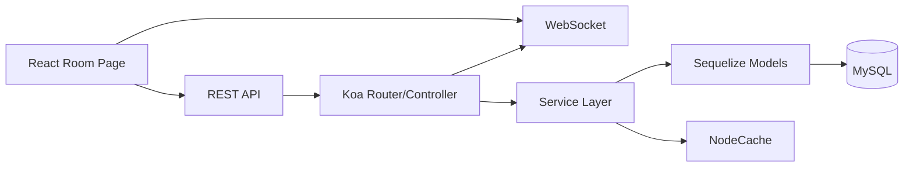
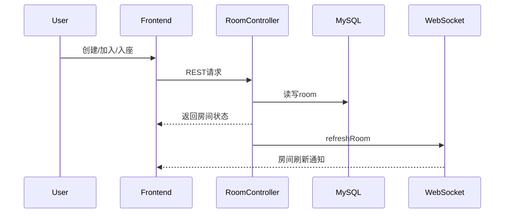

# 多智能体在线语音狼人杀系统 软件设计说明书（SDD）

## 1. 引言

### 1.1 编写目的
编写本软件设计说明书（Software Design Document, SDD）的主要目的，是将《多智能体在线语音狼人杀系统需求分析文档》中确定的各项业务需求、功能需求与非功能需求，转化为具体可执行的系统技术架构与模块设计方案。

本文档作为项目开发、测试与维护阶段的核心技术契约与指导准则，旨在：
1. **确立架构蓝图**：全面阐述系统的总体架构分层、运行环境与核心技术选型。
2. **划分模块边界**：明确后端游戏引擎、多智能体交互、实时通信与数据存储等核心模块的职责及内部逻辑。
3. **规范接口与数据**：统一规范前后端通信接口（REST & WebSocket）、数据库表结构及关键业务流转状态机。
4. **指导工程实践**：为项目开发团队的后续编码实现、系统集成、代码审查及自动化测试提供权威的技术依据。

**预期受众**：本项目开发团队全体成员、项目指导教师、系统架构评审人员、测试工程师，以及后续可能参与项目维护或二次开发的开发者。

### 1.2 项目背景与系统范围
**项目背景：**
传统桌面逻辑推理游戏“狼人杀”深受大众喜爱，但普遍面临线下组局困难、玩家凑不齐、复盘无记录等痛点。为解决这些问题，并探索大语言模型（LLM）在多智能体（Multi-Agent）非完全信息博弈场景中的应用潜力，本项目致力于开发一款高度拟真、支持人机协同协作的**在线多人语音推理与博弈平台——“多智能体在线语音狼人杀”**。

**系统范围：**
本系统不仅接管了传统狼人杀中繁琐的自动化发牌、昼夜流程控制与规则结算机制，其设计范围还将涵盖以下核心能力：
* **基础对局系统**：完整的用户体系、房间分配、6-12人标准局游戏状态机演进。
* **AI 玩家系统（Agent）**：基于大语言模型的 AI 玩家，具备独立视野、性格预设与自主推理决策能力，可随时填补空缺座位。
* **语音交互系统**：集成实时语音识别（STT）与语音合成（TTS）能力，打破人机交互的文本壁垒。
* **数据与复盘系统**：全链路对局日志记录，及基于 LLM 的赛后智能复盘分析。

### 1.3 设计目标与核心技术亮点
基于项目愿景，本系统的架构设计将重点围绕以下三大技术亮点展开：

1. **Multi-Agent 驱动的多智能体协同博弈**
   * **独立沙盒运行**：系统中每个 AI 玩家均作为一个独立的 Agent 实例运行，与其他玩家信息严格隔离（仅拥有自身视角的视野矩阵）。
   * **动态长效记忆（Memory）**：Agent 能够持续接收并理解对局中的聊天文本与行为事件，维持上下文连贯性。
   * **个性化心智模型**：具备独立决策能力，动态计算其他玩家的嫌疑度，并结合设定的性格特征（激进/保守/逻辑型）自动生成符合当前身份的伪装发言、投票决策及夜晚行动。

2. **实时语音识别（STT）与交互闭环**
   * 打通“人机语音屏障”，底层架构集成 STT 与 TTS 异步处理模块。
   * 真人玩家的实时语音流经系统降噪转写为文本供 AI 提取关键信息；AI 生成决策后，通过 TTS 转化为自然语音播报，形成无缝衔接的沉浸式音视频交互闭环。

3. **全栈日志记录与 AI 智能复盘**
   * 游戏引擎具备完整的事件溯源能力，将对局内的发言、票型、技能释放及阶段切换结构化落盘存储。
   * 对局结束后触发 AI 复盘引擎，以上帝视角或特定玩家视角生成包含票型逻辑、发言疑点分析的图文复盘报告。

### 1.4 术语、定义与缩略语
为避免阅读歧义，本文档涉及的技术缩略语及游戏领域特定术语统一定义如下：

| 术语 / 缩写 | 含义说明 | 分类 |
| --- | --- | --- |
| **SDD** | Software Design Document，软件设计说明书。 | 技术 |
| **LLM** | Large Language Model，大语言模型（如 GPT-4, 闭源/开源模型）。 | 技术 |
| **STT / TTS** | Speech-to-Text (语音转文本) / Text-to-Speech (文本转语音)。 | 技术 |
| **Multi-Agent** | 多智能体系统，指多个具备自主决策能力的独立 AI 代理在同一环境中协同或博弈。 | 技术 |
| **Room** | 房间，承载玩家组织与开局入口的容器，具备独立生命周期。 | 业务 |
| **Game** | 一局游戏实例，包含阶段、天数、板子配置及胜负判定规则。 | 业务 |
| **Player** | 某局内玩家的数据快照（与全局系统 User 解耦，包含角色、状态、技能等）。 | 业务 |
| **Stage** | 游戏阶段标识（如 0/1/2/3/4/5/6/6.5/7），驱动状态机演进的核心依据。 | 业务 |
| **GameTag** | 关键事件标签（如死亡事件、发言顺序、PK信息等结构化数据）。 | 业务 |
| **性格预设** | AI 玩家的行为倾向： - **激进型**：倾向于冒险、主动发言与带节奏； - **保守型**：倾向于谨慎、低调发言与随大流； - **逻辑型**：倾向于严谨推理与数据驱动决策。 | 业务 |

### 1.5 参考资料
本文档的编写与设计决策主要参考以下资料：
1. 《多智能体在线语音狼人杀系统 需求分析文档 / PRD》（内部文档，前置产出物）
2. 狼人杀官方通用规则手册（6人局、9人局、12人标准局）
3. IEEE 1016-2009 Standard for Information Technology—Systems Design—Software Design Descriptions

### 1.6 文档结构
本设计说明书的后续章节将按照以下结构展开，由宏观到微观层层递进：
* **第 2~4 章（系统设计方案）**：描述系统的当前状态、总体分层架构、模块划分及软硬件技术选型。
* **第 5~6 章（模块与业务设计）**：详细说明核心子系统（如游戏状态机、房间管理、流程控制）的职责及核心业务时序图。
* **第 7~8 章（数据与接口设计）**：定义数据库实体模型（ER）、表结构、状态缓存方案，以及前后端交互接口及 WebSocket 协议。
* **第 9~10 章（评估与演进设计）**：对系统的非功能特性进行评估，并重点针对 AI 智能体、语音交互等未来扩展功能提供架构预留建议。

### 1.7 编写团队与版本记录

**编写团队：**
* **组长 / 主架构**：沈矜娴 (@Xiann127)
* **核心研发成员**：文就南 (@wenjiunan)、杨策华 (@chuizichaoren)、白纹菲 (@KPBLKPBL)、范盛颉 (@Louis-Dejavu)、雷熙澎 (@ray-055)

**修订记录（Version History）：**
| 版本号 | 修订日期 | 修订人 | 修订说明 |
| --- | --- | --- | --- |
| V1.0.0 | 2026-04-07 | 编写团队 | 初始版本草案完成，确立核心架构与现有代码映射关系。 |

---

### 💡 修改说明与标准对齐点：
1. **增加了“系统范围 (Scope)”和“参考资料 (References)”**：这是正规 SDD（如国标或 IEEE 标准）必须包含的部分，它界定了系统“做多少”以及“基于什么做”。
2. **合并了术语表**：将你原来的 1.4（技术缩写）和 1.7（业务名词）合并为一个带分类的 Markdown 表格，看起来更专业、更清晰。
3. **细化了编写目的**：使用了动宾短语（确立架构蓝图、划分模块边界...），增强了行文的逻辑性。
4. **增加了修订记录 (Version History)**：软件设计文档是随着开发迭代动态演进的，加入版本记录表格是软件工程规范中的基本要求。你可以根据实际日期填入 `202X-XX-XX`。

---

## 2. 系统概述

### 2.1 系统目标（来自需求文档）
1. 用户登录、房间创建/加入、开局、角色分配。
2. 昼夜流程推进、技能结算、投票放逐、胜负判定。
3. 实时状态反馈与对局记录。
4. 后续扩展 AI Agent、STT/TTS、复盘分析与后台管理。

### 2.2 当前实现范围（基于代码）
1. `[已实现]` 账号登录、角色权限基础能力（admin/host/player）。
2. `[已实现]` 房间创建、加入、入座、踢人、观战、退出。
3. `[已实现]` 开局、随机分配角色、视野矩阵初始化。
4. `[已实现]` 阶段推进（含夜晚技能、发言顺序、投票/PK、遗言阶段）。
5. `[已实现]` 胜负判定、游戏结束、再来一局、记录查看。
6. `[已实现]` WebSocket 房间级事件推送与夜晚阶段倒计时推送。
7. `[待扩展]` AI Agent 推理与行为生成、语音 STT/TTS、复盘分析服务化、断线重连恢复机制。

### 2.3 总体设计思路
1. 采用“前后端分离 + 单体后端服务”模式。
2. 后端以 Koa 为基础，自定义 MVC 装载器，按 `controller/service/model` 分层。
3. 游戏规则执行集中在 `gameService + stageService`，控制器负责参数校验与编排调用。
4. 前端房间页作为核心交互页，通过 REST 拉状态 + WebSocket 触发刷新。

---

## 3. 系统总体架构

### 3.1 架构分层
1. 表现层：React + MobX + Ant Design。
2. 接口层：Axios 封装 REST 调用。
3. 控制层：Koa Router + Controller。
4. 领域服务层：Room/Game/Stage/User Service。
5. 数据访问层：Sequelize Model + MySQL。
6. 实时通信层：`nodejs-websocket`（房间路径分流）。
7. 辅助层：NodeCache（倒计时缓存）、日志组件、权限中间件。

### 3.2 核心子系统
1. 用户与权限子系统。
2. 房间与座位管理子系统。
3. 游戏引擎子系统（状态机 + 结算规则）。
4. 实时推送与前端状态同步子系统。
5. 对局记录与复盘数据基础子系统（当前为记录存储与展示，非智能复盘）。

### 3.3 模块依赖关系（代码结构）

### 3.4 主要代码依据
1. 后端入口与装载：[server/application/index.js](f:/werewolf/server/application/index.js)、[server/application/loader.js](f:/werewolf/server/application/loader.js)
2. 路由定义：[server/routes/index.js](f:/werewolf/server/routes/index.js)
3. 游戏核心：[server/controller/gameController.js](f:/werewolf/server/controller/gameController.js)、[server/service/gameService.js](f:/werewolf/server/service/gameService.js)、[server/service/stageService.js](f:/werewolf/server/service/stageService.js)
4. 前端核心页面：[client/src/pages/views/room/index.jsx](f:/werewolf/client/src/pages/views/room/index.jsx)

---

## 4. 技术与运行环境（初步）

1. 前端：React 17、MobX、AntD、Stylus。
2. 后端：Node.js、Koa、koa-router、Sequelize、nodejs-websocket。
3. 数据库：MySQL（`lcoco_*` 表）。
4. 运行脚本：
1. `npm run server`：后端。
2. `npm run front`：前端。
3. `npm run dev`：联调。
5. 端口与通信：
1. 后端 HTTP：`6001`（`config.json`）。
2. 前端开发：`6002`（`.env.development`）。
3. WebSocket：`6003`（硬编码在 loader 中）。

---
## 5. 核心模块设计

### 5.1 用户/鉴权模块
1. 核心功能：用户注册 / 登录、身份鉴权、Token 管理、用户信息维护、权限控制。
2. 登录体系
 2.1 账号密码登录：用户名 + 密码验证，密码采用 bcrypt 加盐哈希存储，防彩虹表与暴力破解。
 2.2 Token 机制：JWT 访问令牌（有效期 2 小时）+ 刷新令牌（有效期 7 天），支持无感续期。
 2.3 鉴权拦截：全局中间件校验 Token 合法性、过期状态、用户状态，非法请求直接拦截。
3. 权限控制
 3.1 接口权限：基于 URL + 请求方法的细粒度权限校验，支持按角色 / 用户分配接口访问权。
 3.2 防重复提交：关键接口（登录、创建房间、投票）采用请求唯一 ID+Redis 短时效锁防重放。
 3.3 安全策略：同一账号异地登录自动踢下线；连续失败登录触发账号锁定（15 分钟）。

### 5.2 房间管理模块
1. 核心功能：房间创建、加入 / 退出、座位管理、观战、房间状态维护、房间生命周期控制。
2. 房间核心流程
 2.1 创建房间：房主设置房间名称、人数上限、游戏板子、密码（可选），生成唯一房间码。
 2.2 加入房间：通过房间码 / ID 匹配，校验密码、人数、状态，自动分配空闲座位。
 2.3 座位机制：固定 6–12 座位，支持房主手动换座、踢人、禁赛；支持观战位（无操作权限）。
 2.4 并发安全：入座 / 踢人 / 开始游戏采用 Redis 分布式锁，防止多客户端并发导致数据不一致。
3. 房间状态流转
 3.1 状态：待开始 → 游戏中 → 已结束 → 已解散
 3.2 规则：游戏中不可加入；解散后自动清理内存与缓存数据；超时未开始自动回收。

### 5.3 游戏状态机/流程控制模块
1. 核心功能：游戏阶段推进、昼夜循环、倒计时、状态一致性、阶段事件触发、全流程有序流转。
2. 状态机模型
 2.1 标准流程：准备 → 黑夜（狼人→预言家→女巫）→ 天亮 → 公投 → 放逐 → 黑夜...
 2.3 扩展阶段：平票 PK 阶段（6.5 态）、警长竞选 / 投票、死亡信息公布、遗言阶段。
 2.4 推进规则：严格前一阶段完成 + 条件满足才允许进入下一阶段；服务端强校验，拒绝前端越阶请求。
3. 时序与一致性
 3.1 倒计时：每个阶段固定时长（可配置），时间到自动推进并广播。
 3.2 事务保证：阶段切换 + 多表写入（状态、记录、玩家）包裹事务，失败回滚 + 告警。
 3.3 状态广播：每次状态变更全房间实时推送，保证客户端视图一致。

### 5.4 角色分配模块
1. 模块职责：按人数板子分配角色，初始化玩家信息。
2. 角色配置体系
 2.1 板子配置：6/8/9/10/12 人标准板子，角色组合可配置（狼人、平民、预言家、女巫、猎人、白痴等）。
 2.2 分配算法：随机洗牌分配，保证阵营平衡；狼队固定互见，神职互不见，平民全盲。
3. 视野与状态初始化
 3.1 视野矩阵：按角色生成可见关系（狼见狼、预言家夜间不可见他人、女巫夜间仅见死亡信息等）。
 3.2 事务写入：一次性写入 game/player/vision 三张表，原子性保证开局数据完整。

### 5.5 白天发言/投票模块
1. 核心功能：发言顺序、投票发起、票型记录、计票逻辑、平票处理、放逐结算、警长竞选。
2. 投票规则
 2.1 参与范围：仅存活玩家可投票；每人一票，可弃票；警长票 1.5 票（可配置）。
 2.2 计票逻辑：
  2.2.1统计有效票，按目标玩家分组计数。
  2.2.2判定：票数 > 存活半数 → 最高票者放逐；平票 → 进入 PK 阶段；无人过半数 → 平安日。
 2.3PK 阶段：仅平票玩家发言，其余人重投；仍平票则本轮无人放逐。
3. 数据与安全
 3.1 票型存储：记录每轮投票人、目标、时间、阶段，支持完整复盘。
 3.2防作弊：服务端唯一校验投票资格、次数、阶段；重复投票 / 越权投票直接拒绝。

### 5.6 夜晚行动模块
1. 核心功能：狼人袭击、预言家查验、女巫解药 / 毒药、猎人开枪、技能冷却与消耗、夜间死亡结算。
2. 角色技能规范
 2.1 狼人：夜间集体统一刀型，支持空刀；多狼投票一致才生效。
 2.2 预言家：每晚查验一人，返回 “好人 / 狼人”，不可重复查验。
 2.3 女巫：解药（可自救首夜）、毒药各一瓶，用后消失；夜间可双药但不可同天对同一人。
 2.4 猎人：被放逐 / 夜间死亡可开枪（被毒则不能）；技能状态全局标记。
3. 结算机制
 3.1 夜间动作统一记录，天亮前集中结算；死亡顺序、技能优先级可配置。
 3.2 状态强校验：仅当前阶段 + 存活 + 有技能 + 未使用才可发动；越阶段 / 重复使用直接拦截。

### 5.7 胜负判定模块
1. 核心功能：阵营存活统计、胜利条件判定、游戏结束、结果广播、复盘数据生成。
2. 胜利模式
 2.1 屠城：狼人杀光所有好人 / 好人杀光所有狼人。
 2.2 屠边：狼人杀光神 / 民任意一边；好人杀光所有狼人。
3. 判定时机
 3.1 放逐结算后、夜间结算后、技能触发后，立即触发胜负检查。
 3.2 终局标记：记录胜利阵营、终局原因（屠边 / 屠城 / 全部死亡）、关键事件，用于复盘与战绩。

### 5.8 实时通信模块
1. 核心功能：WebSocket 连接、房间内消息广播、状态同步、断线重连、消息可靠性保证。
2. 通信协议
 2.1 结构化消息：固定格式 { event, gameId, data, timestamp, version }，支持版本兼容。
 2.2 核心事件：roomUpdate、stageChange、vote、action、gameOver、countdown。
3. 可靠性
 3.1 鉴权：连接时携带 Token 校验，非法连接拒绝。
 3.2 断线恢复：重连后推送当前全量状态，保证客户端补全数据。
 3.3 消息去重：每条消息唯一 ID，客户端防重复处理。

### 5.9 数据存储模块
1. 核心功能：业务数据持久化、事务管理、缓存加速、日志归档、数据备份。
2. 存储分层
 2.1 热数据（房间、游戏、玩家、状态）：MySQL + Redis 缓存（过期自动淘汰）。
 2.2 日志数据（投票、行动、记录）：分表存储，支持 TTL 归档。
 2.3 配置数据（角色、板子、规则）：全局缓存，变更自动刷新。
3. 数据安全
 3.1 事务：关键写操作（开局、投票、结算）强事务，保证 ACID。
 3.2 索引优化：gameId、roomId、userId 建立联合索引，提升查询性能。
 3.3 归档策略：历史对局 3 个月后归档至冷库，保留复盘查询能力。
---

## 6. 关键业务流程设计

### 6.1 创建房间 / 加入房间流程
1. 玩家登录后，房主调用创建房间接口生成 `room + password`。
2. 玩家使用房间码加入，进入等待区。
3. 玩家点击座位入座，房主可踢人。
4. 前端通过 WebSocket 监听 `refreshRoom` 刷新座位态。

### 6.2 游戏开始流程
1. 房主点击开始。
2. 后端校验房主身份、座位是否坐满。
3. 创建 `game`，按人数板子随机分配角色并写入 `player`。
4. 初始化 `vision` 矩阵与开局记录。
5. 房间状态置为进行中，广播 `gameStart`。

### 6.3 角色分配流程
1. 根据 `mode=standard_n` 从角色模板取角色数组。
2. 对座位号随机映射角色。
3. 为每名玩家生成技能快照。
4. 基于角色组合生成视野关系（狼人互认）。

### 6.4 白天阶段流程
1. `stage=4` 结算夜晚死亡并公告。
2. `stage=5` 随机发言顺序（含正逆序）。
3. `stage=6` 投票；若平票且配置为 PK，则进入 `6.5`。
4. `stage=7` 遗言/技能触发窗口后进入下一夜。

### 6.5 投票结算流程
1. 汇总 `action(vote)`。
2. 生成每个候选人的票型记录。
3. 统计弃票。
4. 单一最高票：放逐并登记死亡。
5. 多最高票：按配置“直接过夜”或“PK加赛”。

### 6.6 夜晚行动流程
1. 预言家查验（更新 `vision`）。
2. 狼人袭击（先记行动，不立即死亡）。
3. 女巫阶段综合解药/毒药。
4. 天亮统一结算死亡并写记录。

### 6.7 游戏结束流程
1. 在关键结算点调用胜负判定。
2. 达成条件则写入 `winner`，状态置 `2`。
3. 广播 `gameOver`，前端展示胜负弹窗。
4. 房主可“再来一局”重置房间游戏指针。

---

## 7. 数据设计

### 7.1 核心实体识别
1. 用户：`lcoco_user`
2. 房间：`lcoco_room`
3. 对局：`lcoco_game`
4. 局内玩家快照：`lcoco_player`
5. 视野：`lcoco_vision`
6. 行动：`lcoco_action`
7. 关键标签：`lcoco_game_tag`
8. 记录：`lcoco_record`

### 7.2 关键数据结构（代码事实）
1. `room.wait/room.ob` 使用 JSON 数组。
2. `player.skill` 使用 JSON 数组（技能可用状态）。
3. `record.content` 使用 JSON（文本/动作/富文本）。
4. `game.stage` 为浮点，支持 `6.5` PK 阶段。

### 7.3 数据库模型与脚本
1. ORM 模型目录：[server/mysqlModel](f:/werewolf/server/mysqlModel)
2. 建表脚本：[sql/mysql_schema.sql](f:/werewolf/sql/mysql_schema.sql)
3. 初始化数据：[sql/mysql_seed.sql](f:/werewolf/sql/mysql_seed.sql)
4. 6-12人扩容脚本：[sql/mysql_alter_6_12.sql](f:/werewolf/sql/mysql_alter_6_12.sql)

### 7.4 缓存使用
1. `NodeCache` 用于阶段倒计时键：`game-time-<gameId>`。
2. 中间件预留 `page_url_permission` 缓存读取，但当前仓库未见完整加载链路。

---

## 8. 接口设计

### 8.1 REST API（主要）
1. 登录：
1. `POST /api/login`
2. 房间：
1. `GET /api/room/create/auth`
2. `GET /api/room/info/auth`
3. `GET /api/room/join/auth`
4. `GET /api/room/quit/auth`
5. `GET /api/room/seat/auth`
6. `GET /api/room/kick/auth`
7. `GET /api/room/modifyName/auth`
3. 游戏：
1. `POST /api/game/start/auth`
2. `GET /api/game/info/auth`
3. `GET /api/game/nextStage/auth`
4. `GET /api/game/record/auth`
5. `GET /api/game/checkPlayer/auth`
6. `GET /api/game/assaultPlayer/auth`
7. `GET /api/game/antidotePlayer/auth`
8. `GET /api/game/poisonPlayer/auth`
9. `GET /api/game/votePlayer/auth`
10. `GET /api/game/shootPlayer/auth`
11. `GET /api/game/boomPlayer/auth`
12. `GET /api/game/result/auth`
13. `GET /api/game/destroy/auth`
14. `GET /api/game/again/auth`
15. `GET /api/game/ob/auth`

### 8.2 WebSocket 事件
1. 连接地址：`ws://<host>:6003/lrs/{roomId}`
2. 下行事件（字符串）：
1. `refreshRoom`
2. `refreshGame`
3. `stageChange`
4. `gameStart`
5. `gameOver`
6. `reStart`
3. 倒计时消息（JSON 字符串）：
1. `{"refreshGame":false,"time":N}`

### 8.3 主要请求/响应结构
1. 响应统一包装：
1. `success: boolean`
2. `data: any`
3. `errorCode: number|string|null`
4. `errorMessage: string|null`

### 8.4 内部调用关系
1. `Controller -> gameService.moveToNextStage -> stageService.* -> baseService(model)`。
2. `Controller` 在关键节点直接向 WebSocket 连接池推送事件。
3. `gameService` 负责规则聚合，`stageService` 负责阶段细则结算。

---

## 9. 非功能设计（初步）

### 9.1 可维护性
1. `[已体现]` 分层结构清晰，模型定义集中。
2. `[当前代码中尚未完整体现，以下为建议性补充]` 建议将规则常量、阶段校验、动作合法性统一沉淀为规则引擎模块，降低控制器重复逻辑。

### 9.2 可扩展性
1. `[已体现]` 支持 6-12 人板子、阶段扩展字段、JSON 灵活字段。
2. `[建议性补充]` 为 AI/STT/TTS 增加独立应用服务层与异步事件总线，避免直接耦合控制器。

### 9.3 稳定性
1. `[已体现]` 核心阶段有状态持久化、倒计时缓存。
2. `[建议性补充]` 关键多表写入（开局、结算）需事务化；补充异常恢复与幂等机制。

### 9.4 性能
1. `[已体现]` 业务规模面向小房间并发，基础查询有索引。
2. `[建议性补充]` 高并发下建议引入连接管理、异步写记录、批量查询优化。

### 9.5 安全性
1. `[已体现]` JWT 鉴权、基础角色权限判断。
2. `[建议性补充]` 升级密码算法、补齐 WebSocket 鉴权、强化服务端动作合法性校验、防越权调用。

---

## 10. 当前问题与后续扩展建议

### 10.1 当前基础流程中的不足（基于代码）
1. 动作接口服务端校验不完全一致：部分动作缺少严格阶段校验，存在被直接调用风险。
2. 多处状态写入无事务：开局与阶段结算可能出现部分成功、部分失败。
3. WebSocket 协议较弱：事件为裸字符串，缺少事件版本/签名/统一载荷。
4. 权限链路不闭环：URL 权限缓存读取存在，但未见完整缓存装载逻辑。
5. 文档与实现存在偏差：README 对后端数据库描述仍有历史信息（Mongo）痕迹，实际已是 MySQL + Sequelize。
6. 前后端配置存在不一致：前端“开局人数”设置与后端实际取值路径不完全一致。

### 10.2 模块边界与状态管理评估
1. 模块边界总体清晰（Controller/Service/Model）。
2. 但“规则校验 + 状态变更 + 记录写入”仍有耦合，建议收敛到统一规则服务。
3. 状态机主干明确，但个别阶段文案与字段使用存在实现细节问题（需回归修正）。

### 10.3 面向 AI、多智能体、语音转写、日志复盘的扩展建议（待扩展设计）
1. 当前仓库未发现完整实现，以下为建议性设计。
2. 建议新增 `Agent Orchestrator`：
1. 输入：当前对局快照、角色私有记忆、阶段上下文。
2. 输出：发言文本、投票目标、夜晚技能目标。
3. 建议新增 `Speech Gateway`：
1. STT/TTS 统一适配层。
2. 与游戏状态机异步交互，避免阻塞流程。
4. 建议新增 `Event Bus + Replay Pipeline`：
1. 将 `action/tag/record` 统一事件化。
2. 为复盘分析、审计、A/B 策略迭代提供数据底座。
5. 建议新增 `Connection Session Manager`：
1. 断线重连会话恢复。
2. 房间订阅鉴权与增量同步。

---

## A. 代码库与 SDD 的映射说明

1. 引言/目标/范围：
1. [需求分析文档.md](f:/werewolf/需求分析文档.md)
2. [README.md](f:/werewolf/README.md)
2. 总体架构与启动链路：
1. [app.js](f:/werewolf/app.js)
2. [server/application/index.js](f:/werewolf/server/application/index.js)
3. [server/application/loader.js](f:/werewolf/server/application/loader.js)
4. [server/routes/index.js](f:/werewolf/server/routes/index.js)
3. 核心游戏流程：
1. [server/controller/gameController.js](f:/werewolf/server/controller/gameController.js)
2. [server/service/gameService.js](f:/werewolf/server/service/gameService.js)
3. [server/service/stageService.js](f:/werewolf/server/service/stageService.js)
4. 房间流程：
1. [server/controller/roomController.js](f:/werewolf/server/controller/roomController.js)
2. [server/service/roomService.js](f:/werewolf/server/service/roomService.js)
5. 用户与鉴权：
1. [server/controller/authController.js](f:/werewolf/server/controller/authController.js)
2. [server/middleware/auth.js](f:/werewolf/server/middleware/auth.js)
3. [server/service/userService.js](f:/werewolf/server/service/userService.js)
6. 数据设计：
1. [server/mysqlModel](f:/werewolf/server/mysqlModel)
2. [sql/mysql_schema.sql](f:/werewolf/sql/mysql_schema.sql)
3. [sql/mysql_seed.sql](f:/werewolf/sql/mysql_seed.sql)
7. 前端交互与实时通信：
1. [client/src/pages/views/room/index.jsx](f:/werewolf/client/src/pages/views/room/index.jsx)
2. [client/src/components/game](f:/werewolf/client/src/components/game)
3. [client/src/api](f:/werewolf/client/src/api)

---

## B. 信息不足清单

1. 缺少正式接口文档（字段约束、错误码全集、幂等语义）。
2. 缺少数据库关系图与迁移策略说明（外键/事务策略未文档化）。
3. 缺少自动化测试与性能测试基线（无法验证并发与边界场景覆盖度）。
4. WebSocket 协议缺少消息规范文档（事件类型、payload schema、重连策略）。
5. AI/STT/TTS 仅在需求文档中提出，当前仓库未发现可执行实现。
6. 运维部署与可观测性文档不足（高可用、扩缩容、告警、备份恢复未完整说明）。
