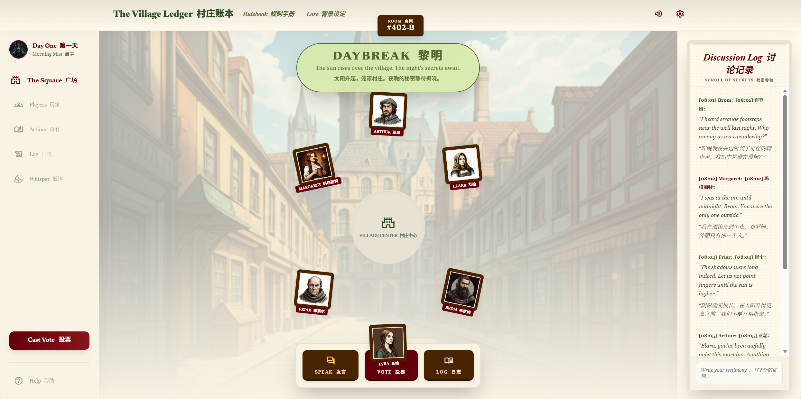
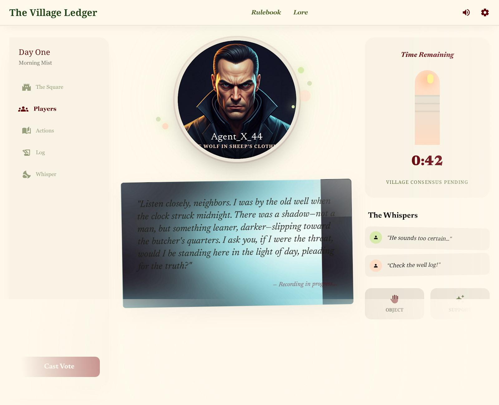
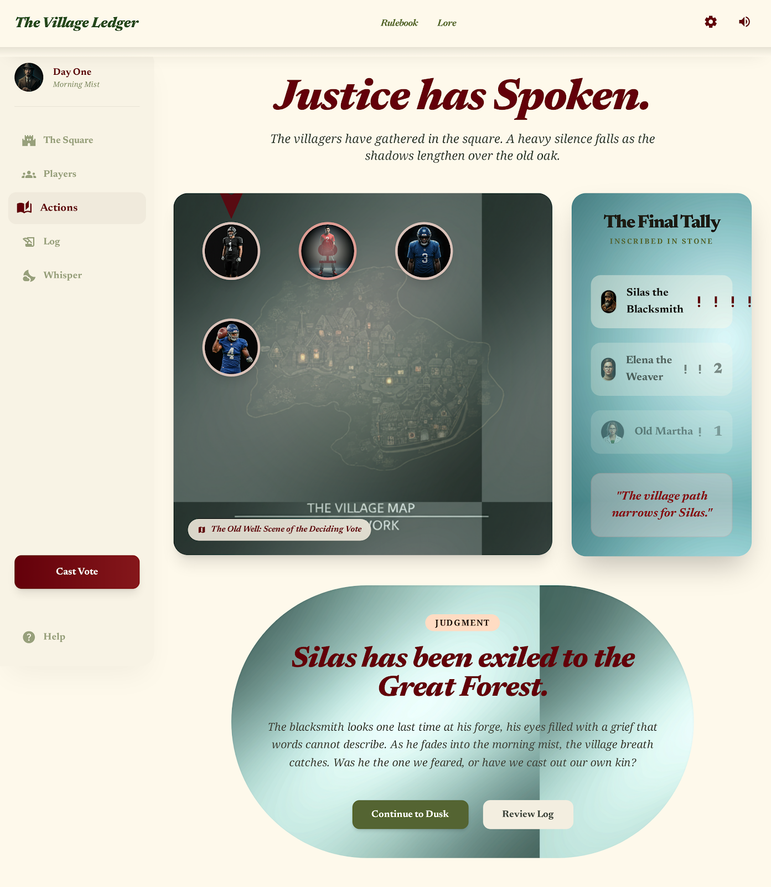
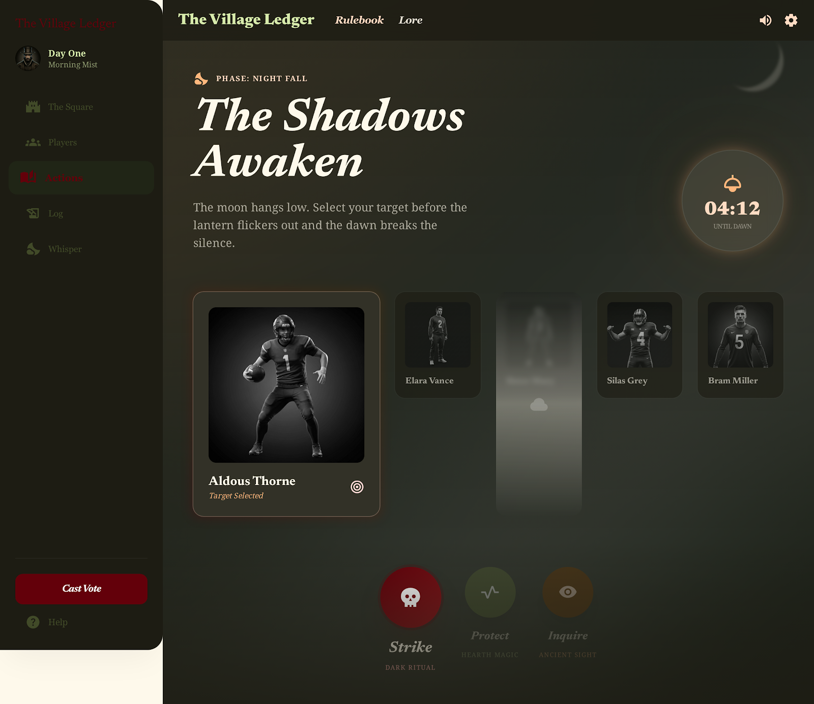
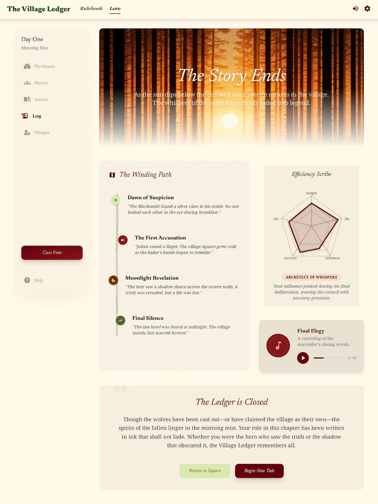

# 需求分析文档

## 1. 引言

### 1.1 编写目的

编写本软件需求分析文档的目的，在于对“多智能体在线语音狼人杀”项目的业务背景、建设目标、系统需求和约束条件进行系统化、规范化描述，为项目后续的系统设计、编码实现、测试验证和验收评估提供统一依据。

本文档面向项目组成员与指导教师，用于：

1. 明确系统建设目标及范围，统一项目成员对系统功能与非功能需求的理解；
2. 将用户层面的需求转化为可分析、可设计、可实现、可测试的系统需求；
3. 为后续总体设计、详细设计、数据库设计、接口设计与测试设计提供输入依据；
4. 作为项目实施过程中的需求基线，支持需求变更管理与阶段成果检查；
5. 为需求跟踪矩阵的建立提供基础，使需求、设计、实现与测试之间具=备可追溯性。

### 1.2 软件需求分析说明

软件需求分析是软件工程活动中的关键阶段，其核心任务是对系统应完成的功能、应满足的性能、应遵守的约束以及与外部环境之间的交互关系进行识别、整理、表达和确认。需求分析的质量将直接影响后续设计与实现工作的正确性和完整性。

对于本项目而言，需求分析不仅需要明确狼人杀网页游戏的业务流程与交互规则，还需要对 AI Agent 在游戏中的定位、行为方式、接口输入输出和质量要求进行分析与定义。只有在需求阶段对这些内容进行清晰描述，后续系统设计与测试工作才能有明确依据，避免出现功能遗漏、逻辑冲突或实现偏差等问题。

### 1.3 软件需求分析目标

本项目需求分析工作的主要目标如下：

1. 对线上狼人杀网页系统应具备的功能进行全面描述，包括房间管理、游戏流程控制、角色技能、投票放逐、胜负判定、实时通信和AI Agent参与等核心内容；
2. 明确系统运行过程中涉及的用户角色、业务流程、数据流转方式及界面交互要求；
3. 描述系统在性能、可用性、安全性、可扩展性、可维护性等方面应满足的非功能需求；
4. 明确系统与外部环境之间的接口要求，包括前后端通信接口、实时消息机制、AI服务接口等；
5. 为系统设计、数据库设计、接口设计、模块划分与测试用例设计提供需求依据；
6. 建立需求到设计、实现、测试之间的对应关系，为项目后续的需求跟踪和质量检查奠定基础。

### 1.4 项目概述

随着互联网技术的发展和在线社交娱乐形式的普及，传统桌面推理类游戏逐渐向数字化与网络化方向转型。狼人杀作为一种典型的多人参与与强交互性的逻辑推理游戏深受大众热爱，但普遍面临着线下游玩人数不足，无法随时开局玩乐的困境。
本项目拟开发一个面向网页端的多人在线狼人杀游戏系统。系统支持玩家通过浏览器进入游戏房间，参与完整的游戏流程，并提供稳定、流畅的游戏体验。
在实现传统狼人杀玩法的基础上，本项目重点引入AI Agent玩家机制，使系统不仅能够支持真人对局，还能在玩家不足的场景下补充AI玩家参与游戏。AI Agent可以在不同的角色身份下进行推理、决策与发言，尽最大可能维护真人玩家的体验感与游戏进程。

本项目强调以下特点：

- **流程与规则完整**：完整覆盖狼人杀核心游戏机制，包括昼夜循环、角色技能与投票逻辑；
- **多角色行为建模**：系统需支持不同角色在不同阶段执行差异化行为；
- **AI Agent 融合**：引入智能玩家参与游戏过程，具备基本推理与决策能力；
- **可复盘与可验证**：系统记录关键事件与行为数据，支持对局回顾与测试验证；

本项目的建设目标不仅是完成一个可运行的网页小游戏，更重要的是通过规范的软件工程方法完成从需求分析到系统设计、实现与测试的完整过程。

## 2. 用户需求分析

### 2.1 用户类型分析

| 角色名称 | 角色说明 | 主要需求分析 |
|---|---|---|
| 玩家（普通用户） | 参与游戏流程的主要用户 | 需要能够顺利加入或创建房间；在游戏过程中进行语音或文本发言；执行投票及夜晚技能操作；获取实时游戏状态反馈；在游戏结束后查看记录与复盘 |
| 房主 | 在玩家基础上拥有房间管理权限的用户 | 需要创建房间并配置参数（如人数、AI数量、发言时长等）；控制游戏开始与结束；在必要时管理房间成员；保证对局顺利启动 |
| 管理员 | 负责系统级管理与维护的用户 | 需要管理用户账号（封禁/解封）；配置系统参数（游戏规则、AI难度等）；查看系统运行状态与日志；保证系统稳定运行 |
| AI Agent 玩家 | 由系统控制的虚拟玩家，参与游戏逻辑 | 需要根据游戏上下文进行推理与决策；生成发言、投票及夜晚行动；维护对局记忆与玩家嫌疑度；与语音模块结合完成语音输出 |

### 2.2 用户需求列表
| 需求ID | 需求名称 | 用户需求描述 | 优先级 |
|---|---|---|---|
| SRS-UR-01 | 登录进入系统 | 用户可完成登录并进入首页。 | 高 |
| SRS-UR-02 | 创建房间 | 房主可创建房间并设置人数、阶段时长、平票规则等参数。 | 高 |
| SRS-UR-03 | 加入房间 | 玩家可通过房间码加入未满且可加入的房间。 | 高 |
| SRS-UR-04 | 房间内组织 | 玩家可入座、改名、退出；房主可踢人。 | 高 |
| SRS-UR-05 | 开局与分配 | 房主可开局，系统自动分配角色并开始流程。 | 高 |
| SRS-UR-06 | 回合行动 | 玩家可在对应阶段执行技能与投票。 | 高 |
| SRS-UR-07 | 实时状态反馈 | 用户可看到阶段变化、倒计时、广播、结果反馈。 | 高 |
| SRS-UR-08 | 对局记录查看 | 用户可查看本局记录，结束后用于复盘。 | 中 |
| SRS-UR-09 | 结束与重开 | 房主可结束本局并发起再来一局。 | 中 |
| SRS-UR-10 | AI 玩家参与 | 系统支持 AI 玩家参与发言、投票与夜晚决策。 | 高 |
| SRS-UR-11 | 断线恢复 | 用户断线后重连可恢复当前对局状态。 | 高 |
| SRS-UR-12 | 稳定与易用 | 用户期望系统稳定、安全、响应及时、界面易操作。 | 高 |

## 3. 功能需求（Functional Requirements）
*从系统整体能力出发，描述项目运行所必须具备的核心业务逻辑，包括游戏规则执行、AI行为、语音交互以及数据记录等完整流程。*

### 3.1 游戏逻辑模块
*描述游戏核心流程与规则执行逻辑，包括房间管理、角色分配、阶段控制、玩家操作以及胜负判定等功能，确保游戏按照既定规则有序运行。*
| 需求ID | 需求名称 | 需求描述 | 输入 | 输出 | 约束条件 | 优先级 |
|---|---|---|---|---|---|---|
| SRS-F-01 | 用户注册与登录 | 普通玩家：支持用户名、密码、邮箱、验证码注册登录；JWT 身份认证，记住登录状态，安全退出；未登录无法进入游戏。管理员：后台专用登录入口，权限隔离，操作留痕 | 用户信息、认证信息 | 登录结果、用户状态 | 未认证用户不得进入系统 | 高 |
| SRS-F-02 | 房间管理 | 房主：创建房间、配置人数、AI 数 、发言时长、平票规则；生成 6 位房间码。普通玩家：按房间码加入、查看房间列表、筛选可加入房间。 |  房间参数、玩家信息 | 房间状态、玩家列表 | 房间状态需保持一致 |高 |
| SRS-F-03 | 开局与角色分配 | 房主：满足人数条件可点击开局。系统：自动分配狼人 、预言家、女巫 、平民，阵营平衡；真人与 AI 混排；角色仅本人可见。 | 房间人数、规则配置 | 玩家角色列表、初始状态 | 未满足开局条件不得开始 | 高 |
| SRS-F-04 | 游戏流程控制 | 系统：自动控制黑夜→狼人行动→预言家→女巫→天亮→发言→投票→放逐的完整循环；阶段倒计时、自动推进。玩家：仅在当前阶段可操作，不可跨阶段执行。 | 当前阶段、计时信息、玩家状态 | 新阶段状态、阶段广播事件 | 不允许跳过阶段或非法推进 | 高 |
| SRS-F-05 | 角色与技能系统 | 狼人（夜晚）：共同选择击杀目标。预言家（夜晚）：查验一人阵营。女巫（夜晚）：解药 / 毒药各限 1 次。系统：技能结算、状态更新、结果仅本人可见。 | 玩家操作、角色信息、目标玩家 | 技能执行结果、状态变化 | 技能必须符合角色与阶段限制 | 高 |
| SRS-F-06 | 投票与放逐机制 | 玩家 、 AI：每轮投 1 名存活玩家，可弃权。系统：实时计票、平票按配置处理（重投 、无人出局）；公布票型与放逐结果。 | 投票信息、存活玩家列表 | 放逐结果、票型统计 | 每轮每人仅允许一次投票 | 高 |
| SRS-F-07 | 胜负判定 | 	系统：实时检测阵营存活数。狼人胜利：狼人≥好人数量。好人胜利：狼人全部出局。游戏结束并展示结果。 | 存活玩家阵营信息 | 胜负结果、终局状态 | 判定逻辑必须一致且唯一 | 高 |

### 3.2 AI Agent模块
*描述AI玩家在游戏中的行为与决策能力，包括AI生成、上下文记忆、推理分析及行为执行，使AI能够以不同角色和策略参与游戏。*
| 需求ID | 需求名称 | 需求描述 | 输入 | 输出 | 约束条件 | 优先级 |
|---|---|---|---|---|---|---|
| SRS-F-08 | AI玩家生成 | 系统：按房主配置数量生成 AI；分配激进 、 保守 、 逻辑型性格；自动补位使房间达开局人数；AI 显示专属标识。 | 房间配置、AI数量 | AI玩家实例 | AI数量与配置一致 | 高 |
| SRS-F-09 | AI上下文记忆 | AI：持续记录游戏过程中的发言、投票、行为数据，形成上下文记忆 | 历史发言、行为记录 | AI记忆数据结构 | 不可访问隐藏信息 | 高 |
| SRS-F-10 | AI推理与嫌疑评估 | AI：基于上下文计算玩家嫌疑度，并动态更新判断 | 游戏上下文、历史记录 | 嫌疑度评分、推理结果 | 推理需与已有信息一致 | 高 |
| SRS-F-11 | AI行为决策 | AI：结合角色、性格与推理结果生成发言、投票与夜晚行动决策 | AI记忆、角色信息 | 发言内容、行动指令 | 不得暴露自身身份 | 高 |
| SRS-F-12 | AI多样性行为 | AI：不同性格AI表现出不同策略（激进发言/保守隐藏/逻辑推理），且各自具备不同的记忆与行为能力 | 性格参数、上下文 | 行为差异化结果 | 行为需符合设定风格 | 中 |

### 3.3 语音交互模块
*描述系统的语音交互能力，包括语音输入、语音输出以及语音与AI结合的交互流程，实现语音驱动的游戏体验。*
| 需求ID | 需求名称 | 需求描述 | 输入 | 输出 | 约束条件 | 优先级 |
|---|---|---|---|---|---|---|
| SRS-F-13 | 语音输入（STT） | 玩家：按住说话，松开自动上传转文字；实时展示转写结果；支持重录。系统：降噪、普通话优先、敏感词过滤。 | 玩家语音数据 | 文本发言内容 | 转写结果需在可接受延迟内返回 | 高 |
| SRS-F-14 | 语音输出（TTS） | AI / 系统：AI 发言文本→合成语音；按阶段自动播放；音量可控、音色自然。 | 文本内容 | 语音播放内容 | 播放过程需与游戏阶段同步 | 高 |
| SRS-F-15 | 语音交互闭环 | 	系统：玩家语音→STT 文本→送入 AI 理解→AI 生成回复→TTS 播报→同步展示文本；全程不阻塞游戏流程。 | 语音输入、文本结果 | 语音反馈、文本展示 | 不影响游戏主流程执行 | 高 |

### 3.4 日志与复盘模块
*描述游戏过程中的数据记录与分析能力，包括关键事件日志记录及基于AI的复盘分析，为玩家提供对局回顾与策略优化支持。*
| 需求ID | 需求名称 | 需求描述 | 输入 | 输出 | 约束条件 | 优先级 |
|---|---|---|---|---|---|---|
| SRS-F-16 | 全流程日志记录 | 系统：自动记录每一步：角色分配、昼夜切换、发言、投票、技能、放逐、胜负；脱敏隐藏身份；结构化存储。 | 游戏事件流 | 结构化日志数据 | 需隐藏敏感身份信息 | 高 |
| SRS-F-17 | AI智能复盘分析 | 系统 / AI：读取日志生成复盘：票型分析、发言疑点、技能收益、失误点；给出策略建议；支持图文展示。 | 游戏日志数据 | 分析报告、策略总结 | 数据查询需要完整 | 高 |

### 3.5 UI界面设计
*描述前端向用户展示的视觉元素、交互反馈、动效以及排版需求。*

| 需求ID | 需求名称 | 功能描述 | 优先级 |
|---|---|---|---|
| SRS-UI-01 | 游戏桌面与席位展示 | 玩家：看到席位、头像、昵称、存活状态；自己角色可见，他人隐藏。房主：可管理席位、踢人、锁定。 | 高 |
| SRS-UI-02 | 发言区展示与倒计时 | 展示实时发言内容，并区分玩家与AI发言，同时提供发言倒计时提示 | 高 |
| SRS-UI-03 | 阶段切换与状态提示 | 在阶段切换时提供明显的视觉提示，并根据阶段自动禁用/启用页面上的操作按钮 | 高 |
| SRS-UI-04 | 夜晚行动界面 | 夜晚阶段对狼人/预言家/女巫等角色提供专属操作界面，明确指示可选择的行动目标，并对不可选目标置灰 | 高 |
| SRS-UI-05 | 投票界面与票型动画展示 | 白天投票阶段弹出投票操作；投票结束后，系统需以图表或指向线段直观展示票型统计结果，并对最高票出局者播放出局动画 | 中 |
| SRS-UI-06 | 语音交互反馈界面 | 在玩家操作前端语音录制时提供可视化的收音反馈，如录音状态（麦克风闪烁）与实时音量波形展示 | 中 |
| SRS-UI-07 | 响应与交互体验 | 前端基础界面需适配PC端主流分辨率；整体交互保持简洁直观，减少视觉干扰，确保新手玩家能快速理解当前游戏状态 | 中 |
| SRS-UI-08 | 复盘报告可视化排版 | AI复盘界面需进行图文并茂的排版设计（如时间轴流、雷达图等），使通俗化报告易于阅读，并集成原声音频的播放控件 | 低 |

---

#### 界面示意图：

  
   
  <em>图1 登录大厅界面</em>

  
   
  <em>图2 白天广场主界面</em>

  
   
  <em>图3 村民发言环节界面</em>

  
   
  <em>图4 投票与计票界面</em>

  
   
  <em>图5 夜晚行动环节界面</em>

  
   
  <em>图6 玩家身份揭示界面</em>

  
   
  <em>图7 游戏复盘报告界面</em>

## 4. 接口描述（Interface Specification）

*描述系统中各模块之间以及系统对外的交互接口，用于说明数据如何在不同组件之间传递与处理，重点包括软件接口与通信接口两类内容。*

### 4.1 软件接口（Software Interfaces）

*描述系统内部各功能模块之间的数据交互关系，以及系统与外部服务之间的接口形式。*

| 接口名称 | 功能说明 | 输入 | 输出 | 
|---|---|---|---|
| 游戏逻辑 → AI接口 | 将当前游戏状态、历史发言及玩家行为数据传递给AI模块，用于推理与决策 | 游戏状态、发言记录、行为数据 | AI决策结果（发言、投票、行动） |
| AI → 游戏逻辑接口 | AI模块返回生成的行为与发言内容，由游戏逻辑模块进行执行与更新 | AI决策数据 | 游戏状态更新、行为执行结果 |
| 语音模块 → AI接口 | 将语音转写后的文本提供给AI模块，用于理解玩家发言内容 | 转写文本、上下文信息 | AI理解结果 |
| 游戏模块 → 语音模块接口 | 将系统生成的文本（AI发言或系统提示）转换为语音输出 | 文本内容 | 语音数据 |
| 游戏逻辑 → 日志模块接口 | 将游戏过程中的关键事件记录到日志系统中 | 行为事件、状态变化 | 结构化日志数据 |
| 日志模块 → 复盘模块接口 | 提供完整游戏数据用于复盘分析 | 游戏日志数据 | 复盘分析结果 |

### 4.2 通信接口（Communication Interfaces）

*描述系统在运行过程中各组件之间以及客户端与服务器之间的信息传递方式，强调实时性与数据一致性。*

| 接口名称 | 功能说明 | 输入 | 输出 |
|---|---|---|---|
| 客户端 → 服务端通信 | 玩家通过客户端发送操作请求，如发言、投票及技能操作 | 用户操作数据、语音数据 | 请求响应结果 |
| 服务端 → 客户端广播 | 服务端向所有玩家同步游戏状态变化，如阶段切换、发言内容及投票结果 | 游戏状态更新、事件信息 | 实时消息推送 |
| 实时发言通信接口 | 支持玩家发言内容的实时传输与展示，包括文本与语音形式 | 发言数据（文本/语音） | 发言展示内容 |
| 阶段同步通信接口 | 在不同游戏阶段之间同步状态信息，确保所有客户端一致 | 阶段状态信息 | 状态更新通知 |
| AI交互通信接口 | 服务端与AI服务之间的数据交互，用于获取AI推理与决策结果 | 上下文信息、请求数据 | AI输出内容 |
| 语音服务通信接口 | 系统与语音服务之间的数据交互，用于语音转写与语音生成 | 音频数据、文本内容 | 转写文本、语音数据 |

## 5. 性能需求（Performance Requirements）
*用于约束系统在响应时间、并发能力、语音处理效率以及系统稳定性等方面的表现，以保证游戏过程的流畅性与实时性。*

| 需求ID | 需求名称 | 指标要求 | 优先级 |
|---|---|---|---|
| SRS-PERF-01 | 前端页面加载时间 | 在正常网络环境下，前端主界面的加载时间应尽量控制在 2 秒以内。 | 中 |
| SRS-PERF-02 | 常规接口响应延迟 | 系统后端接口（如登录、房间管理、投票）平均响应时间应 ≤ 300ms，95%请求不超过 500ms（不包含 AI 推理与语音转写接口） | 中 |
| SRS-PERF-03 | 语音转写延迟（STT） | 从玩家结束语音输入到完成语音转文字处理的时间应尽量控制在 1~2 秒以内 | 高 |
| SRS-PERF-04 | 并发处理能力 | 系统应支持至少 3~5 个房间同时运行，每个房间最多 12 人，并保证游戏流程正常进行无卡顿 | 高 |
| SRS-PERF-05 | 语音转写准确率 | 在正常的背景噪音及普通话发音环境下，系统集成的语音转写功能，其文字转换结果应具有较高准确率（约 80%~90%） | 高 |
| SRS-PERF-06 | 实时通信稳定性 | 系统应保证实时通信连接的稳定性，减少断连或延迟对游戏体验的影响 | 高 |
| SRS-PERF-07 | 异常重试 | 在语音服务或AI调用异常时，系统应具备重试或降级处理能力，避免影响游戏流程 | 中 |
| SRS-PERF-08 | 断线重连状态恢复 | 玩家断线后能够重新连接并恢复当前游戏状态，保证历史数据与游戏进度不丢失 | 高 |
| SRS-PERF-09 | 文本转语音延迟（TTS） | 文本生成语音的时间应尽量控制在 2~3 秒以内，以保证语音播报的可用性 | 中 |

## 6. 其他需求（Other Requirements）
*主要描述系统在安全性、稳定性、可维护性、易用性等方面的要求。*

| 需求ID | 需求名称 | 功能描述 | 优先级 |
|---|---|---|---|
| SRS-OR-01 | 安全性 | 用户密码需加密存储，系统需提供JWT身份认证机制，敏感数据传输需具备基本保护措施，并具备一定的防攻击能力。 | 高 |
| SRS-OR-02 | 稳定性 | 系统在运行过程中应保持稳定，在异常或断线情况下不影响整体游戏流程，并支持恢复用户状态。 | 高 |
| SRS-OR-03 | 兼容性 | 系统应兼容主流浏览器及常见PC分辨率环境，保证功能正常使用。 | 中 |
| SRS-OR-04 | 可维护性 | 代码应遵循统一规范，具备清晰的模块划分与文档说明，便于后续维护与扩展。 | 中 |
| SRS-OR-05 | 易用性 | 界面交互应简洁直观，核心操作（如发言、投票）应能够在较少步骤内完成。 | 高 |
| SRS-OR-06 | 合规性 | 系统应对语音与文本内容进行基本合规处理，避免传播敏感信息，并遵循基本的数据隐私保护原则。 | 高 |
| SRS-OR-07 | 可配置性 | 游戏参数（如发言时长、AI数量等）应支持配置调整，以满足不同使用需求。 | 中 |
| SRS-OR-08 | 数据备份能力 | 系统应支持基础的数据备份与恢复能力，以防止数据丢失。 | 中 |

## 7. 需求跟踪矩阵（Traceability Matrix）
*本矩阵用于建立用户需求与系统功能需求之间的对应关系，确保每一项用户需求均被系统功能覆盖，并支持从需求到设计与实现的正向与逆向追踪。正向追踪将从需求ID检查是否具备设计、实现与测试覆盖；逆向追踪将从模块/代码检查是否可追溯到明确需求。*

### 7.1 正向追踪（用户需求 → 系统需求 → 模块）
| 用户需求ID | 用户需求名称 | 对应系统需求ID | 系统需求名称 | 对应模块 |
|---|---|---|---|---|
| SRS-UR-01 | 登录进入系统 | SRS-F-01 | 用户注册与登录 | 用户管理模块 |
| SRS-UR-02 | 创建房间 | SRS-F-02 | 房间管理 | 房间管理模块 |
| SRS-UR-03 | 加入房间 | SRS-F-02 | 房间管理 | 房间管理模块 |
| SRS-UR-04 | 房间内组织 | SRS-F-02 | 房间管理 / 用户设置 | 房间管理模块 |
| SRS-UR-05 | 开局与分配 | SRS-F-03 | 开局与角色分配 / 角色安全机制 | 游戏逻辑模块 |
| SRS-UR-06 | 回合行动 | SRS-F-04, F-05, F-06 | 游戏流程 / 技能系统 / 投票机制 | 游戏逻辑模块 |
| SRS-UR-07 | 实时状态反馈 | SRS-F-04, F-13, F-14, SRS-UI-03 | 流程控制 / 状态同步 / UI提示 | 通信与UI模块 |
| SRS-UR-08 | 对局记录查看 | SRS-F-16, F-17 | 日志记录 / 复盘分析 | 日志与复盘模块 |
| SRS-UR-09 | 结束与重开 | SRS-F-07 | 胜负判定 / 房间控制 | 游戏逻辑模块 |
| SRS-UR-10 | AI 玩家参与 | SRS-F-08 ~ F-12 | AI生成 / 推理 / 决策 | AI Agent模块 |
| SRS-UR-11 | 断线恢复 | SRS-PERF-08 | 异常恢复 / 状态恢复 | 系统稳定性模块 |
| SRS-UR-12 | 稳定与易用 | SRS-PERF-01 ~ 09, SRS-OR-01 ~ 08, SRS-UI-07 | 系统性能 / 安全性 / 易用性保障 | 系统整体 |

### 7.2 反向跟踪（模块 → 覆盖需求）

| 系统模块 | 覆盖的系统需求 | 对应用户需求 |
|---|---|---|
| 游戏逻辑模块 | SRS-F-03 ~ F-07 | UR-05, UR-06, UR-09 |
| AI Agent模块 | SRS-F-08 ~ F-12 | UR-10 |
| 语音模块 | SRS-F-13 ~ F-15 | UR-06, UR-07 |
| 实时通信模块 | SRS-F-04, F-13, F-14, SRS-UI-03 | UR-07 |
| 日志与复盘模块 | SRS-F-16 ~ F-17 | UR-08 |
| 房间管理模块 | SRS-F-02 | UR-02, UR-03, UR-04 |
| 用户管理模块 | SRS-F-01 | UR-01 |

